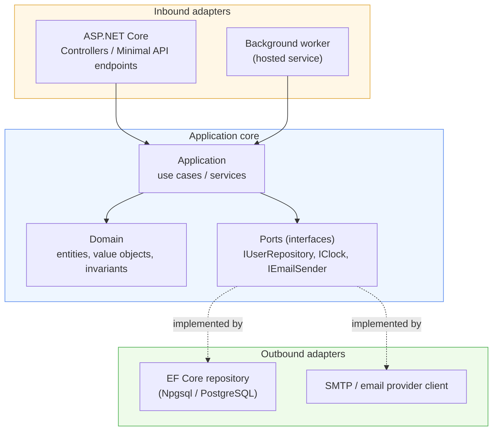

# ASP.NET Backend: Architecture and Guidelines

## 1. Purpose and scope

This document defines the architectural pattern, data access approach, security posture, and code style expected in ASP.NET Core backend work. It is a standalone technical reference, not tied to any single project's domain, and applies to any ASP.NET Core service maintained under this organization's standards.

It assumes EF Core as the data access layer, code-first, targeting PostgreSQL through the Npgsql provider, and Hexagonal Architecture (ports and adapters) as the structural pattern for the solution.

## 2. Sources

- Microsoft Learn, ASP.NET Core best practices: `learn.microsoft.com/aspnet/core/fundamentals/best-practices`.
- Microsoft Learn, ASP.NET Core security topics: `learn.microsoft.com/aspnet/core/security/`.
- Microsoft Learn, EF Core performance introduction: `learn.microsoft.com/ef/core/performance/`.
- Microsoft Learn, EF Core database providers, including the Npgsql PostgreSQL provider: `learn.microsoft.com/ef/core/providers/`.
- Microsoft Learn, EF Core transactions: `learn.microsoft.com/ef/core/saving/transactions`.
- Microsoft Learn / .NET docs, C# coding conventions: `learn.microsoft.com/dotnet/csharp/fundamentals/coding-style/coding-conventions`.
- Hexagonal Architecture (ports and adapters), the general pattern as described by Alistair Cockburn, applied here to an ASP.NET Core solution layout. This is a well-established architectural pattern, not an ASP.NET-specific concept, and this document explains how the two combine.

## 3. Hexagonal architecture (ports and adapters)

Hexagonal architecture, also called ports and adapters, puts an application's domain and use-case logic at the center of the system, with zero dependency on any framework, database technology, or transport mechanism. Everything the core needs from the outside world, a database, an HTTP API, an external service, is expressed as an interface owned by the core. Those interfaces are the **ports**. The concrete implementations that plug into them, an EF Core repository, an ASP.NET controller, an HTTP client for a third-party service, are the **adapters**.

The practical benefit is a codebase where the business rules can be tested, and reasoned about, without a database connection, without an HTTP pipeline, and without a running web server. Swapping PostgreSQL for another store, or adding a second inbound adapter such as a message queue consumer alongside the HTTP API, becomes a matter of writing a new adapter against an existing port, not rewriting the core.



The direction of the arrows is the whole point. The core defines `IUserRepository`; the EF Core adapter implements it and depends on the core, never the reverse. The core has no reference to `Microsoft.EntityFrameworkCore`, no reference to `Microsoft.AspNetCore.Mvc`, and no reference to Npgsql. If the core project's `.csproj` needs any of those packages, the boundary has already been broken.

## 4. Solution and project layout

Map the hexagon onto actual project boundaries so the dependency rule is enforced by the compiler, not just by convention:

```
src/
  MyApp.Domain/           # entities, value objects, domain events, invariants. No framework references.
  MyApp.Application/       # use cases, application services, port interfaces (I*Repository, I*Gateway).
                            # Depends on MyApp.Domain only.
  MyApp.Infrastructure/    # EF Core DbContext, entity configurations, repository implementations,
                            # external service clients. Depends on MyApp.Application (to implement its ports)
                            # and MyApp.Domain.
  MyApp.Api/                # ASP.NET Core host: controllers or minimal API endpoints, middleware,
                            # dependency injection wiring, configuration. Depends on MyApp.Application
                            # and MyApp.Infrastructure (composition root only).
tests/
  MyApp.Domain.Tests/
  MyApp.Application.Tests/  # use cases tested against fakes/mocks of the ports, no database needed
  MyApp.Infrastructure.Tests/  # repository tests against a real or containerized PostgreSQL instance
  MyApp.Api.Tests/           # integration tests through the HTTP pipeline (WebApplicationFactory)
```

The one place allowed to reference every project is the composition root, typically `Program.cs` in `MyApp.Api`, where dependency injection wires the concrete `Infrastructure` implementations to the `Application` interfaces. This is the only file in the solution that is allowed to know both what a port is and what implements it.

**Dependency rule, stated plainly:** `Domain` depends on nothing. `Application` depends on `Domain`. `Infrastructure` depends on `Application` and `Domain`. `Api` depends on all three but contains no business logic of its own, only HTTP concerns (request parsing, response shaping, status codes) and wiring.

## 5. EF Core code-first with PostgreSQL

### 5.1 Provider setup

Use the `Npgsql.EntityFrameworkCore.PostgreSQL` NuGet package as the EF Core provider. It is maintained by the Npgsql team, tracks specific EF Core major versions (a provider built for EF Core 9 will not work against EF Core 10), and should be pinned to a version compatible with the EF Core version in use.

```csharp
services.AddDbContext<AppDbContext>(options =>
    options.UseNpgsql(configuration.GetConnectionString("Postgres"),
        npgsqlOptions => npgsqlOptions.MigrationsAssembly("MyApp.Infrastructure")));
```

### 5.2 DbContext design

The `DbContext` lives in `MyApp.Infrastructure` and exposes `DbSet<T>` properties for aggregate roots only, not for every entity in the model. Entities reachable only through navigation from an aggregate root (line items on an order, for example) should not get their own `DbSet`; they are reached through the root.

Keep entity configuration out of the `DbContext` class itself. Use `IEntityTypeConfiguration<T>` classes, one per entity, applied via `modelBuilder.ApplyConfigurationsFromAssembly()`. This keeps the `DbContext` file short regardless of how large the model grows, and keeps each entity's mapping concerns, keys, indexes, relationships, column types, next to that entity's own configuration rather than centralized in one large file.

```csharp
public class UserConfiguration : IEntityTypeConfiguration<User>
{
    public void Configure(EntityTypeBuilder<User> builder)
    {
        builder.ToTable("users");
        builder.HasKey(u => u.Id);
        builder.Property(u => u.Email).HasMaxLength(320).IsRequired();
        builder.HasIndex(u => u.Email).IsUnique();
    }
}
```

### 5.3 Naming conventions on PostgreSQL

PostgreSQL folds unquoted identifiers to lowercase and conventionally uses `snake_case`, while C# and EF Core default to `PascalCase`. Left unaddressed, this forces every identifier to be quoted in generated SQL and produces a schema that looks foreign to anyone working in `psql` directly. Apply a naming convention translator, most commonly the `EFCore.NamingConventions` package, configured for snake_case, so `OrderLine.UnitPrice` maps to `order_line.unit_price` automatically, rather than hand-specifying `HasColumnName` on every property.

```csharp
options.UseNpgsql(connectionString)
       .UseSnakeCaseNamingConvention();
```

### 5.4 Migrations workflow

Code-first means the C# model is the source of truth, and the database schema is derived from it through migrations, never edited by hand out of band. The workflow:

1. Change the entity classes and/or their `IEntityTypeConfiguration`.
2. Generate a migration: `dotnet ef migrations add <DescriptiveName> --project MyApp.Infrastructure --startup-project MyApp.Api`.
3. Review the generated migration file. EF Core's inference is usually correct but not infallible, especially around renames (which it may interpret as a drop-and-create) and index changes; a rename should be reviewed and, if needed, hand-edited to use `RenameColumn` instead of `DropColumn`/`AddColumn`.
4. Apply migrations through a controlled process (an explicit `dotnet ef database update` step in a deploy pipeline, or `context.Database.Migrate()` run once at startup behind a lock in constrained environments), never automatically on every application boot in a multi-instance deployment, where two instances migrating concurrently can race.

### 5.5 Connection pooling

PostgreSQL connections are relatively expensive to establish. Npgsql pools connections at the ADO.NET level by default; verify the pool size (`Maximum Pool Size` in the connection string) is sized to the expected concurrent load, and pair it with `DbContext` pooling (`AddDbContextPool` instead of `AddDbContext`) in high-throughput services to also reuse `DbContext` instances themselves, not just the underlying database connections. `DbContext` pooling requires the context to have no per-request-only state beyond what the pooling mechanism resets, so review this before adopting it on an existing context.

## 6. EF Core performance: advanced topics

EF Core's own performance documentation frames overall data access performance as a combination of four factors: raw database/query performance, the amount of data transferred over the network, the number of network round trips, and EF's own runtime overhead. In practice, the first three dominate; EF's own overhead is usually negligible next to query execution time and network latency. The practices below target each factor.

### 6.1 Read performance

- **Use `AsNoTracking()` for read-only queries.** Change tracking has a real cost: EF Core snapshots every tracked entity to detect changes later. A query that only displays data and never calls `SaveChanges()` on its results should not pay that cost.

  ```csharp
  var users = await context.Users
      .AsNoTracking()
      .Where(u => u.IsActive)
      .ToListAsync();
  ```

- **Filter and project in the query, not in memory.** `.Where()`, `.Select()`, and aggregate operators (`.Sum()`, `.Count()`) should execute in the database. Pulling a full table into memory and then filtering with LINQ-to-Objects defeats the point of a query language and multiplies both network transfer and application memory pressure.
- **Watch for client evaluation.** EF Core will, in some cases, resolve part of a query on the client rather than translating it to SQL, silently, if the SQL translation isn't possible. This can turn an intended single-row lookup into a full table scan pulled into memory. Log generated SQL in development (`.LogTo(Console.WriteLine, LogLevel.Information)` on the context options, filtered to the `Microsoft.EntityFrameworkCore.Database.Command` category) and read it, don't assume the LINQ expression compiled to the query you intended.
- **Avoid the N+1 pattern.** Accessing a navigation property inside a loop over query results, without having included it, issues one query per iteration. Use `.Include()` (and `.ThenInclude()` for nested navigations) to fetch related data in the original query.
- **Choose between a single query and split queries deliberately when including collections.** A single query with multiple `.Include()` calls on collection navigations produces a SQL join that repeats parent columns once per child row (a "cartesian explosion"), which can inflate network transfer dramatically for wide parent entities with many children. `.AsSplitQuery()` issues one query per included collection instead, avoiding the row multiplication at the cost of multiple round trips. Prefer split queries when including more than one collection navigation on a wide entity, and measure both approaches with actual data volumes before committing to one.
- **Use compiled queries only where profiling justifies it.** `EF.CompileAsyncQuery()` removes the LINQ-to-SQL translation cost for a query executed extremely frequently with the same shape. It adds real code complexity and reduced flexibility for a saving that, per the EF Core team's own guidance, is often negligible next to database and network time. Measure before adopting it, not as a default.

### 6.2 Write performance

- **Batch `SaveChanges()` calls rather than calling `SaveChanges()` after every single entity addition** in a loop; EF Core batches the underlying SQL statements within one `SaveChanges()` call where the provider supports it, which is far fewer round trips than one `SaveChanges()` per entity.
- **Use `ExecuteUpdate()`/`ExecuteDelete()` for bulk operations** that don't need per-entity change tracking or domain logic, a mass status update across many rows, for example, rather than loading every entity into memory, mutating it, and calling `SaveChanges()`. These execute as a single SQL statement against the database.
- **Pool `DbContext` instances** (`AddDbContextPool`) in high-throughput write paths, as noted in section 5.5, to avoid the allocation cost of constructing a fresh context per request.

### 6.3 Pagination and indexing

- **Never return an unbounded collection from an endpoint.** Page every list-returning query with `.Skip()`/`.Take()` (or, for stable pagination under concurrent writes, keyset pagination ordered on an indexed column) and return page size and continuation information to the caller.
- **Index what you filter and sort on.** A code-first model with no explicit indexing beyond primary keys will perform acceptably in development against small seed data and then degrade sharply in production. Add `HasIndex()` calls in entity configurations for every column used in a `Where()`, `OrderBy()`, or join condition on a table expected to grow, and verify the resulting migration actually creates the index.
- **Tag queries for observability.** `.TagWith("GetActiveUsersForDashboard")` embeds a comment in the generated SQL, which makes a slow query visible in database-side logs and slow query analyzers immediately traceable back to the LINQ call site that produced it.

## 7. Security: EF Core transactions, RBAC, and isolation

### 7.1 Transactional atomicity

By default, EF Core wraps all the changes in a single `SaveChanges()` call in an implicit transaction: either every change in that call succeeds, or none of them are applied. For most application code, this default is sufficient and no explicit transaction handling is needed.

Reach for an **explicit transaction** when a single logical operation spans more than one `SaveChanges()` call, or spans a `SaveChanges()` call plus a raw SQL statement that must succeed or fail together:

```csharp
await using var transaction = await context.Database.BeginTransactionAsync();
try
{
    context.Accounts.Add(debitEntry);
    await context.SaveChangesAsync();

    context.Accounts.Add(creditEntry);
    await context.SaveChangesAsync();

    await transaction.CommitAsync();
}
catch
{
    // transaction auto-rolls back on dispose if not committed
    throw;
}
```

EF Core automatically creates a savepoint before each `SaveChanges()` call made while an explicit transaction is already open, so a failure partway through a multi-step transaction can be rolled back to the last savepoint and retried, rather than aborting the entire transaction. Be aware that manually controlled transactions are incompatible with EF Core's automatic connection-retry execution strategies; a service configured with `EnableRetryOnFailure()` needs its explicit transaction wrapped in `strategy.ExecuteAsync()` so the whole transaction, not a partial fragment of it, is what gets retried.

### 7.2 Isolation levels

The default isolation level is whatever the database provider defaults to, `Read Committed` on PostgreSQL. This is adequate for the overwhelming majority of application code. Raise the isolation level explicitly, via `BeginTransactionAsync(IsolationLevel.Serializable)` or the equivalent on `TransactionScope`, only for operations with a genuine correctness requirement that `Read Committed` cannot provide: a financial balance check-then-update that must not observe a concurrent write between the check and the update, for example. A higher isolation level increases lock contention and the chance of serialization failures that the caller must be prepared to retry; treat it as a deliberate, documented decision on a specific operation, not a blanket setting.

### 7.3 Optimistic concurrency

For the common case, protecting against two concurrent updates silently overwriting each other, prefer optimistic concurrency over raising the isolation level. Add a concurrency token to the entity, PostgreSQL has no native `rowversion` type as SQL Server does, so the common approach is either a `xmin` system column mapped as a concurrency token, or an application-managed version integer incremented on every update.

```csharp
public class Account
{
    public Guid Id { get; set; }
    public decimal Balance { get; set; }

    [Timestamp]
    public uint Version { get; set; }  // mapped to PostgreSQL's xmin
}
```

```csharp
builder.Property(a => a.Version)
       .IsRowVersion()
       .HasColumnName("xmin")
       .HasColumnType("xid");
```

`SaveChangesAsync()` then throws `DbUpdateConcurrencyException` if the row was modified since it was loaded, and the caller decides how to reconcile: reload and retry, merge, or surface a conflict to the user. This scales better under load than pessimistic locking or a raised isolation level, because it never blocks a competing transaction; it only detects the conflict after the fact.

### 7.4 Role-based access control

Apply RBAC at more than one layer; relying on controller-level `[Authorize(Roles = "Admin")]` attributes alone leaves the application core with no enforcement of its own, and any new entry point, a background job, a second API surface, that bypasses the controller layer bypasses authorization entirely.

- **At the API boundary**, use ASP.NET Core's policy-based authorization (`[Authorize(Policy = "CanManageUsers")]`), which is more flexible and more testable than raw role checks, and centralizes the mapping from a named capability to the roles or claims that satisfy it in one place (`AddAuthorization()` policy configuration), rather than scattering `Roles = "..."` strings across controllers.
- **At the application layer**, have use cases accept the acting user's identity and authorization context explicitly (an `IUserContext` or `ClaimsPrincipal` passed in, not read from a static/ambient accessor) and check permission for the specific operation before performing it, so the check travels with the business logic regardless of which adapter invoked it.
- **At the data layer**, consider PostgreSQL row-level security (`CREATE POLICY`) for defense in depth on genuinely sensitive multi-tenant data, so that even a bug in application-layer authorization, or a raw SQL escape hatch, cannot return another tenant's rows. Row-level security is a meaningful additional layer, not a replacement for application-layer checks; the two serve different failure modes.

### 7.5 SQL injection and raw SQL

EF Core's LINQ-to-SQL translation parameterizes values automatically and is not vulnerable to SQL injection by construction. Risk reappears the moment raw SQL is used: `FromSqlRaw()` and `ExecuteSqlRaw()` do not parameterize interpolated values inserted into the SQL string itself. Always use `FromSqlInterpolated()`/`ExecuteSqlInterpolated()` with C# string interpolation syntax, which EF Core parses and parameterizes correctly, or pass explicit `NpgsqlParameter` objects to the raw variants; never build a raw SQL string by concatenating or interpolating a value directly into `FromSqlRaw()`.

```csharp
// Correct: interpolated values become parameters, not string content.
var users = await context.Users
    .FromSqlInterpolated($"SELECT * FROM users WHERE email = {email}")
    .ToListAsync();
```

## 8. ASP.NET Core code guidelines and best practices

### 8.1 Controllers and minimal APIs

Both controller-based MVC and minimal API endpoints are fully supported hosting models in current ASP.NET Core; the choice is a project-level decision, not a per-endpoint one. Minimal APIs carry less ceremony for small, focused services; controllers group related endpoints and give attribute-based conventions (model binding, filters) a natural home in larger surfaces. Whichever is chosen, keep the same discipline from section 4: an endpoint handler parses the request, calls into the application layer, and shapes the response. It does not contain business logic, and it does not call `DbContext` directly. That call belongs behind a port, implemented by an infrastructure adapter.

### 8.2 Dependency injection lifetimes

Match the registered lifetime to the actual state the service holds:

- **Singleton** for stateless services and services that are expensive to construct and safe to share across all requests (a configured `HttpClient` via `IHttpClientFactory`, a memory cache).
- **Scoped** for anything tied to a single request, most notably `DbContext` and any repository or use case that depends on it. A scoped service must never be injected into, or captured by, a singleton; doing so pins the first request's instance for the app's entire lifetime and is a common source of subtle data leakage between requests.
- **Transient** for lightweight, stateless services that are cheap to construct and have no reason to be shared.

### 8.3 Configuration and validation

Bind configuration to strongly typed options classes (`IOptions<T>` / `IOptionsSnapshot<T>`) rather than reading `IConfiguration["Some:Key"]` by string key scattered through the codebase; this catches configuration typos at startup validation time instead of at first use in production. Validate incoming request models explicitly, either with data annotations plus ASP.NET Core's built-in model validation, or a dedicated validation library, and return a structured `400 Bad Request` with field-level detail rather than letting an invalid model reach application logic and fail with a less specific error further downstream.

### 8.4 Error handling

Centralize exception-to-response translation in one place, `UseExceptionHandler()` with a typed handler, or ASP.NET Core's `IExceptionHandler` interface, rather than wrapping every controller action in its own try/catch. Application-layer exceptions should be specific and meaningful (`UserNotFoundException`, `InsufficientBalanceException`), not generic; the centralized handler maps known exception types to the correct HTTP status code and a consistent error response shape (the `ProblemDetails` standard is the built-in, RFC 7807-aligned option), and everything unmapped becomes a logged `500` rather than leaking internal exception detail to a client.

### 8.5 API versioning

Version the API deliberately once it has external consumers, whether through the URL (`/v1/...`), a header, or media type, using the `Asp.Versioning` package rather than an ad hoc convention. Decide on a versioning approach before the first breaking change is needed, not during the incident caused by shipping one without a plan.

## 9. ASP.NET Core performance: advanced topics

### 9.1 Async all the way down

Blocking a thread pool thread on synchronous I/O, calling `.Result` or `.Wait()` on a `Task`, using a synchronous stream read on the request body, is the single most common ASP.NET Core performance bug, and it compounds badly: a small number of blocked threads under load causes thread pool starvation, which degrades response times for every request, not just the blocking one. The rule is unconditional for hot code paths: make every I/O-bound call asynchronous, all the way from the controller/endpoint action down through every layer it calls, and never introduce a synchronous wait to bridge async code back to sync. `Task.Run` inside a request handler does not fix a blocking call, it just moves the block to a different thread pool thread; it does not eliminate the underlying cost.

### 9.2 Caching and compression

- **Cache aggressively at whichever layer is cheapest to invalidate correctly.** In-memory (`IMemoryCache`) for single-instance or per-instance-acceptable caching; a distributed cache (Redis, or PostgreSQL-backed if no dedicated cache store is available yet) once the service runs on more than one instance and cache coherency across instances matters.
- **Use output caching or response caching for endpoints whose response is safe to serve from cache for a bounded time**, rather than hitting the database on every identical request.
- **Enable response compression** for text-based payloads (JSON, HTML), which is often the single largest, cheapest win for response latency over a real network, particularly for larger payloads or slower client connections.

### 9.3 Minimize allocations in hot paths

- **Reuse `HttpClient` instances through `IHttpClientFactory`** rather than constructing and disposing `HttpClient` directly; a disposed `HttpClient` can leave sockets in `TIME_WAIT` and exhaust available sockets under load if the pattern repeats on every request.
- **Avoid large object heap churn.** Objects at or above 85,000 bytes go on the large object heap, which is only reclaimed by a full, comparatively expensive garbage collection. Avoid allocating many large, short-lived objects (buffers, large strings assembled through concatenation) on a hot path; pool them with `ArrayPool<T>` where a large buffer is genuinely needed repeatedly.
- **Return `IAsyncEnumerable<T>` or call `.ToListAsync()` before returning a query result**, rather than returning `IEnumerable<T>` directly from an action, which forces synchronous enumeration by the response serializer and can itself become a blocking-call problem under the same thread pool starvation risk as section 9.1.
- **Page large collections at the API boundary**, never returning an unbounded result set to a client in a single response, for the same memory and thread pool reasons noted in section 6.3 at the database layer.

### 9.4 Keep the request pipeline lean

Every middleware component runs on every matching request; a slow or blocking component early in the pipeline has an outsized effect on overall throughput. Keep custom middleware minimal and fast, and use targeted profiling (Visual Studio's diagnostic tools, or a sampling profiler such as PerfView) to identify genuinely hot code paths before optimizing rather than optimizing by intuition.

### 9.5 Use the current supported release

Each ASP.NET Core release has shipped measurable performance improvements over the previous one, in JIT/GC behavior, in the HTTP stack, and in the framework itself. Staying on a current, supported release is itself a performance practice, not just a maintenance one.

## 10. ASP.NET Core security

### 10.1 Authentication and authorization

Treat authentication (proving who the caller is) and authorization (deciding what that caller may do) as distinct concerns handled by distinct mechanisms. Use a standard, well-reviewed authentication scheme, JWT bearer tokens for an API consumed by a separate frontend, or cookie authentication for a server-rendered app, rather than a hand-rolled token scheme. Prefer a managed identity or a well-supported identity provider over storing and validating credentials directly in application code wherever the deployment target supports it.

Avoid the OAuth Resource Owner Password Credentials grant; it requires the client to handle the user's raw password directly and is considered a significant security risk by current OAuth guidance. Use an authorization code flow (with PKCE for public clients) instead.

### 10.2 Secrets and configuration

Never commit passwords, connection strings with embedded credentials, or API keys into source control, including into configuration files checked into the repository. Use the .NET Secret Manager tool for local development secrets, and a proper secret store (environment-injected secrets from a managed vault, not plain environment variables holding production connection strings) for deployed environments. Environment variables are commonly stored and logged in plain text by the surrounding infrastructure, so they are an acceptable mechanism for non-production configuration but not the recommended one for production secrets.

For environment variables names use `CAPITAL_SNAKE_CASE`.

### 10.3 Transport and headers

Enforce HTTPS and HSTS in every environment beyond local development (`UseHttpsRedirection()`, `UseHsts()`). Set appropriate security response headers (`X-Content-Type-Options`, a `Content-Security-Policy` scoped to what the app actually needs, `Referrer-Policy`) rather than relying on framework defaults alone, since defaults are necessarily conservative across all possible uses of the framework, not tuned to one application's actual needs.

### 10.4 Cross-cutting vulnerabilities

- **Cross-Site Request Forgery (CSRF).** Use ASP.NET Core's built-in anti-forgery token support for any cookie-authenticated, state-changing endpoint reachable from a browser form or fetch call. Token-based (bearer) authentication for a pure API consumed by a separate frontend is inherently less exposed to CSRF, since the token is not automatically attached by the browser the way a cookie is, but confirm this is genuinely the auth model in use before relying on it as a mitigation.
- **Cross-Site Scripting (XSS).** Razor's default output encoding covers most server-rendered cases automatically; the risk concentrates wherever raw HTML is deliberately rendered unencoded, or where the API's JSON output is consumed by a frontend that does its own unsafe DOM insertion. This is primarily a frontend-side control, but a backend serving raw HTML fragments must apply the same discipline.
- **SQL injection.** Covered in section 7.5; the discipline is the same regardless of whether the vulnerable code sits in a controller, a background job, or a script, parameterize every value, never interpolate directly into raw SQL.
- **Open redirects.** Validate any redirect target that comes from user input or a query parameter against an allow-list of known-safe destinations, rather than redirecting to an arbitrary caller-supplied URL.
- **Cross-Origin Resource Sharing (CORS).** Configure CORS with an explicit, named policy listing the exact origins allowed, never a wildcard origin combined with credentialed requests, which most modern browsers refuse outright and which represents a meaningful widening of attack surface where it is technically permitted.

## 11. C# code guidelines and performance

### 11.1 Style and conventions

- **Naming.** Types and public members use `PascalCase`; parameters and locals use `camelCase`; private fields commonly use a leading underscore (`_repository`) to distinguish them at a glance from parameters and locals of the same conceptual name.
- **Use language keywords for built-in types** (`string`, `int`, `bool`) rather than the BCL type names (`String`, `Int32`, `Boolean`), and prefer `int` over unsigned integer types unless the value's non-negativity is itself meaningful documentation.
- **Use `var` only when the type is obvious from the right-hand side** of the assignment, a `new` expression, an explicit cast, or a literal, not when the type is inferred only from a method's name or return type read elsewhere.
- **Use file-scoped namespace declarations** (`namespace MyApp.Domain;`) rather than the older brace-delimited form, and place `using` directives outside the namespace declaration to avoid namespace-resolution ambiguity that can otherwise surface unpredictably as new dependencies are added later.
- **Use expression-bodied members and pattern matching where they improve clarity**, but not where they compress genuinely branching logic to the point that it becomes harder, not easier, to read at a glance.
- **Use collection expressions** (`int[] values = [1, 2, 3];`) for initializing collections in current C# versions, and `required` properties over constructor parameters where the goal is simply to force initialization rather than to compute a derived value at construction time.
- **Catch specific exception types**, not `catch (Exception)` without a filter, except at a single, deliberate top-level boundary (the centralized error handler described in section 8.4) whose entire job is to catch everything that reached it unhandled.

### 11.2 Nullable reference types and records

Enable nullable reference types (`<Nullable>enable</Nullable>`) on every project. It converts an entire class of null-reference bugs from a runtime crash into a compile-time warning, and it makes the intent of every reference type in a public API explicit: a parameter typed `string` cannot be null without the caller receiving a compiler warning; a parameter typed `string?` documents that it can, at the signature itself, without needing a separate comment.

Prefer `record` types for immutable data carried across layer boundaries, DTOs returned from an API, value objects in the domain, since records give structural equality and a concise declaration syntax for free, both of which matter for data that is compared and passed around rather than mutated in place. Reserve `class` for entities with real identity and behavior, where reference equality (or a custom identity-based equality) is actually the correct semantic.

### 11.3 Async/await pitfalls

- **Never block on async code with `.Result` or `.Wait()`.** Beyond the thread pool starvation cost covered in section 9.1, this pattern is a well-known source of deadlocks in any context with a synchronization context (historically ASP.NET classic, and still relevant in some UI frameworks); ASP.NET Core has no synchronization context by default, which makes the deadlock less likely there specifically, but the thread pool starvation cost applies regardless of hosting model.
- **Use `ConfigureAwait(false)` in library code** that has no reason to resume on a specific context, library and infrastructure-layer code in particular, since it avoids an unnecessary context-capture cost on every `await`. This matters less in ASP.NET Core application code itself, which has no synchronization context to capture, but remains good practice in reusable library projects that may be consumed by hosts that do have one.
- **Avoid `async void`**, except for event handlers, where the signature is required by the delegate being implemented. An `async void` method's exceptions cannot be caught by the caller through normal means, and in a web request handler specifically, using `async void` lets the HTTP response complete before the method's work finishes, which can crash the process if the method later tries to write to a response that has already ended.
- **Avoid wrapping already-asynchronous work in `Task.Run`** inside a request handler. ASP.NET Core already dispatches request handling onto thread pool threads; an unnecessary `Task.Run` adds a second, pointless scheduling hop without changing where any actual blocking occurs.

### 11.4 Allocation-conscious patterns

- **Use `Span<T>`/`ReadOnlySpan<T>` for high-frequency parsing or slicing work** (parsing a fixed-format identifier out of a larger string on a hot path, for instance) where avoiding an intermediate allocation measurably matters; this is a targeted optimization for genuinely hot paths, not a default replacement for `string`/`string[]` throughout ordinary application code, where the added complexity is not repaid.
- **Be deliberate about LINQ in hot paths.** LINQ's readability is a real advantage in the overwhelming majority of application code, where the underlying collection is small and the method is called infrequently. On a path called extremely often with a non-trivial collection size, LINQ's enumerator allocations and delegate calls have a measurable cost; profile before rewriting, and only rewrite the specific hot path identified, not the codebase's LINQ usage wholesale.
- **Prefer `struct` for small, immutable, frequently allocated value types** (a coordinate pair, a small identifier wrapper) where value semantics are correct and the type stays small, since this avoids heap allocation and garbage collection pressure entirely for that type. Default to `class` otherwise; a large `struct`, or one that is boxed frequently through an interface or object reference, can perform worse than the equivalent class through excessive copying.

## 12. Quick reference checklist

- Domain has zero framework references. Application depends only on Domain. Infrastructure implements Application's ports. Api is the composition root and contains no business logic.
- Model tables as aggregate roots with `DbSet<T>`; configure every entity through `IEntityTypeConfiguration<T>`, not inline in the `DbContext`.
- Apply a snake_case naming convention for PostgreSQL; review every generated migration before applying it, especially renames.
- Use `AsNoTracking()` on read-only queries; use `.Include()`/`.AsSplitQuery()` deliberately to avoid both N+1 queries and cartesian-explosion joins.
- Wrap multi-step writes in an explicit transaction; use optimistic concurrency (`xmin`/version column) as the default protection against lost updates, and raise isolation level only for a specific, documented correctness need.
- Enforce RBAC at the API, application, and, for sensitive multi-tenant data, database layers, not at the controller alone.
- Never interpolate a value directly into `FromSqlRaw()`/`ExecuteSqlRaw()`; use the interpolated or parameterized variants.
- Make every I/O-bound call asynchronous end to end; never call `.Result`, `.Wait()`, or a synchronous stream read on a hot path.
- Enable nullable reference types on every project; catch specific exception types; centralize exception-to-response translation.
- Cache aggressively, compress responses, reuse `HttpClient` through `IHttpClientFactory`, and page every collection-returning endpoint.
- Never commit secrets; enforce HTTPS/HSTS everywhere outside local development; scope CORS to an explicit origin allow-list.
