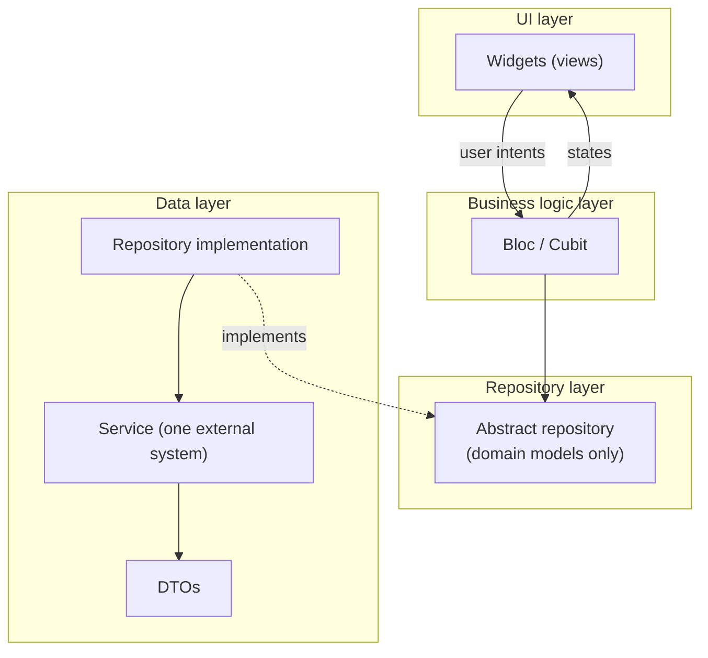
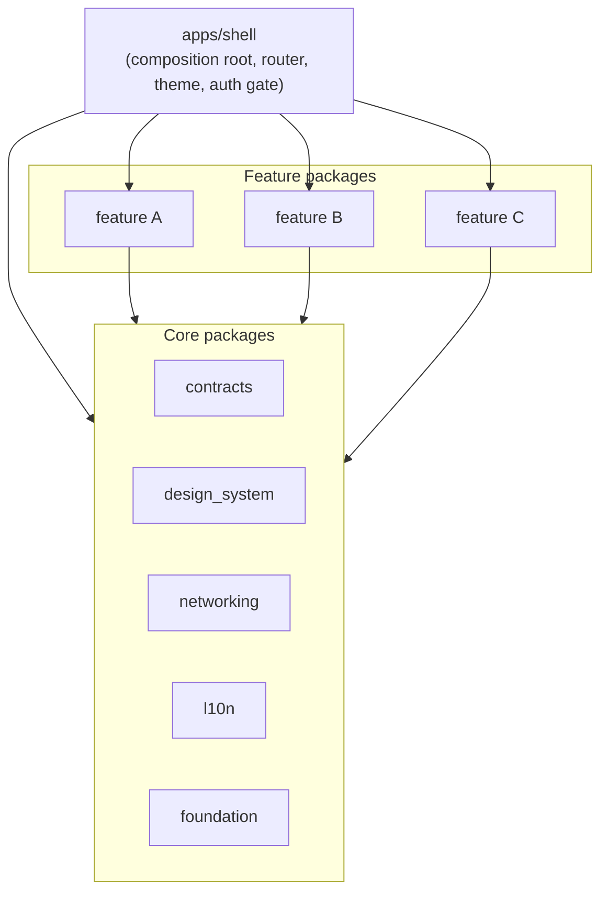

# Flutter Architecture

## 1. Purpose, status and scope

This document is the binding architecture and coding-standards reference for every Flutter application built in this repository.

**Status.** Binding. Every rule marked MUST or MUST NOT is mandatory. No waiver, exception or temporary bypass is permitted. When a rule conflicts with a feature requirement, the conflict is raised with the project owner and resolved before implementation continues. Code never silently deviates from this document.

**Scope.** The document covers the Flutter client on every target the project ships:

| Target | Notes |
|---|---|
| iOS, Android | Full rule set |
| Web | Full rule set; platform limits are stated where a rule differs |
| Desktop (macOS, Windows, Linux) | Full rule set |

It defines five areas:

1. Application architecture (section 4).
2. UI/UX architecture based on microfrontends (section 5).
3. UI/UX engineering best practices, including responsive layout and app store compliance (section 6).
4. Performance best practices and advanced performance topics (section 7).
5. Strict coding standards and coding best practices (section 8).

**Relationship to other documents.**

- `docs/SECURITY.md` defines the security controls. Where this document describes a security-relevant mechanism (networking, storage, input, logging, routing), `docs/SECURITY.md` defines the minimum it must satisfy. When both documents apply, the stricter requirement wins.
- `docs/GDPR.md` defines personal data rules. Every change that touches personal data must adhere to the GDPR rules.
- `docs/uiux/` holds the visual design specifics of the product: palette values, typography choices, iconography and screen designs. This document defines how those designs are implemented; `docs/uiux/` defines what they look like.
- `docs/features/` holds one document per feature. Each feature document states which feature package implements it (section 5) and lists the rule identifiers of this document that its design relies on.

## 2. Normative language and rule identifiers

The keywords MUST, MUST NOT, REQUIRED, SHALL, SHALL NOT, SHOULD, SHOULD NOT and MAY are interpreted as described in RFC 2119 and RFC 8174 when they appear in capitals.

Because no waivers exist (section 1), SHOULD is used only where a stronger alternative is also acceptable. Choosing not to follow a SHOULD requires the stronger alternative to be in place and to be recorded in the feature document under `docs/features/`.

Every rule has a stable identifier of the form `FL-<AREA>-<NN>`, for example `FL-BLOC-03`. Identifiers are cited in code reviews, doc comments, test names and pull request descriptions. A removed rule's identifier is never reused.

| Area code | Section | Topic |
|---|---|---|
| `GOV` | 1 to 3 | Governance and sources |
| `ARCH` | 4.1 to 4.2 | Layers and dependency direction |
| `BLOC` | 4.3 | Business logic layer (BLoC and Cubit) |
| `DATA` | 4.4 to 4.6 | Repository layer, data layer, models, errors |
| `DI` | 4.7 | Dependency injection |
| `SIM` | 4.8 | Separation of real and simulated data |
| `MOD` | 5 | Microfrontend modularization |
| `NAV` | 5.5 | Routing and navigation |
| `UI` | 6.1 to 6.3, 6.6 to 6.8 | Design system, layout, UI states, motion |
| `A11Y` | 6.4 | Accessibility |
| `L10N` | 6.5 | Localization and formatting |
| `STORE` | 6.9 | Google Play and Apple App Store compliance |
| `PERF` | 7 | Performance |
| `CODE` | 8.1 to 8.7 | Coding standards |
| `TEST` | 8.8 | Testing and coverage |

## 3. Sources

- Sebastian Faust, "Using Google's Flutter Framework for the Development of a Large-Scale Reference Application", Bachelor thesis, Technische Hochschule Köln, 2020. `epb.bibl.th-koeln.de/frontdoor/index/index/docId/1498`, URN `urn:nbn:de:hbz:832-epub4-14989`. Licensed CC BY-ND 4.0. Referred to below as "the thesis". It is the basis of the application architecture in section 4.
- Flutter documentation, "App architecture": `docs.flutter.dev/app-architecture`.
- Flutter documentation, "Performance best practices": `docs.flutter.dev/perf/best-practices`, and the linked advanced pages: rendering performance, app size, deferred components, concurrency and isolates, Impeller, DevTools performance and memory views.
- Effective Dart: `dart.dev/effective-dart`.
- Dart pub workspaces: `dart.dev/tools/pub/workspaces`.
- bloc library documentation: `bloclibrary.dev`, including its architecture and naming conventions.
- go_router package documentation: `pub.dev/packages/go_router`.
- W3C Web Content Accessibility Guidelines (WCAG) 2.2.
- Material Design 3: `m3.material.io`, including window size classes and canonical layouts.
- Apple App Review Guidelines: `developer.apple.com/app-store/review/guidelines`.
- Apple Human Interface Guidelines: `developer.apple.com/design/human-interface-guidelines`.
- Google Play Developer Policy Center: `play.google/developer-content-policy`.
- Google Play target API level requirements: `developer.android.com/google/play/requirements/target-sdk`.
- Android core app quality and large screen app quality guidelines: `developer.android.com/quality`.
- Android 16 behavior changes: `developer.android.com/about/versions/16/behavior-changes-16`.
- Apple information property list keys `UIRequiresFullScreen` and `UISupportedInterfaceOrientations`: `developer.apple.com/documentation/bundleresources/information-property-list`.
- Apple app icons (Human Interface Guidelines) and "Offering account deletion in your app": `developer.apple.com/support/offering-account-deletion-in-your-app`.

The store and platform sources above were checked against sections 6.2 and 6.9 on 24 September 2026. The Apple App Review Guidelines page shows no revision date, so the date of each check is recorded by FL-STORE-21.

- **FL-GOV-01.** When a source and this document differ, this document applies. When this document and `docs/SECURITY.md` or `docs/GDPR.md` differ, the stricter requirement applies.
- **FL-GOV-02.** A design decision that is not covered by this document MUST be raised with the project owner and added to this document before it is implemented.

## 4. Application architecture

### 4.1 Layers

The architecture follows the four-layer model of the thesis (thesis section 4.2.1, Table 5). The thesis reached this model by combining the BLoC pattern with a classic layered architecture and the Repository Pattern, after comparing the main Flutter state management approaches and interviewing Felix Angelov, the author of the bloc library. The thesis also separates two ideas that are often mixed: state management is how state changes; architecture is the set of rules that decides where code lives and what it may depend on (thesis section 4.1.1). This section defines both.

| Layer | Responsibility | Consists of |
|---|---|---|
| UI | Renders state and forwards user input. Contains as little logic as possible. | Widgets |
| Business logic | Owns every state change of a feature. Consumes user intents and emits immutable states. | Blocs and Cubits |
| Repository | Platform-agnostic contracts between business logic and data. Decouples the two layers. | Abstract repository classes and domain models |
| Data | Talks to one external system each: the backend API, secure storage, a local database, a platform channel. | Services, DTOs, repository implementations |



- **FL-ARCH-01.** Every class MUST belong to exactly one of the four layers. Its file MUST live in the folder of that layer (section 5.3).
- **FL-ARCH-02.** Dependencies MUST point in one direction only: UI depends on business logic; business logic depends on the repository layer; the data layer depends on the repository layer. No layer depends on a layer above it. This applies the Dependency Inversion Principle (DIP): the business logic depends on abstractions it owns, and the data layer implements them.
- **FL-ARCH-03.** Widgets MUST NOT call repositories or services. Blocs MUST NOT call services. The only path from UI to data is UI, then Bloc, then abstract repository.
- **FL-ARCH-04.** An optional use-case class MAY be placed in the business logic layer when one operation orchestrates two or more repositories and that orchestration is needed by more than one Bloc. A use case depends only on abstract repositories. A use case that wraps a single repository call MUST NOT be created, because it adds indirection without a separate responsibility.

### 4.2 Why this model

The thesis states the advantages of the BLoC pattern within a layered architecture (thesis section 4.1.3.1), and they are the reasons this document makes it mandatory:

1. Business logic is in one place and easy to find.
2. Business logic is independent of the UI.
3. Business logic is testable without a widget tree.
4. Widgets rebuild only when the state they depend on changes.
5. State changes are predictable, because they are only allowed to happen in one place.

The Flutter team's own architecture guide reaches the same structure (views, a state holder per view, repositories as the source of truth, services wrapping external systems) with MVVM naming. In this document the Bloc or Cubit plays the view model role.

### 4.3 Business logic layer: BLoC and Cubit

State management uses the `flutter_bloc` package. The rules below are derived from Paolo Soares' eight rules of the BLoC pattern (thesis section 4.1.3.2) and from the bloc library's architecture guidance.

**Rules for Blocs and Cubits**

- **FL-BLOC-01.** Every change of application state MUST happen inside a Bloc or Cubit. `StatefulWidget` state MAY hold only ephemeral UI state that no other widget reads and that has no business meaning: animation controllers, focus nodes, scroll controllers, text editing controllers for non-secret input.
- **FL-BLOC-02.** A Cubit MUST be used by default. Its public methods are named after user intents (`refreshRequested()`, `currencySelected(currency)`), not after mechanics (`setLoading()`). A Bloc with events MUST be used instead when the feature needs event transformation (debounce, throttle, `droppable`, `restartable` or `sequential` from `bloc_concurrency`) or when every input must be traceable as an event.
- **FL-BLOC-03.** Inputs and outputs are simple: a Cubit exposes intent methods and a stream of states; a Bloc accepts events and exposes a stream of states. A Bloc or Cubit MUST NOT expose any other public mutable member or any public stream other than its state stream.
- **FL-BLOC-04.** Every dependency MUST be passed through the constructor and typed as an abstract repository, an abstract use case or a port from a core package. A Bloc MUST NOT construct its own dependencies (thesis rule "all dependencies must be injectable").
- **FL-BLOC-05.** Blocs MUST be platform agnostic. They MUST NOT import `dart:io`, `dart:html`, `package:web`, `package:flutter/material.dart`, `package:flutter/widgets.dart` or any platform plugin, and MUST NOT reference `Platform`, `kIsWeb` or `BuildContext`. Platform differences belong in data layer implementations selected through dependency injection (thesis rule "no platform branching").
- **FL-BLOC-06.** States MUST be immutable, MUST use value equality (section 4.5), and MUST be modeled as a `sealed` class hierarchy or as a single class with an explicit status enum. Emitting a mutated copy of the previous state object is forbidden, because value equality then suppresses the rebuild (thesis section 4.4).
- **FL-BLOC-07.** A Bloc MUST NOT depend on another Bloc. When one feature's state must react to another's, both Blocs depend on the same repository stream, or the UI layer connects them with a `BlocListener`. This keeps each Bloc testable alone and avoids hidden coupling between features.
- **FL-BLOC-08.** A Bloc MUST cancel every stream subscription it opens and release every resource it holds in `close()`.
- **FL-BLOC-09.** Scope follows the thesis design process (thesis section 4.2.2): a Bloc starts as one feature, defined as one piece of value given to the user. When it holds more than one concern, it MUST be split into Blocs with one concern each. This applies the Single Responsibility Principle (SRP): each Bloc has one reason to change.
- **FL-BLOC-10.** A Bloc MUST NOT catch an exception and continue silently. Every failure received from a repository is turned into an explicit failure state (section 4.6).

**Rules for widgets**

- **FL-BLOC-11.** Each widget that is complex enough to own behavior MUST have a related Bloc or Cubit. Presentational widgets that only render values passed to them MUST NOT have one.
- **FL-BLOC-12.** Widgets MUST NOT transform the input they send to a Bloc. Raw user input is passed as is; parsing and validation happen in the Bloc.
- **FL-BLOC-13.** Widgets MUST display Bloc state with as little transformation as possible. Converting a domain value to display text uses the formatters of the localization package (section 6.5). Calculations, filtering and sorting happen in the Bloc.
- **FL-BLOC-14.** A widget MUST NOT hold a reference to a Bloc it did not receive from `BlocProvider` (section 4.7).

### 4.4 Repository and data layers

- **FL-DATA-01.** Each repository contract MUST be an `abstract interface class` in the repository layer. It uses only domain models and the result type of section 4.6. It MUST NOT mention DTOs, HTTP, JSON, storage or plugin types.
- **FL-DATA-02.** A repository implementation is the single source of truth for one kind of domain data. It decides on caching, combines calls to its services, maps DTOs to domain models, and translates exceptions into failures.
- **FL-DATA-03.** A repository implementation MUST NOT depend on another repository. Coordination across repositories belongs to a use case (FL-ARCH-04).
- **FL-DATA-04.** A service wraps exactly one external system. It holds no state and no business logic. It returns DTOs or throws a typed exception.
- **FL-DATA-05.** Services that call the backend MUST use the shared API client from the core networking package. That client applies TLS pinning, request signing, DPoP and JWE (SEC-TLS-04, SEC-SIG-05, SEC-SIG-08, SEC-JWE-01). A feature MUST NOT create its own HTTP client or call `package:http`, `dart:io` `HttpClient` or `fetch` directly.
- **FL-DATA-06.** Data cached on the device MUST follow SEC-FE-01 and SEC-FE-02: secrets only in the platform secure store; Confidential data only encrypted; Restricted data never cached except tokens and keys.
- **FL-DATA-07.** Repositories that expose data changing over time MUST expose it as a `Stream` of domain models. Streams MUST be broadcast or replayed by design and documented as such in the doc comment of the contract.

### 4.5 Models, immutability and equality

The thesis uses immutable models, states and events wherever possible, and value equality for all of them (thesis sections 4.3 to 4.5). Immutable objects cannot enter an invalid state after construction and cannot be changed by another part of the app that holds the same reference.

- **FL-DATA-08.** Domain models, DTOs, states and events MUST be annotated `@immutable`, MUST have only `final` fields, and MUST use `const` constructors where all fields allow it. Collections held by these classes MUST be unmodifiable views or unmodifiable copies.
- **FL-DATA-09.** Domain models, states and events MUST implement value equality by extending `Equatable` and listing every field in `props`. Hand-written `operator ==` and `hashCode` on these classes are forbidden.
- **FL-DATA-10.** DTOs and domain models MUST be separate classes. DTOs mirror the wire format and live in the data layer. Domain models express business meaning and live in the repository layer. Mapping happens only in the repository implementation.
- **FL-DATA-11.** Every domain model constructor MUST validate its invariants. An invalid value MUST fail at construction by throwing `InvalidDomainValueException` from `core/foundation`, which the repository implementation translates into a failure (FL-DATA-13). An invalid value never reaches the business logic layer.
- **FL-DATA-12.** Monetary and price values MUST NOT be stored or calculated as `double`. They use an exact decimal representation with an explicit scale and currency.

### 4.6 Errors and results

- **FL-DATA-13.** Repository methods MUST return a `Result<T>` from the core package: a `sealed` class with the subclasses `Success<T>` and `Failure<T>`. The failure carries a `sealed` `AppFailure` type (for example network unavailable, unauthorized, validation rejected, integrity failure). Repository methods MUST NOT throw to the business logic layer.
- **FL-DATA-14.** Blocs MUST handle every `AppFailure` subtype with an exhaustive `switch`. Adding a new subtype therefore breaks compilation until every Bloc handles it.
- **FL-DATA-15.** Failure messages shown to users come from localization keys (section 6.5). Exception text, stack traces, server messages and internal identifiers MUST NOT be shown in the UI (SEC-APP-10).
- **FL-DATA-16.** Unhandled errors MUST be captured through `FlutterError.onError` and `PlatformDispatcher.instance.onError` in the shell, scrubbed of personal data and secrets, and reported under SEC-FE-10.

### 4.7 Dependency injection

The thesis uses dependency injection to break transitive dependencies and to let different implementations of one contract be injected without the consumer changing its behavior (thesis section 4.6).

- **FL-DI-01.** Dependencies MUST be provided with `RepositoryProvider` (and `MultiRepositoryProvider`) and Blocs with `BlocProvider` (and `MultiBlocProvider`), scoped in the widget tree. A global service locator, a static singleton or a top-level mutable variable holding a dependency is forbidden.
- **FL-DI-02.** App-wide dependencies (API client, security ports, secure storage, clock, logger) MUST be provided once by the shell above the router. Feature dependencies MUST be provided by the feature's own registration function at the feature's route scope (section 5.4), so they are created when the feature is entered and disposed when it is left.
- **FL-DI-03.** A `BlocProvider` that creates a Bloc MUST use the `create` constructor so that the provider closes it. `BlocProvider.value` MUST be used only to pass an existing Bloc to a new route or overlay, never with a newly created instance.
- **FL-DI-04.** Providers MUST be declared with the abstract type (`RepositoryProvider<PriceRepository>`), never the implementation type. Consumers therefore cannot depend on an implementation. This applies the Liskov Substitution Principle (LSP): any implementation that honors the contract can be injected without the consumer changing.
- **FL-DI-05.** Security components are accessed only through their ports, provided in the same way (SEC-GOV-10). Feature code MUST NOT call cryptographic, key store, attestation or platform security APIs directly.

### 4.8 Real data and simulated data

- **FL-SIM-01.** A code path works either against real data end to end or is a separate simulation or test path. The two MUST NOT be mixed in one class, one method or one build.
- **FL-SIM-02.** Fakes, mocks, fixtures and simulated repositories MUST live only in `test/`, `integration_test/` or a dedicated package that the release app does not depend on. They MUST NOT be present in `lib/` of any package that ships in a release build.
- **FL-SIM-03.** A simulation build, when needed, MUST be a separate build flavor with its own entry point, selected at build time. It MUST NOT be selectable by runtime configuration, remote flag or hidden gesture in a release build (SEC-SDLC-09).
- **FL-SIM-04.** A repository implementation MUST NOT fall back to local or sample data when the real source fails. It returns a failure (FL-DATA-13).

### 4.9 Worked example

A minimal feature that shows the latest price quote. Every class and function carries a doc comment that states business meaning, as required by section 8.4.

```dart
// packages/features/price_ticker/lib/src/repository/price_quote.dart

/// A price for one asset in one fiat currency at the moment the backend
/// observed it. Quotes are never extrapolated on the client.
@immutable
final class PriceQuote extends Equatable {
  /// Rejects a quote without a positive price, because a zero or negative
  /// market price means the upstream feed is broken.
  PriceQuote({
    required this.assetCode,
    required this.currencyCode,
    required this.price,
    required this.observedAt,
  }) {
    if (price.signum <= 0) {
      throw InvalidDomainValueException(field: 'price');
    }
  }

  /// The traded asset, as identified by the backend.
  final String assetCode;

  /// The ISO 4217 currency the [price] is expressed in.
  final String currencyCode;

  /// The price of one unit of the asset, exact to the backend's scale
  /// (FL-DATA-12).
  final Decimal price;

  /// When the backend observed the price, in UTC (FL-L10N-05).
  final DateTime observedAt;

  @override
  List<Object?> get props => [assetCode, currencyCode, price, observedAt];
}
```

```dart
// packages/features/price_ticker/lib/src/repository/price_repository.dart

/// The source of truth for current price quotes shown to the user.
///
/// DIP: the price Cubit depends on this contract; the data layer provides
/// the implementation (FL-ARCH-02, FL-DATA-01).
abstract interface class PriceRepository {
  /// Returns the latest quote for [assetCode] in [currencyCode], as last
  /// confirmed by the backend.
  Future<Result<PriceQuote>> latestQuote({
    required String assetCode,
    required String currencyCode,
  });
}
```

```dart
// packages/features/price_ticker/lib/src/data/price_service.dart

/// Retrieves quotes from the backend price endpoint.
///
/// SRP: this class only talks to that endpoint; mapping and error
/// translation belong to [PriceRepositoryImpl] (FL-DATA-04).
final class PriceService {
  /// Uses the shared API client, which applies the transport and message
  /// protection required by SEC-TLS-04, SEC-SIG-05 and SEC-JWE-01.
  const PriceService(this._client);

  final ApiClient _client;

  /// Fetches the backend's latest quote for one asset and currency pair.
  Future<PriceQuoteDto> fetchLatest(String assetCode, String currencyCode) =>
      _client.get(
        ApiRoute.latestQuote(assetCode: assetCode, currency: currencyCode),
        decode: PriceQuoteDto.fromJson,
      );
}
```

```dart
// packages/features/price_ticker/lib/src/data/price_repository_impl.dart

/// Serves quotes from the backend and reports every failure explicitly.
/// There is no fallback to cached or sample prices (FL-SIM-04), because a
/// stale price shown as current misleads the user.
final class PriceRepositoryImpl implements PriceRepository {
  /// Receives the service that reaches the backend price endpoint.
  const PriceRepositoryImpl(this._service);

  final PriceService _service;

  /// Maps the backend quote to the domain model and translates transport
  /// failures and invalid backend values into [AppFailure] values the
  /// business logic can act on.
  @override
  Future<Result<PriceQuote>> latestQuote({
    required String assetCode,
    required String currencyCode,
  }) async {
    try {
      final dto = await _service.fetchLatest(assetCode, currencyCode);
      return Success(dto.toDomain());
    } on ApiException catch (error) {
      return Failure(error.toAppFailure());
    } on InvalidDomainValueException {
      return const Failure(AppFailure.invalidData());
    }
  }
}
```

```dart
// packages/features/price_ticker/lib/src/bloc/price_state.dart

/// What the price screen can show: nothing requested yet, a request in
/// progress, a confirmed quote, or a failure the user must be told about.
@immutable
sealed class PriceState extends Equatable {
  /// Base constructor shared by all price screen states.
  const PriceState();

  @override
  List<Object?> get props => [];
}

/// No quote has been requested yet.
final class PriceInitial extends PriceState {
  /// Creates the state shown before the first request.
  const PriceInitial();
}

/// A quote request is in progress.
final class PriceLoading extends PriceState {
  /// Creates the state shown while the backend is queried.
  const PriceLoading();
}

/// The backend confirmed [quote].
final class PriceLoaded extends PriceState {
  /// Creates the state that shows a confirmed quote.
  const PriceLoaded(this.quote);

  /// The quote to show, exactly as confirmed by the backend.
  final PriceQuote quote;

  @override
  List<Object?> get props => [quote];
}

/// The quote could not be obtained for the reason in [failure].
final class PriceFailed extends PriceState {
  /// Creates the state that explains why no quote is shown.
  const PriceFailed(this.failure);

  /// The reason shown to the user through its localized message.
  final AppFailure failure;

  @override
  List<Object?> get props => [failure];
}
```

```dart
// packages/features/price_ticker/lib/src/bloc/price_cubit.dart

/// Owns what the price screen shows for the asset and currency the user
/// selected.
///
/// SRP: this Cubit handles one concern, the current quote (FL-BLOC-09).
/// DIP: it depends on [PriceRepository], not on its implementation.
final class PriceCubit extends Cubit<PriceState> {
  /// Starts with no quote requested.
  PriceCubit(this._repository) : super(const PriceInitial());

  final PriceRepository _repository;

  /// The user asked for the current quote of [assetCode] in [currencyCode].
  Future<void> quoteRequested({
    required String assetCode,
    required String currencyCode,
  }) async {
    emit(const PriceLoading());
    final result = await _repository.latestQuote(
      assetCode: assetCode,
      currencyCode: currencyCode,
    );
    emit(switch (result) {
      Success(:final value) => PriceLoaded(value),
      Failure(:final failure) => PriceFailed(failure),
    });
  }
}
```

```dart
// packages/features/price_ticker/lib/src/ui/price_view.dart

/// Shows the current quote and one explicit state for loading and failure,
/// so the user never sees a price that was not confirmed (FL-UI-08).
final class PriceView extends StatelessWidget {
  /// Creates the price view for the Cubit provided above it.
  const PriceView({super.key});

  /// Renders exactly one of the four price states.
  @override
  Widget build(BuildContext context) {
    return BlocBuilder<PriceCubit, PriceState>(
      builder: (context, state) => switch (state) {
        PriceInitial() || PriceLoading() => const AppLoadingIndicator(),
        PriceLoaded(:final quote) => PriceQuoteTile(quote: quote),
        PriceFailed(:final failure) => AppFailureMessage(failure: failure),
      },
    );
  }
}
```

## 5. UI/UX architecture: microfrontends

### 5.1 What "microfrontends" means in Flutter

This section adapts the web microfrontend idea (independently owned, independently testable slices of the UI composed by a host) to Flutter's own tools: Dart packages, pub workspaces, a composing shell app, `go_router` and deferred imports.

The thesis supports this direction. It names modularization as the most important recommendation of Felix Angelov for large Flutter applications (thesis section 4.8.1), lists its advantages (smaller components are easier to maintain, components can be reused, separate teams can work in parallel, the program is divided by function), and describes full feature modularization, where each module owns its UI, business logic and data access, as the approach Angelov's team at BMW was moving to (thesis section 5.2). The thesis also names the cost: separate feature packages can duplicate model classes (thesis section 4.8.3). Section 5.3 defines how this cost is controlled.

### 5.2 Workspace structure

The Flutter code is a single Dart pub workspace. One shell app composes independent feature packages that depend on shared core packages.

```
<flutter workspace root>/
  pubspec.yaml                  # workspace root; lists every member package
  pubspec.lock                  # single lock file for the whole workspace
  analysis_options.yaml         # shared strict analyzer configuration (section 8.2)
  apps/
    shell/                      # the only runnable app; composition root
  packages/
    core/
      contracts/                # cross-feature contracts, route names, shared events
      design_system/            # tokens, themes, shared widgets (section 6.1)
      networking/               # ApiClient and security ports wiring (docs/SECURITY.md)
      l10n/                     # ARB files, generated localizations, formatters
      foundation/               # Result, AppFailure, Clock, logging port
    features/
      <feature_name>/           # one package per feature
```



- **FL-MOD-01.** The Flutter code MUST be one pub workspace. Every package MUST declare `resolution: workspace`, and the workspace MUST have exactly one committed `pubspec.lock` (SEC-SDLC-03).
- **FL-MOD-02.** `apps/shell` MUST be the only package with a `main` entry point for a real build. Simulation flavors (FL-SIM-03) are separate entry points in a separate app package.
- **FL-MOD-03.** A feature package MUST NOT depend on another feature package, directly or through `dev_dependencies`. A CI check MUST parse every feature `pubspec.yaml` and fail the build when this rule is broken.
- **FL-MOD-04.** Core packages MUST NOT depend on feature packages or on the shell. Core packages MAY depend on other core packages without cycles.
- **FL-MOD-05.** A feature package MUST be buildable and testable on its own: `flutter test` inside the package passes without the shell.

### 5.3 Inside a feature package

Inside each package, the thesis's layered file structure applies (thesis section 4.7): the folders follow the architecture's layers, which is the most important aspect of the code. At workspace level the structure is feature-first, which removes the main weakness the thesis lists for a layered structure, that files of one feature are scattered.

```
packages/features/<feature_name>/
  lib/
    <feature_name>.dart         # the only public library (FL-MOD-06)
    src/
      ui/                       # widgets, grouped by screen; ui/widgets/ for feature-shared widgets
      bloc/                     # Blocs, Cubits, states, events, use cases
      repository/               # abstract repositories and domain models
      data/                     # services, DTOs, repository implementations
      di/                       # the feature's provider registration
      routes/                   # the feature's go_router routes
  test/                         # mirrors lib/src
  pubspec.yaml
```

- **FL-MOD-06.** Each feature package MUST expose exactly one public library, `lib/<feature_name>.dart`. It exports only the feature's contract implementation (section 5.4). Everything under `lib/src/` is private to the package, and other packages MUST NOT import `src/` paths (enforced by the `implementation_imports` lint).
- **FL-MOD-07.** A domain model that is used by two or more features MUST be defined once in `core/contracts`. A domain model used by one feature MUST stay in that feature. This controls the duplication named in thesis section 4.8.3 without turning `contracts` into a shared dumping ground.
- **FL-MOD-08.** Widgets used by two or more features MUST be in `core/design_system`. A feature MUST NOT copy a widget from another feature.

### 5.4 Feature contract and composition

Each feature plugs into the shell through one contract class declared in `core/contracts`.

```dart
// packages/core/contracts/lib/src/feature_module.dart

/// What every feature hands to the shell so the shell can mount it without
/// knowing its internals.
///
/// OCP: a new feature is added by adding a new implementation to the
/// shell's list; existing features and the shell's routing code do not change.
/// ISP: the shell sees only routes and providers, never the feature's Blocs.
abstract interface class FeatureModule {
  /// Routes under which the feature's screens are reachable.
  List<RouteBase> get routes;

  /// Wraps the feature's route subtree with the repositories and Blocs the
  /// feature needs, so they exist only while the feature is on screen.
  Widget provide(BuildContext context, Widget child);
}
```

- **FL-MOD-09.** Every feature MUST implement `FeatureModule` and export that implementation from its public library. The shell MUST mount features only through this contract.
- **FL-MOD-10.** Features MUST communicate with each other only through contracts in `core/contracts`: route names for navigation (section 5.5) and abstract interfaces or typed streams for data. A feature that publishes data implements the contract; a feature that consumes it depends on the contract. The shell wires the two. This applies DIP and ISP: consumers depend on a narrow abstraction, not on the producing feature.
- **FL-MOD-11.** The shell MUST hold only composition concerns: the router, app-wide providers (FL-DI-02), themes and localization delegates, the authentication gate, the error handlers of FL-DATA-16, and the client security bootstrap (RASP start-up checks under SEC-RASP-06 and SEC-RASP-10, minimum version check under SEC-FE-11, background re-lock under SEC-FE-12). The shell MUST NOT contain feature screens or feature business logic.
- **FL-MOD-12.** On Web and Android, a feature that is not on the start path SHOULD be loaded with a deferred import (`import ... deferred as ...`) and `loadLibrary()` before its routes are first built. The route MUST show the design system's loading state while the library loads and a failure state with a retry action if loading fails. On Android this requires the deferred components configuration of the Flutter build; on iOS and Desktop deferred imports resolve immediately and need no extra configuration.

### 5.5 Routing and navigation

- **FL-NAV-01.** Navigation MUST use `go_router`. The shell owns the single `GoRouter` instance and builds its route tree from the `routes` of every `FeatureModule`. `StatefulShellRoute` is used for persistent navigation (tabs, rail, drawer).
- **FL-NAV-02.** Every route MUST have a name. Route names and their typed parameter lists MUST be declared in `core/contracts`. A feature navigates to another feature only with `context.goNamed` or `context.pushNamed` and these names, never with a hard-coded path string.
- **FL-NAV-03.** Route paths, path parameters and query parameters MUST NOT contain Confidential or Restricted values (docs/SECURITY.md section 5). On Web, the URL is visible in history, logs and referrers.
- **FL-NAV-04.** Authentication and authorization gates MUST be implemented in the router's `redirect` callback, driven by the authentication state from the shell. A client-side gate controls only what is displayed; every decision is still enforced on the server (SEC-RASP-14).
- **FL-NAV-05.** Deep links MUST use verified links and MUST NOT trigger a sensitive action without confirmation inside the app (SEC-FE-07). Every externally reachable route MUST validate its parameters and show the not-found screen for invalid values.
- **FL-NAV-06.** Objects MUST NOT be passed between routes through `extra` when the route must survive a Web reload, deep link or state restoration. Such a route receives identifiers and loads its data through its Bloc.

## 6. UI/UX best practices

This section defines the binding engineering rules for building the UI. Visual design values are defined in `docs/uiux/` and implemented through the design system package.

### 6.1 Design system

- **FL-UI-01.** `core/design_system` MUST be the only source of colors, typography, spacing, radii, elevation, durations and curves. They are defined as design tokens and exposed through `ThemeData` (Material 3, `useMaterial3: true`) and `ThemeExtension` classes for tokens that Material does not cover.
- **FL-UI-02.** Feature code MUST NOT contain literal colors (`Color(0x...)`, `Colors.*`), literal font sizes or font families, or literal spacing values. It reads them from `Theme.of(context)` and the design system's extensions.
- **FL-UI-03.** The design system MUST provide a light theme and a dark theme. The app follows the operating system setting by default and lets the user override it.
- **FL-UI-04.** Every shared component (buttons, inputs, list tiles, dialogs, loading, empty and failure states) MUST be implemented once in the design system with widget tests and golden tests in both themes, and features MUST use these components.

### 6.2 Responsive and adaptive layout

A responsive layout changes with the space available. An adaptive layout also changes with the input devices and the platform conventions the user expects. Both stores review this: Apple expects iPad apps to support multitasking and all orientations, and Android 16 ignores orientation, resizability and aspect ratio restrictions on displays at least 600 logical pixels wide for apps that target it.

- **FL-UI-05.** Layouts MUST adapt to the available width using the window size classes of the design system, which follow Material 3: compact below 600 logical pixels, medium from 600 to below 840, expanded from 840 to below 1200, large from 1200 to below 1600, and extra-large from 1600. Width MUST be read with `MediaQuery.sizeOf(context)` or `LayoutBuilder`, never with `MediaQuery.of(context).size`, which rebuilds on every media query change. The size class is computed by one function in the design system; features MUST NOT compare widths against their own numbers.
- **FL-UI-06.** Layout decisions MUST be based on available space and input capabilities, not on the device type or operating system. The same screen supports touch, mouse, trackpad and keyboard: hover states, visible focus, keyboard shortcuts for primary actions on Desktop and Web, and scroll behavior that works with a mouse wheel. The only permitted use of the platform is the platform conventions of FL-UI-18, and only inside the design system.
- **FL-UI-07.** The app MUST draw edge to edge on every platform: system bars are transparent and the app content extends behind them. Interactive content and text MUST be kept out of system areas with `SafeArea`, `MediaQuery.paddingOf(context)` and `MediaQuery.viewPaddingOf(context)`, including display cutouts and gesture navigation areas. Opting out of edge-to-edge enforcement on Android is forbidden. Content MUST NOT overflow at any supported size and MUST remain usable in both orientations.
- **FL-UI-18.** Platform conventions MUST be implemented only inside `core/design_system`, selected from `Theme.of(context).platform`. They are limited to: page transitions and the back gesture (edge swipe on iOS and macOS, predictive back on Android), the adaptive variants of switches, sliders, checkboxes, progress indicators, dialogs, action sheets and date and time pickers, scroll physics, text selection controls, and haptic feedback. Visual identity (colors, typography, shapes) stays the same on every platform (FL-UI-01). Feature code MUST NOT read `Theme.of(context).platform`, `defaultTargetPlatform`, `Platform` or `kIsWeb`; it uses the design system component, which chooses the convention. This applies SRP and OCP: platform behavior changes in one place, and a new platform convention is added to the design system without changing any feature.
- **FL-UI-19.** Top-level navigation MUST follow the size class: a navigation bar at the bottom on compact, a navigation rail on medium and expanded, and a navigation rail or a permanent navigation drawer on large and extra-large. The destinations, their order and the selected destination MUST stay the same when the size class changes. The adaptive navigation scaffold is one design system component used by the shell with `StatefulShellRoute` (FL-NAV-01).
- **FL-UI-20.** On expanded and wider size classes, a screen MUST NOT stretch a single column across the full width. Screens that show a collection and the details of one item MUST use the list-detail canonical layout, with both panes visible. Screens with secondary content MUST use the supporting pane layout. Collections of cards MUST use the feed layout with a column count that grows with the width. On compact and medium, the same screen shows one pane at a time, and the detail pane is reached by navigation.
- **FL-UI-21.** Text blocks MUST be limited by a maximum content width token from the design system, so that body text lines do not exceed 80 characters. Layouts MUST work down to a width of 320 logical pixels without two-dimensional scrolling, as required by WCAG 2.2 success criterion 1.4.10 (Reflow). Content that needs two dimensions, such as a data table or a chart, MAY scroll in the second dimension within its own region.
- **FL-UI-22.** Layouts MUST NOT place content or controls under a hinge or a separating fold reported by `MediaQuery.displayFeaturesOf(context)`. A two-pane layout on such a device MUST split at the hinge. The app MUST remain fully usable in split screen, multi-window, freeform and resizable windows on Android, in iPad multitasking, and in resizable Desktop and Web windows, at every size down to the limit of FL-UI-21. Desktop builds MUST declare a minimum window size no smaller than that limit.
- **FL-UI-23.** The app MUST NOT lock the orientation or restrict resizing or aspect ratio: no `SystemChrome.setPreferredOrientations` call that removes an orientation, no `android:screenOrientation`, `android:resizableActivity="false"`, `android:minAspectRatio` or `android:maxAspectRatio`, and no `UIRequiresFullScreen`. Apple deprecated `UIRequiresFullScreen` in iOS 26; an app that sets it runs in a compatibility mode that scales its scene when the window is resized instead of laying it out again. iPad builds MUST declare all four orientations in `UISupportedInterfaceOrientations~ipad`. This follows WCAG 2.2 success criterion 1.3.4 (Orientation), which FL-A11Y-01 already makes binding, and keeps the app fully resizable in iPad multitasking (FL-UI-22).
- **FL-UI-26.** The iOS release MUST run natively on iPad, with the layouts of section 6.2 for the iPad's size classes. Apple guideline 2.4.1 recommends that iPhone apps run on iPad whenever possible; this document makes it mandatory, because iOS is a full-rule-set target (section 1).
- **FL-UI-24.** A change of window size, orientation, fold state, theme, text scale or locale MUST NOT lose the user's state: the navigation stack, the selected destination and pane, scroll positions and non-secret form input are kept. Application state is kept because Blocs are scoped above the layout that changes (FL-DI-02). Ephemeral widget state uses `PageStorageKey` and the `RestorationMixin`, and the shell enables state restoration with a `restorationScopeId` so the navigation stack survives the operating system ending the process in the background. Secure input and Confidential or Restricted values MUST be excluded from restoration (SEC-PWD-09).
- **FL-UI-25.** Screens with text input MUST stay usable while the on-screen keyboard is shown, in both orientations: the focused field is scrolled into view, and the primary action stays reachable without closing the keyboard. Layouts read the keyboard with `MediaQuery.viewInsetsOf(context)` or rely on `Scaffold` resizing, and MUST NOT disable `resizeToAvoidBottomInset` without providing the same behavior.

### 6.3 Explicit UI states

- **FL-UI-08.** Every screen or section that depends on asynchronous data MUST render exactly one of four explicit states: loading, data, empty, and failure. The failure state names what went wrong in user terms (FL-DATA-15) and offers a retry action when retrying can succeed. A blank area or an unchanged previous value shown without indication is forbidden.
- **FL-UI-09.** Data that can be out of date (for example a price) MUST show when it was last confirmed, taken from the domain model, not from the client clock at render time.
- **FL-UI-10.** Every user action that takes longer than 100 milliseconds MUST give visible feedback, and a control MUST be disabled while its action is in progress so the action cannot be submitted twice.

### 6.4 Accessibility

- **FL-A11Y-01.** The UI MUST meet WCAG 2.2 level AA on every target.
- **FL-A11Y-02.** Every interactive element MUST have a touch target of at least 48 by 48 logical pixels and an accessible label. Icons without text MUST be wrapped in `Semantics` or use the `tooltip` or `semanticLabel` parameter. Decorative images MUST be excluded from semantics.
- **FL-A11Y-03.** Text contrast MUST be at least 4.5:1 (3:1 for large text and for UI component boundaries) in both themes. The design system's tests MUST verify token pairs against these ratios.
- **FL-A11Y-04.** Layouts MUST remain usable with the system text scale at 200 percent. Text MUST NOT be clamped with a fixed `TextScaler`, and text containers MUST NOT have a fixed height.
- **FL-A11Y-05.** Focus order MUST follow the visual reading order, every element reachable by pointer MUST be reachable by keyboard, and focus MUST be visible.
- **FL-A11Y-06.** Information MUST NOT be conveyed by color alone. Price changes, for example, use a sign or icon in addition to color.
- **FL-A11Y-07.** Widget tests MUST run `meetsGuideline(androidTapTargetGuideline)`, `meetsGuideline(iOSTapTargetGuideline)`, `meetsGuideline(labeledTapTargetGuideline)` and `meetsGuideline(textContrastGuideline)` for every screen.

### 6.5 Localization and formatting

- **FL-L10N-01.** Every user-facing string MUST come from ARB files in `core/l10n` through `flutter_localizations` and generated localization classes. String literals shown to users are forbidden in feature code.
- **FL-L10N-02.** Numbers, currency amounts, percentages, dates and times MUST be formatted with locale-aware formatters provided by `core/l10n`. String concatenation of a number and a currency symbol is forbidden.
- **FL-L10N-03.** Plurals and gender MUST use ICU message syntax in ARB files, never conditional code.
- **FL-L10N-04.** Layouts MUST support right-to-left locales by using directional classes (`EdgeInsetsDirectional`, `AlignmentDirectional`, `start` and `end`).
- **FL-L10N-05.** Dates received from the backend are in UTC and MUST be converted to local time only at display time.

### 6.6 Motion

- **FL-UI-11.** Durations and curves MUST come from design system tokens. Implicit animations (`AnimatedContainer`, `AnimatedOpacity`, `AnimatedSwitcher`) SHOULD be preferred over explicit controllers when they achieve the effect.
- **FL-UI-12.** When `MediaQuery.disableAnimationsOf(context)` is true, non-essential animation MUST be removed or reduced to a cross-fade.

### 6.7 Forms and input

- **FL-UI-13.** Input validation rules live in the Bloc (FL-BLOC-12). The UI shows the validation result from state, next to the field, with a text message and not only a color.
- **FL-UI-14.** Each input MUST declare the correct `keyboardType`, `textInputAction` and `autofillHints`. Passwords, recovery codes and other secrets MUST use the secure input widget from the design system, which implements SEC-PWD-01 to SEC-PWD-11. `TextField` MUST NOT be used for secrets.

### 6.8 Security and privacy in the UI

- **FL-UI-15.** Screens that show Confidential or Restricted data or secure input MUST apply screen-capture protection and app switcher hiding (SEC-FE-05) through the design system's protected scaffold.
- **FL-UI-16.** Copy actions on Confidential or Restricted data are forbidden except where SEC-FE-06 allows them.
- **FL-UI-17.** UI analytics and interaction tracking MUST NOT record personal data, screen content or free text. Any analytics SDK is a third-party service and requires the review defined in `docs/GDPR.md` before it is added.

### 6.9 Store compliance

This section defines the rules that make every release acceptable to Google Play and the Apple App Store, and, where the stores set only a minimum, a stricter requirement. Store requirements change over time, so rules that depend on a store's current value (such as the target API level) refer to the value the store requires on the day of submission. The person preparing a release checks the current value against the sources in section 3 and records it in the release pull request.

Rules written as "when the app ..." apply only to a release that contains that capability. The rule applies from the first release that adds the capability.

**Platform and build**

- **FL-STORE-01.** Android builds MUST set `targetSdkVersion` and `compileSdkVersion` to at least the API level that Google Play requires for new apps and updates on the day of submission. iOS and macOS builds MUST be built with the Xcode and SDK versions that Apple requires on the day of submission.
- **FL-STORE-02.** Android releases MUST be uploaded as Android App Bundles, MUST include 64-bit native code, and MUST support 16 KB memory page sizes. Every plugin with native code MUST be checked for 16 KB page size support during its review (FL-CODE-31).
- **FL-STORE-03.** iOS and macOS builds MUST declare only the capabilities and entitlements the app uses. macOS builds for the Mac App Store MUST enable App Sandbox.
- **FL-STORE-04.** Back navigation MUST work through `go_router` and `PopScope` only. Android builds MUST set `android:enableOnBackInvokedCallback="true"` so the predictive back animation shows where the back action leads. On iOS and macOS, the edge swipe back gesture MUST work on every pushed route. A back action that would discard unsaved user input MUST ask for confirmation instead of discarding it. Back on the root route of the start destination leaves the app.

**Launch and icons**

- **FL-STORE-05.** Each platform MUST ship the icon formats its store and launcher use: on Android an adaptive icon with separate foreground and background layers and a monochrome layer for themed icons; on iOS, iPadOS and macOS a layered icon built with Icon Composer on a 1024 by 1024 layout, with a background layer and one or more foreground layers, that provides the default, dark, clear and tinted appearances with the same core visual features in each; on Windows and Web the formats of each target, including a maskable icon in the Web manifest. The icon artwork is defined in `docs/uiux/`.
- **FL-STORE-06.** Each platform MUST show a native launch screen until the first Flutter frame: a launch storyboard on iOS, the SplashScreen API on Android 12 and later with an equivalent launch theme on earlier versions. Its background MUST match the first Flutter frame in the light and the dark theme, so no flash of a different color appears. The launch screen MUST NOT be kept on screen after the first frame and MUST NOT contain advertising or text that needs localization.

**Permissions and privacy**

- **FL-STORE-07.** When the app requests a runtime permission, the request MUST happen only when the user starts the action that needs it, never at start-up. It MUST be preceded by an in-app explanation, built from a design system component, that states what is accessed and why. The app MUST NOT require the user to grant a permission or enable a system feature (notifications, location, tracking) to use functionality that does not depend on it, or to receive any reward (Apple guideline 5.1.2). When the user denies it, the app MUST keep working, the dependent feature MUST show why it is unavailable and how to enable it in the system settings, and the app MUST NOT ask again in a loop. Only permissions the app uses MUST be declared, and every iOS usage description string MUST be specific and localized (FL-L10N-01).
- **FL-STORE-08.** The privacy policy MUST be reachable from inside the app without signing in, and MUST be the same document linked in both store listings. Its content is defined under `docs/GDPR.md`.
- **FL-STORE-09.** The Apple privacy manifest (`PrivacyInfo.xcprivacy`) MUST declare the data the app collects, its tracking domains and every required reason API it uses, and each plugin MUST provide its own manifest where Apple requires one. The App Store privacy details and the Google Play Data safety form MUST be derived from the records kept under `docs/GDPR.md` and MUST be updated in the same change that changes what data is collected or shared. A difference between the app's behavior and these declarations is a defect.
- **FL-STORE-10.** When the app tracks users across apps or websites owned by other companies, it MUST request permission through App Tracking Transparency on iOS before any tracking, in addition to the consent required by `docs/GDPR.md`. Tracking MUST NOT start and MUST NOT be implied before consent is given.
- **FL-STORE-11.** When the app offers account creation, it MUST also offer account deletion inside the app, reachable from the account settings, in every region where the app is available. Deletion removes the whole account record, its associated personal data and the content the user created; only deactivating or disabling the account is insufficient. The flow MAY ask for confirmation and re-authentication, and MUST NOT require a phone call, an email or another support flow. When part of the deletion happens on a website, the app links directly to that page. When the app supports Sign in with Apple, deletion MUST revoke the user's tokens through the Sign in with Apple REST API. A web page for requesting deletion without the app installed MUST be linked in the Google Play listing. Features that do not need an account MUST be usable without one, and the app MUST NOT ask for personal data that its core functionality or the law does not require (Apple guideline 5.1.1).
- **FL-STORE-12.** When the app uses a third-party or social login service to set up or authenticate the user's primary account, it MUST also offer, as an equivalent option, a login service that limits data collection to the user's name and email address, lets the user keep their email address private, and does not collect interactions with the app for advertising without consent (Apple guideline 4.8). Sign in with Apple meets these conditions.

**Content and business**

- **FL-STORE-13.** The Google Play Financial features declaration MUST be completed for every release and kept accurate. When the app provides services in a highly regulated field (such as banking, financial services or cryptocurrency exchange), it MUST be published by the legal entity that provides those services, under an organization developer account (Apple guidelines 5.1.1 (ix) and 3.1.5). Regulated features MUST be enabled only in regions where the required licenses exist, with the region decision enforced by the backend. When the app offers cryptocurrency features: wallets are offered only by an organization developer account; exchange transactions happen only on an approved exchange; initial coin offerings, cryptocurrency futures and other crypto-securities trading are offered only by an established bank, securities firm or other approved financial institution; mining MUST NOT run on the device; and cryptocurrency MUST NOT be given as a reward for tasks such as downloading other apps, inviting other users or posting to social networks. Cryptocurrency MUST NOT be used to unlock features of the app (FL-STORE-14). Market data MUST show the attribution required by its provider's license and the time of the value (FL-UI-09).
- **FL-STORE-14.** When the app sells digital content, features or subscriptions, it MUST use Apple In-App Purchase and Google Play Billing, except where a store's rules for a region allow another method. Prices, renewal terms and cancellation instructions MUST be shown before the purchase is confirmed.
- **FL-STORE-15.** When the app sends notifications, the permission MUST follow FL-STORE-07, including the notification permission on Android 13 and later. The app MUST work without the notification permission. Notifications MUST NOT be used for promotions or direct marketing unless the user explicitly opted in through consent text shown in the app, and the app MUST offer an in-app way to opt out of them (Apple guideline 4.5.4). Notifications MUST be grouped into categories (Android notification channels) that the user can turn off separately, and MUST NOT show Confidential or Restricted data on the lock screen.
- **FL-STORE-16.** Every release MUST contain only complete features. Placeholder text, "coming soon" screens, beta labels, empty menu entries and broken links are forbidden. The main content of the app MUST NOT be a wrapped website. Links to external web content MUST open in the system browser or in the platform's in-app browser tab, never in a web view that can read the page.
- **FL-STORE-17.** The age rating questionnaires of both stores MUST be answered accurately and updated in the same change that alters the content the app shows. When the app shows content created by other users, it MUST offer a way to report content, block users and contact the publisher, and objectionable content MUST be filtered.
- **FL-STORE-18.** Store screenshots and previews MUST show the user interface of the submitted version, at every device size each store requests (phones, 7 and 10 inch Android tablets, iPad), MUST show the app in use rather than only a title screen, login screen or launch screen, and MUST NOT show features, content or behavior the app does not have (Apple guideline 2.3). Metadata and privacy information MUST be updated with every version that changes what they describe.
- **FL-STORE-19.** When the app requires signing in, every submission MUST give the store reviewers a working demo account on the production backend, and the backend MUST be running during review (Apple guideline 2.1). A built-in demo mode MUST NOT be used as a substitute, because it would place simulated data in the release build (FL-SIM-01).

**Release quality gates**

- **FL-STORE-20.** Before a release is submitted: the Google Play pre-launch report MUST show no crashes and no unresolved accessibility findings; the Xcode Accessibility Inspector audit MUST pass on every screen; the main flows MUST be completed with TalkBack and with VoiceOver; the user-perceived crash rate and ANR rate in Android vitals and the crash rate in App Store Connect MUST be below Google's bad behavior thresholds for the previous release. Accessibility features declared in the App Store (Accessibility Nutrition Labels) MUST be declared only when every common task of the app supports them.
- **FL-STORE-21.** Every release pull request MUST record the date on which the store and platform sources of section 3 were checked for that release, and every change found in them since the previous check. A store requirement that conflicts with or is missing from this document MUST be raised under FL-GOV-02, and this document MUST be updated before the release is submitted.

## 7. Performance

Flutter renders a frame on two threads: the UI thread builds the widget tree and produces a layer tree, and the raster thread turns the layer tree into GPU commands. On a 60 Hz display each frame has 16 milliseconds: the target is 8 milliseconds or less for build and 8 milliseconds or less for raster. On a 120 Hz display the whole frame has about 8 milliseconds. Staying inside the budget also reduces battery use and heat, and keeps the app smooth on lower-end devices.

- **FL-PERF-01.** Every screen MUST render with average build and raster times each at or below 8 milliseconds, and without frames above 16 milliseconds during normal interaction, on the reference low-end device of each mobile platform, measured in profile mode.

### 7.1 Controlling build cost

- **FL-PERF-02.** `build()` MUST only read state and compose widgets. It MUST NOT perform I/O, start futures, allocate large collections, sort, filter, or parse. That work belongs to the Bloc.
- **FL-PERF-03.** Every widget and widget constructor call that can be `const` MUST be `const` (enforced by lints in section 8.2). A `const` subtree is not rebuilt when its parent rebuilds.
- **FL-PERF-04.** Rebuilds MUST be scoped to the smallest subtree that depends on the change: use `BlocSelector`, `context.select`, or `buildWhen` on `BlocBuilder`, and place the builder as deep in the tree as possible. A `BlocBuilder` around a whole screen for a value used by one widget is forbidden.
- **FL-PERF-05.** Large widgets MUST be split along their change boundaries: parts that change often and parts that rarely change are separate widget classes.
- **FL-PERF-06.** Reusable pieces of UI MUST be `StatelessWidget` or `StatefulWidget` classes, not helper methods or functions that return a `Widget`. A class gives Flutter a separate element that can skip rebuilding; a helper method is re-executed with its parent every time.
- **FL-PERF-07.** In `AnimatedBuilder`, `ValueListenableBuilder` and similar builders, every subtree that does not depend on the animated value MUST be passed through the `child` parameter so it is built once.
- **FL-PERF-08.** Strings built from several parts in a loop MUST use `StringBuffer`, not repeated `+`.
- **FL-PERF-09.** `operator ==` MUST NOT be overridden on widgets. Widget equality runs during every rebuild comparison and turns tree updates into O(N²) work. The only exception is a leaf widget whose comparison is proven by measurement to be cheaper than rebuilding it, documented in its doc comment.

### 7.2 Costly painting: saveLayer, opacity and clipping

`saveLayer()` allocates an offscreen buffer and switches the GPU render target, which is expensive, especially on older devices. Some widgets call it implicitly: `ShaderMask`, `ColorFilter`, `Chip` when `disabledColorAlpha` is not `0xff`, `Text` with an `overflowShader`, and `Opacity` in many cases.

- **FL-PERF-10.** `ShaderMask`, `ColorFilter`, `BackdropFilter` and `Clip.antiAliasWithSaveLayer` MUST NOT be used unless the design cannot be achieved otherwise. Each use MUST be justified in the widget's doc comment and verified with the DevTools "checkerboard offscreen layers" option.
- **FL-PERF-11.** The `Opacity` widget MUST NOT be used for static transparency when a semi-transparent color, an image `color` with blend mode or `opacity` parameter on the image achieves the same result. It MUST NOT be animated: use `AnimatedOpacity` or `FadeTransition`, and `FadeInImage` for images.
- **FL-PERF-12.** Clipping MUST be used only where needed (the default is `Clip.none`). Rounded corners MUST use `borderRadius` on a `BoxDecoration` or the shape of the component instead of `ClipRRect` where the result is equal. Clipping MUST NOT be applied inside an animation; images are clipped before they are animated.
- **FL-PERF-13.** Overlapping semi-transparent shapes that change rarely SHOULD be painted once and cached (for example with a `RepaintBoundary` around a `CustomPaint`) instead of being recomposed each frame.
- **FL-PERF-14.** A widget that repaints often and independently of its surroundings (a live chart, a ticker, a progress indicator) MUST be wrapped in a `RepaintBoundary`, and the benefit MUST be confirmed with the DevTools repaint rainbow.

### 7.3 Lists, grids and layout passes

- **FL-PERF-15.** Lists and grids whose children are not all visible at once MUST use lazy builders: `ListView.builder`, `ListView.separated`, `GridView.builder`, or `SliverList`/`SliverGrid` with a builder delegate. A `Column`, `ListView` or `GridView` with a concrete `children` list is allowed only when all children fit on screen.
- **FL-PERF-16.** Items with a known fixed extent MUST declare it through `itemExtent` or `prototypeItem`, so the list does not need to lay out children to know their size.
- **FL-PERF-17.** Intrinsic layout (`IntrinsicHeight`, `IntrinsicWidth`, and widgets that call intrinsic measurement) MUST NOT be used inside lists or grids. Cells get a fixed size, or are sized relative to one anchor cell, or use a custom `RenderObject`. The DevTools "track layouts" option reveals intrinsic passes as timeline events named `<runtimeType> intrinsics`.
- **FL-PERF-18.** List items MUST have stable `Key`s derived from the domain identifier when items can be inserted, removed or reordered.

### 7.4 Measuring and profiling

- **FL-PERF-19.** Performance MUST be measured only in profile mode (`flutter run --profile`) on a physical device. Debug mode runs assertions and JIT-compiled code and does not represent release performance. Emulators and simulators MUST NOT be used for performance conclusions.
- **FL-PERF-20.** Before any optimization, the cause MUST be identified with DevTools: the Performance view (frame chart, timeline), "track widget builds", "track layouts", "track paints", "checkerboard offscreen layers" and the repaint rainbow. The pull request MUST state the before and after measurements.
- **FL-PERF-21.** Each feature package MUST have at least one `integration_test` performance test for its main scroll or interaction path that records a timeline with `binding.traceAction` and fails when the 90th percentile build or raster time exceeds the FL-PERF-01 budget. These tests run in CI in profile mode on a device farm or physical device runner.

### 7.5 Rendering engine and shader compilation

- **FL-PERF-22.** Impeller MUST NOT be disabled on targets where it is the default renderer. Impeller compiles its shaders at build time, which removes the first-run shader compilation jank of the older Skia backend.
- **FL-PERF-23.** On targets that render with Skia, first-run jank MUST be checked by profiling a fresh install. Visual effects that cause it (complex gradients, blurs, shadows on animated elements) MUST be simplified when the jank is visible.

### 7.6 Concurrency and isolates

Dart runs each isolate on one thread. `async` and `await` keep I/O from blocking the UI isolate, but they do not help with CPU-bound work, which blocks frames for as long as it runs.

- **FL-PERF-24.** CPU-bound work that can take more than 4 milliseconds on the reference device (parsing large JSON, decoding large payloads, cryptographic work that is not delegated to platform code, statistics over long series) MUST run outside the UI isolate with `Isolate.run`. Recurring work with a steady stream of messages MUST use a long-lived isolate with `Isolate.spawn` and ports.
- **FL-PERF-25.** On Web, isolates are not available and `Isolate.run` and `compute` run on the main thread. Web builds MUST keep payloads small enough to process within the frame budget, split work across frames, or move the computation to the backend.
- **FL-PERF-26.** Data passed between isolates MUST be plain data. Closures that capture large objects, `BuildContext` or Blocs MUST NOT be sent to another isolate.

### 7.7 Images

- **FL-PERF-27.** Raster images MUST be decoded at the size they are displayed at, using `cacheWidth` or `cacheHeight` (or `ResizeImage`), computed from the logical size and `MediaQuery.devicePixelRatioOf(context)`.
- **FL-PERF-28.** Icons and simple illustrations MUST be vector assets or icon fonts. Raster assets MUST be provided in 1x, 2x and 3x variants and compressed.
- **FL-PERF-29.** Screens with many images MUST be checked with the DevTools memory view. The image cache limits MUST be adjusted only on measured memory pressure, and the change MUST be documented with the measurement.

### 7.8 Memory and resource lifecycle

- **FL-PERF-30.** Every controller, `FocusNode`, `StreamSubscription`, `Timer`, `AnimationController` and listener created by a `State` MUST be disposed or cancelled in `dispose()`. The `cancel_subscriptions` and `close_sinks` lints (section 8.2) are enabled.
- **FL-PERF-31.** A `State` or Bloc MUST NOT be referenced after it is disposed or closed. After every `await` in a `State`, `mounted` MUST be checked before using `context` or `setState` (enforced by `use_build_context_synchronously`).
- **FL-PERF-32.** Memory growth MUST be checked with the DevTools memory view and leak tracking in widget tests (`LeakTesting`) for every screen that the user can open and close repeatedly.

### 7.9 App size and start-up

- **FL-PERF-33.** Release builds MUST be analyzed with `flutter build <target> --analyze-size` for every release. A size increase above 5 percent compared to the previous release MUST be explained in the pull request that causes it.
- **FL-PERF-34.** Assets MUST be audited: unused assets, fonts and locales MUST be removed, and fonts MUST be subset where the platform supports it. Icon font tree shaking MUST remain enabled.
- **FL-PERF-35.** Code MUST NOT defeat tree shaking with reflection-like patterns, such as maps from runtime strings to constructors of many types.
- **FL-PERF-36.** Work that is not needed for the first frame MUST NOT run before `runApp`. Start-up MUST show the first frame before loading feature data, and features off the start path follow FL-MOD-12. Time to first frame MUST be measured in profile mode for every release.

## 8. Coding standards

These rules apply to every Dart file in the workspace, including tests. They extend Effective Dart and make many of its recommendations mandatory.

### 8.1 Naming and formatting

- **FL-CODE-01.** Types, extensions, enums and type parameters use `UpperCamelCase`. Libraries, packages, directories and files use `lowercase_with_underscores`. Variables, parameters, members and named constructors use `lowerCamelCase`, including constants.
- **FL-CODE-02.** Names MUST be complete words that describe business meaning. Abbreviations are allowed only when they are more common than the full word (`id`, `url`, `api`, `dto`) and are then written as words (`apiClient`, `PriceDto`). Single-letter names are allowed only for type parameters and loop indexes.
- **FL-CODE-03.** Bloc and Cubit naming follows the bloc library conventions: events in past tense describing what happened (`QuoteRefreshRequested`), states as nouns or adjectives of the feature (`PriceLoaded`), Cubit methods named after the user intent.
- **FL-CODE-04.** Every file MUST be formatted with `dart format`. CI MUST run `dart format --output=none --set-exit-if-changed .` and fail on differences.
- **FL-CODE-05.** Control flow statements MUST always use braces, including single-line bodies.
- **FL-CODE-06.** Imports MUST be ordered: `dart:` imports, then `package:` imports, then exports, each group sorted. Imports within `lib/` MUST use `package:` URIs; relative imports are forbidden.

### 8.2 Analyzer and lints

- **FL-CODE-07.** Every package MUST include the workspace `analysis_options.yaml`. CI MUST run `dart analyze --fatal-infos --fatal-warnings` and fail on any finding. `// ignore:` and `// ignore_for_file:` comments are forbidden, except in generated files, which are excluded by path in the configuration.

The shared configuration:

```yaml
include: package:flutter_lints/flutter.yaml

analyzer:
  language:
    strict-casts: true
    strict-inference: true
    strict-raw-types: true
  exclude:
    - "**/*.g.dart"
    - "**/generated/**"

linter:
  rules:
    - always_declare_return_types
    - always_put_required_named_parameters_first
    - always_use_package_imports
    - annotate_overrides
    - avoid_catches_without_on_clauses
    - avoid_catching_errors
    - avoid_dynamic_calls
    - avoid_positional_boolean_parameters
    - avoid_print
    - avoid_redundant_argument_values
    - avoid_relative_lib_imports
    - avoid_returning_null_for_void
    - avoid_slow_async_io
    - avoid_type_to_string
    - avoid_unnecessary_containers
    - avoid_unused_constructor_parameters
    - avoid_void_async
    - cancel_subscriptions
    - close_sinks
    - comment_references
    - depend_on_referenced_packages
    - directives_ordering
    - discarded_futures
    - exhaustive_cases
    - implementation_imports
    - no_leading_underscores_for_local_identifiers
    - only_throw_errors
    - prefer_const_constructors
    - prefer_const_constructors_in_immutables
    - prefer_const_declarations
    - prefer_const_literals_to_create_immutables
    - prefer_final_fields
    - prefer_final_in_for_each
    - prefer_final_locals
    - prefer_single_quotes
    - public_member_api_docs
    - sized_box_for_whitespace
    - sort_child_properties_last
    - sort_constructors_first
    - test_types_in_equals
    - throw_in_finally
    - type_annotate_public_apis
    - unawaited_futures
    - unnecessary_lambdas
    - unnecessary_statements
    - use_build_context_synchronously
    - use_key_in_widget_constructors
    - use_super_parameters
```

- **FL-CODE-08.** Rules MAY be added to this configuration. Removing or relaxing a rule requires a change to this document first.

### 8.3 Language usage

- **FL-CODE-09.** `dynamic` MUST NOT be used, except for the raw JSON value inside a DTO's `fromJson`, where it is immediately checked and cast to a concrete type. `Object?` is used for values of unknown type.
- **FL-CODE-10.** The null assertion operator `!` MUST NOT be used. Nullable values are handled with pattern matching, `if-case`, null-aware operators or an explicit check that throws a typed error with business meaning.
- **FL-CODE-11.** Local variables and fields MUST be `final` unless they are reassigned. `late` MUST NOT be used, except for fields initialized in `initState` of a `State` class.
- **FL-CODE-12.** Closed sets of types (states, events, failures, results) MUST be `sealed`, and `switch` over them MUST be exhaustive without a default branch, so the compiler reports every missed case.
- **FL-CODE-13.** Classes MUST declare their intended use with class modifiers: `final` for classes that are not designed for extension, `abstract interface` for contracts, `sealed` for closed hierarchies, `base` where subclassing is designed but implementation is not.
- **FL-CODE-14.** Every `catch` MUST name the exception type with `on`. `Error` subtypes MUST NOT be caught, because they indicate programming mistakes that must surface. Expected failures, including invalid external data, MUST be thrown as `Exception` subtypes defined for the purpose. `Error` subtypes (`ArgumentError`, `StateError`) are thrown only for violated preconditions that indicate a programming mistake.
- **FL-CODE-15.** Asynchronous code MUST use `async` and `await`. Every `Future` MUST be awaited or explicitly passed to `unawaited()` with a doc comment on the enclosing function stating why the result is not needed.
- **FL-CODE-16.** `print` and `debugPrint` MUST NOT be used. Logging goes through the logging port in `core/foundation`, which is disabled in release builds except for security events without personal data (SEC-FE-10, SEC-OPS-03).
- **FL-CODE-17.** Secrets, tokens and personal data MUST NOT appear in `toString()` output, log messages, exception messages, analytics or assertions (SEC-PWD-09).
- **FL-CODE-18.** String interpolation MUST be used instead of concatenation for combining values with text that is not user-facing. User-facing text follows FL-L10N-01.

### 8.4 Documentation and comments

These rules restate the repository rules of `AGENTS.md` for Dart code.

- **FL-CODE-19.** Every class, mixin, extension, enum, typedef, constructor, function and method, public or private, MUST have a `///` doc comment. Every public field and top-level constant MUST have one as well (enforced by `public_member_api_docs`).
- **FL-CODE-20.** A doc comment MUST describe business meaning: why the element exists, which business rule it enforces, and what the caller can rely on. It MUST NOT restate what the name, type signature or structure already says.
- **FL-CODE-21.** Where a design applies a SOLID principle, the doc comment MUST name the principle and the reason, for example "DIP: depends on [PriceRepository] so the data source can change without changing this Cubit". Classes that implement a rule of this document or of `docs/SECURITY.md` MUST cite its identifier.
- **FL-CODE-22.** The first sentence of a doc comment MUST stand alone as a summary. Identifiers are referenced with square brackets so that the `comment_references` lint verifies them.
- **FL-CODE-23.** Inline `//` comments are allowed only to explain business logic. Comments that explain language constructs or mechanical steps are forbidden.
- **FL-CODE-24.** `TODO`, `FIXME`, `HACK` and similar placeholder comments are forbidden. Comments MUST describe the code as it is and MUST NOT describe intended or planned changes. Commented-out code is forbidden.

### 8.5 Design rules

- **FL-CODE-25.** Declarations MUST be private unless another library needs them. Package-internal declarations live under `lib/src/` and are not exported (FL-MOD-06).
- **FL-CODE-26.** A file MUST contain one public top-level type. Small private helper types used only by that type MAY be in the same file. A sealed hierarchy (for example a state class and its subclasses) is one type for this rule.
- **FL-CODE-27.** A file MUST NOT exceed 400 lines. A function or method MUST NOT exceed 40 lines, excluding its doc comment. A `build` method that exceeds the limit is split into widget classes (FL-PERF-06).
- **FL-CODE-28.** Boolean parameters MUST be named. Functions with more than three parameters MUST use named parameters.
- **FL-CODE-29.** Constructors MUST NOT perform I/O, start asynchronous work or register listeners that outlive the object. Initial loading is triggered by an explicit intent method called by the UI or the provider's `create` callback.
- **FL-CODE-30.** Magic numbers and magic strings MUST NOT appear in logic. They become named constants with a doc comment that states their business meaning.

### 8.6 Dependencies

- **FL-CODE-31.** Every third-party package MUST be reviewed before adoption for maintenance status, publisher, license, platform support, permissions and transitive dependencies (SEC-SDLC-03), and the review is recorded in the feature document that introduced it. A package that sends data to a third party also requires the `docs/GDPR.md` review.
- **FL-CODE-32.** Version constraints MUST use caret ranges in `pubspec.yaml`, and the resolved versions are fixed by the single committed `pubspec.lock` (FL-MOD-01). `dependency_overrides` are forbidden.
- **FL-CODE-33.** The approved core packages are: `flutter_bloc`, `bloc`, `bloc_concurrency`, `equatable`, `go_router`, `flutter_localizations`, `intl`, `decimal`, and for tests `bloc_test`, `mocktail` and `leak_tracker_flutter_testing`. Any other package goes through FL-CODE-31.

### 8.7 Platform code

- **FL-CODE-34.** Platform-specific code (plugins, method channels, `dart:io`, `package:web`) MUST be confined to data layer services behind an abstract contract, with one implementation per platform selected through conditional imports or dependency injection. This applies DIP: the rest of the app depends on the contract only.
- **FL-CODE-35.** Method channel and FFI payloads MUST be validated on both sides as untrusted input.

### 8.8 Testing

The layered architecture exists to make each layer testable on its own (thesis section 4.1.3.1 and 4.6.1).

| Layer | Test type | Replaced dependencies |
|---|---|---|
| Data: services | Unit tests against a fake `ApiClient` | The API client |
| Data: repository implementations | Unit tests | Services |
| Business logic | `bloc_test` tests of emitted state sequences | Abstract repositories |
| UI | Widget tests and golden tests | Blocs, through `MockCubit` / `MockBloc` |
| Whole app | `integration_test` on devices | Nothing in real runs; a separate simulation flavor only where FL-SIM-03 allows it |

- **FL-TEST-01.** Line coverage MUST be at least 90 percent in every package, measured with `flutter test --coverage` and checked in CI. Only generated files may be excluded, and each exclusion is listed by path in the coverage configuration.
- **FL-TEST-02.** Every Bloc and Cubit MUST have `bloc_test` tests for every intent or event, covering the success path and every `AppFailure` subtype it handles.
- **FL-TEST-03.** Every repository implementation MUST have tests for DTO to domain mapping, for each failure translation, and for its caching behavior.
- **FL-TEST-04.** Every screen MUST have widget tests for each of its UI states (FL-UI-08), the accessibility guideline checks of FL-A11Y-07, golden tests in light and dark themes at the compact, medium, expanded and large size classes, and a widget test that changes the size class and verifies that state is kept (FL-UI-24). Every design system component with a platform convention (FL-UI-18) MUST have golden tests for each `TargetPlatform` it distinguishes.
- **FL-TEST-05.** Tests MUST NOT depend on network access, wall-clock time or random values. Time comes from the injected clock; randomness from an injected source.
- **FL-TEST-06.** Client-side security tests required by SEC-SDLC-07 (secure input buffer zeroing, response signature failure handling) MUST exist in the packages that implement those components.
- **FL-TEST-07.** Test names MUST describe the business behavior under test and cite the rule identifier when the test verifies a rule of this document or of `docs/SECURITY.md`.
- **FL-TEST-08.** A test MUST NOT be skipped or disabled in committed code.

## 9. SOLID in the architecture

| Building block | Responsibility | Principle and reason |
|---|---|---|
| Service | Calls one external system | **SRP**: one reason to change, the external system's interface. |
| Abstract repository | Contract for one kind of domain data | **DIP**: business logic depends on this abstraction, not on the data source. **ISP**: each contract covers one kind of data, so consumers do not depend on methods they do not use. |
| Repository implementation | Caching, mapping, failure translation | **SRP**: the only place where DTOs become domain models. **LSP**: any implementation honoring the contract, on any platform, is substitutable. |
| Bloc / Cubit | State changes for one feature concern | **SRP**: one concern per Bloc (FL-BLOC-09). **DIP**: dependencies injected as abstractions (FL-BLOC-04). |
| Use case | Orchestration across repositories | **SRP**: one named business operation. |
| `FeatureModule` | Mounts a feature in the shell | **OCP**: new features are added without changing existing ones. **ISP**: the shell sees only routes and providers. |
| Cross-feature contracts | Data and navigation between features | **DIP**: producer and consumer depend on the contract, not on each other. |
| Design system | Tokens, shared components, size classes and platform conventions | **SRP**: visual decisions and platform conventions change in one place (FL-UI-18). **OCP**: new tokens are added through `ThemeExtension`, and new platform conventions are added inside the design system, without changing existing components or features. |
| Platform service contracts | Access to plugins and platform APIs | **DIP**: the app depends on the contract; per-platform implementations are injected. |

## 10. Compliance checklist

A change to the Flutter code is complete only when every applicable line below is true and the affected rule identifiers are listed in the pull request.

- [ ] Every class is in exactly one layer and dependencies point one way only (FL-ARCH-01 to FL-ARCH-04).
- [ ] State changes happen only in Blocs and Cubits that are platform agnostic, injected, immutable in state, and independent of other Blocs (FL-BLOC-01 to FL-BLOC-14).
- [ ] Repositories are abstract contracts with domain models; services wrap one system and use the shared API client; models are immutable with value equality; failures are typed results (FL-DATA-01 to FL-DATA-16).
- [ ] Dependencies are provided through `RepositoryProvider` and `BlocProvider` with abstract types; no service locator exists (FL-DI-01 to FL-DI-05).
- [ ] No simulated data exists in release code paths (FL-SIM-01 to FL-SIM-04).
- [ ] Features are separate packages without feature-to-feature dependencies, with one public library and a `FeatureModule` (FL-MOD-01 to FL-MOD-12).
- [ ] Navigation uses named `go_router` routes from `core/contracts`, and URLs carry no Confidential or Restricted data (FL-NAV-01 to FL-NAV-06).
- [ ] UI uses design system tokens and components, adapts to size, input and platform conventions, draws edge to edge, keeps state across configuration changes, and shows explicit loading, data, empty and failure states (FL-UI-01 to FL-UI-26).
- [ ] The UI meets WCAG 2.2 AA and passes the accessibility guideline tests (FL-A11Y-01 to FL-A11Y-07).
- [ ] All user-facing text and formatting is localized (FL-L10N-01 to FL-L10N-05).
- [ ] The release meets the Google Play and Apple App Store rules and passes the release quality gates (FL-STORE-01 to FL-STORE-21).
- [ ] Performance budgets are met and measured in profile mode; build, paint, list, isolate, image, memory and size rules are followed (FL-PERF-01 to FL-PERF-36).
- [ ] Formatting, analyzer, language, documentation, design, dependency and platform code rules pass (FL-CODE-01 to FL-CODE-35).
- [ ] Coverage is at least 90 percent in every package, and the required tests exist (FL-TEST-01 to FL-TEST-08).
- [ ] The `docs/SECURITY.md` section 24 checklist passes for every security-relevant change.
- [ ] The `docs/GDPR.md` section 20 checklist passes for every change involving personal data.
- [ ] The feature document under `docs/features/` is created or updated.
