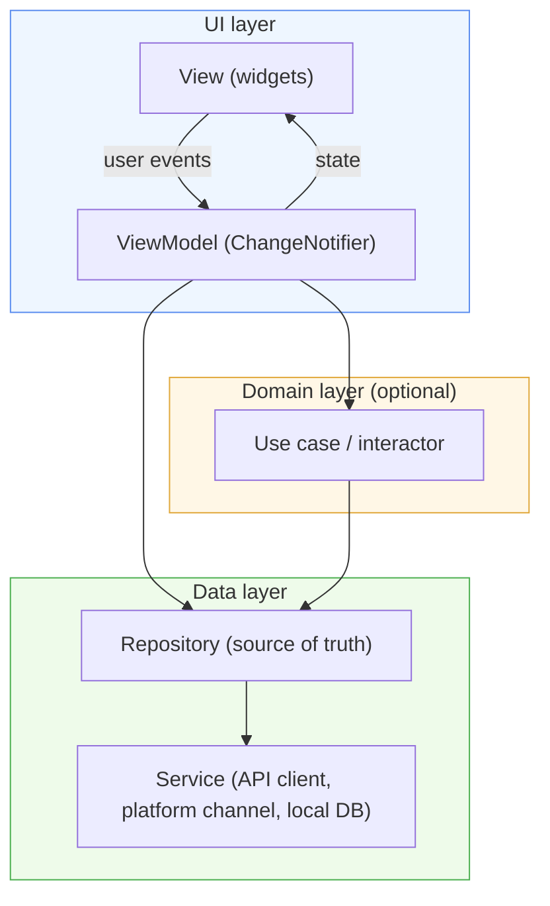
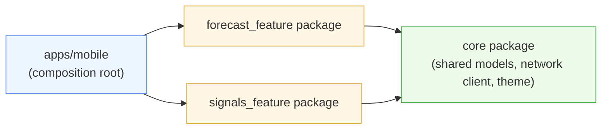

# Flutter Frontend: Architecture and Guidelines

## 1. Purpose and scope

This document defines the architectural pattern, performance practices, and code style expected in Flutter frontend work. It is a standalone technical reference, not tied to any single project's domain. It applies to any Flutter application maintained under this organization's standards, whether a mobile app, a web build, or a desktop target.

The goal is consistency. A developer who has read this document should be able to open any Flutter codebase built under it and immediately recognize where the UI logic lives, where the business logic lives, where data access happens, and how those three areas are allowed to depend on each other.

## 2. Sources

- Flutter official documentation, "App architecture" guide and its subpages: `docs.flutter.dev/app-architecture`, including the guide to app architecture, the case study, recommendations, and design patterns pages.
- Flutter official documentation, performance section: `docs.flutter.dev/perf`, including performance best practices, rendering performance, app size, deferred components, and isolates/concurrency.
- Effective Dart, the official Dart style and usage guide: `dart.dev/effective-dart`.
- Sebastian Faust, "Using Google's Flutter Framework for the Development of a Large-Scale Reference Application," Technische Hochschule Köln, 2020 (`epb.bibl.th-koeln.de/frontdoor/index/index/docId/1498`). This thesis is an academic, non-Google source and is used here to cross-check the official guidance against independently validated findings, not as a primary authority.
- The section on modularization and microfrontend-inspired structure is a pattern adapted from web microfrontend practice and Flutter's own module/add-to-app tooling. It is not an official Google term, and this document treats it as an engineering pattern to apply deliberately, not a documented Flutter feature.

## 3. Layered app architecture

Flutter's official guidance recommends a layered architecture built around MVVM (Model-View-ViewModel), organized into three layers: the UI layer, an optional domain layer, and the data layer. The rule that holds the whole structure together is simple: **dependencies point downward only.** The UI layer depends on the domain layer. The domain layer depends on the data layer. The data layer depends on nothing above it. A service never knows a repository exists, a repository never knows a view model exists, and a view never talks to a service directly.

This layering exists for four concrete reasons, all stated directly in the official guidance:

- **Separation of concerns.** Each class has one job. A view renders. A view model holds UI state. A repository is the source of truth for a kind of data. A service wraps one external system.
- **Testability.** Because inputs and outputs at each layer are simple and well defined, each layer can be tested in isolation, with the layers below it replaced by fakes or mocks.
- **Scalability.** Multiple developers can work on different layers or different features concurrently with fewer merge conflicts, because the boundaries are explicit.
- **Lower cognitive load.** A new team member can learn one layer at a time instead of having to hold the entire application in their head before making a change.

Flutter's own documentation is explicit that this structure is aimed at teams building feature-rich applications with growing codebases, and that a small app or a prototype may not need all three layers. Adopt the domain layer when business logic becomes complex enough to be reused across more than one view model, not by default.



### 3.1 UI layer

The UI layer contains **views** and **view models**, in a strict one-to-one relationship: one view model per view.

Views are built from widgets and are kept dumb by design. A view's job is to render whatever state its view model currently holds, and to forward user interaction to the view model as a command call. A view should never contain business logic, never fetch data directly, and never perform calculations on the data it displays. If a widget's `build()` method is doing anything more than reading values and composing other widgets, that logic belongs one layer down.

View models extend `ChangeNotifier` (or an equivalent observable state holder) and are responsible for:

- retrieving data from repositories or use cases,
- transforming that data into a shape the view can render directly (filtering, sorting, formatting),
- holding UI-only state such as loading flags, selection state, or scroll position,
- exposing commands, which are just methods the view calls in response to user input.

```dart
class ForecastViewModel extends ChangeNotifier {
  final ForecastRepository _repository;

  ForecastViewModel(this._repository) {
    _load();
  }

  bool isLoading = false;
  String? error;
  List<ForecastPoint> points = [];

  Future<void> _load() async {
    isLoading = true;
    notifyListeners();
    try {
      points = await _repository.getForecast();
      error = null;
    } catch (e) {
      error = e.toString();
    } finally {
      isLoading = false;
      notifyListeners();
    }
  }

  Future<void> refresh() => _load();
}
```

### 3.2 Domain layer

The domain layer is optional and holds use cases (also called interactors): classes that orchestrate one or more repositories to perform a single, named piece of business logic. A use case depends on repositories, never the other way around, and it never depends on a view model.

Add a use case only when the alternative is duplicating orchestration logic across two or more view models, or when a single operation genuinely spans multiple repositories and deserves a name of its own. Creating a use case for every single data fetch adds indirection without adding value; that is the opposite of what this layer is for.

```dart
class RefreshDashboardUseCase {
  final ForecastRepository _forecastRepository;
  final SignalRepository _signalRepository;

  RefreshDashboardUseCase(this._forecastRepository, this._signalRepository);

  Future<void> execute() async {
    await _forecastRepository.refresh();
    await _signalRepository.refresh();
  }
}
```

### 3.3 Data layer

The data layer contains **repositories** and **services**.

A repository is the single source of truth for one kind of domain model. It decides whether to serve cached data or fetch fresh data, handles retries and error translation, and exposes its data as a `Stream` or `Future` of domain objects, never as raw API responses. Repositories may depend on one or more services, and may be depended on by many view models or use cases, but a repository must never depend on another repository. If two repositories need to share information, that coordination belongs in a use case above them.

A service wraps exactly one external data source: an HTTP API, a platform channel, a local database, a file system. Services hold no state and contain no business logic. Their job is narrow: make the call, return the raw result or throw. This narrowness is what makes them easy to fake in tests and easy to reuse across multiple repositories.

```dart
class ForecastService {
  final http.Client _client;
  final Uri _baseUrl;

  ForecastService(this._client, this._baseUrl);

  Future<List<Map<String, dynamic>>> fetchForecast() async {
    final response = await _client.get(_baseUrl.resolve('/forecast'));
    if (response.statusCode != 200) {
      throw Exception('Failed to load forecast: ${response.statusCode}');
    }
    return (jsonDecode(response.body) as List).cast<Map<String, dynamic>>();
  }
}
```

## 4. State management within the architecture

The MVVM pattern is Flutter's official recommendation for organizing UI state, but it does not mandate a specific package. The view model role can be implemented with plain `ChangeNotifier` and `Provider`, with Riverpod, with Bloc/Cubit, or with a signals-based approach. What matters architecturally is not which package is chosen, but that the chosen mechanism respects the layer boundaries above: state lives in something that plays the view model role, views stay declarative, and the dependency direction is never inverted.

When choosing a state management approach for a new project, weigh:

- **Team familiarity.** A well-known tool used correctly beats an unfamiliar tool used poorly.
- **Testability of the chosen primitive.** Whatever is chosen should be trivially instantiable and observable in a unit test, without needing a widget tree.
- **Granularity of rebuilds.** Some solutions make it easier than others to scope a rebuild to exactly the widget subtree that changed; this has direct performance consequences, covered in section 7.

Whatever is chosen, document it once per project and apply it consistently. Mixing multiple state management approaches within the same feature set increases onboarding cost without a matching benefit.

## 5. Academic cross-reference: lessons from independent research

Sebastian Faust's 2020 thesis at Technische Hochschule Köln, "Using Google's Flutter Framework for the Development of a Large-Scale Reference Application," studied how to structure a large Flutter codebase before Google's official app-architecture guidance existed in its current form. The thesis is useful here precisely because it reached similar conclusions independently, through expert interviews and comparison against the state management literature of the time, rather than by following a single vendor's opinion.

Two points from the thesis are worth carrying into this document explicitly:

- **Layered architecture was identified as a necessity, not an option, once an application grows past a small size.** The thesis frames this as one of several "crossroads" a team scaling a Flutter codebase will face, independent of which specific state management library is chosen. This matches the official guidance's own framing that the three-layer structure is aimed at growing, multi-developer codebases.
- **State management choice was evaluated against testability and separation of concerns, not popularity.** The thesis compared BLoC against alternatives available at the time using these criteria, reinforcing that the choice of state management primitive is secondary to whether it lets business logic be tested without a running widget tree.

The practical takeaway: when a team debates state management packages, the debate should be framed in terms of testability and separation of concerns first. Popularity and ecosystem size are legitimate secondary factors, not primary ones.

## 6. Modularization and a microfrontends-inspired structure

Flutter has no official feature called "microfrontends." What it has is a set of tools, package-per-feature project structure, `flutter_module` for embedding Flutter in a host app (add-to-app), and deferred components for splitting an app's download, that together let a team apply the same engineering goals microfrontends pursue on the web: independently ownable, independently deployable pieces of a larger application. This section names that pattern honestly as an adaptation, not a documented Flutter concept.

### 6.1 Package-per-feature

For a single-app codebase that does not need runtime independence, the lighter-weight version of this pattern is organizing the codebase as a set of Dart packages, one per feature, inside a monorepo (using Melos or plain path dependencies). Each feature package exposes only what other features need through a small public API and keeps its view, view model, domain, and data classes internal otherwise.

```
my_app/
  packages/
    forecast_feature/
      lib/
        src/
          ui/
          domain/
          data/
        forecast_feature.dart   # public API surface
    signals_feature/
      lib/
        src/...
        signals_feature.dart
    core/
      lib/
        src/...
        core.dart                # shared models, networking client, design tokens
  apps/
    mobile/
      lib/main.dart              # composes features into one app
```

This buys most of the benefit that a monolithic `lib/features/...` folder structure does not: features can be built, tested, and versioned somewhat independently, ownership boundaries are enforced by the package boundary and not just convention, and a feature that turns out to be reusable across two apps can be published as its own package with no restructuring.



### 6.2 Runtime-level separation: add-to-app and deferred components

When feature teams genuinely need independent release cadences, Flutter's `add-to-app` support allows a Flutter module to be embedded inside one or more host apps (native Android/iOS, or another Flutter app) as a distinct unit, closer to what a microfrontend achieves on the web. Deferred components let parts of an app's Dart code and assets be downloaded on demand rather than bundled into the initial install, which supports a similar goal of shipping a smaller core and loading feature modules lazily.

These tools carry real operational cost: version skew between host and module, more complex CI/CD, and debugging that spans process or module boundaries. Reach for package-per-feature first, and only escalate to module-level separation when there is a concrete organizational reason, separate teams needing separate release trains, a feature that must be reused across otherwise unrelated apps, not as a default starting structure.

## 7. Performance: advanced topics

Flutter's performance guidance is organized around a hard constraint: on a 60Hz display, an app has 16 milliseconds to produce a frame, split roughly between building (UI thread) and rendering (GPU thread). On 120Hz devices, that budget halves. Every technique below exists to stay inside that budget, or to reduce cost outside the per-frame path (memory, app size, startup time).

### 7.1 Controlling build() cost

`build()` runs every time a widget's dependencies change, so its cost multiplies across the frame budget. The concrete levers:

- **Use `const` constructors wherever possible.** A `const` widget is built once and Flutter can skip rebuilding it entirely when its parent rebuilds. Enable the `prefer_const_constructors` and related lints from `flutter_lints` so this is enforced automatically rather than remembered by convention.
- **Localize `setState()` calls.** Call `setState()` (or trigger `notifyListeners()`) on the smallest widget or view model that actually owns the changed state, not higher up the tree. A `setState()` call at the top of a large screen rebuilds everything beneath it.
- **Split large widgets along their change boundaries.** If one part of a widget subtree changes frequently and another part rarely does, they should be separate widgets, so the frequently changing part can rebuild without dragging the rest along.
- **Prefer `StatelessWidget` composition over helper methods that return widgets.** A helper method that returns a `Widget` still executes as part of the parent's `build()` and gives Flutter no independent element to diff against; a separate widget class does.
- **Avoid expensive work inside `build()`** entirely, no network calls, no heavy computation, no allocation of large collections. `build()` should read already-computed state and compose widgets.

### 7.2 Widget rebuild profiling

Use Flutter DevTools' Performance view to see actual frame build and raster times, and the "track widget rebuilds" feature to see which widgets rebuilt on a given frame and why. A frame consistently over the 16ms (or 8ms on 120Hz) budget is a signal to profile, not guess. Profile in profile mode, not debug mode; debug mode carries overhead (assertions, uncompiled JIT paths) that does not reflect production performance.

### 7.3 Costly widgets and effects

- **`saveLayer()` is expensive.** It allocates an offscreen buffer and forces a GPU render target switch. It is triggered implicitly by widgets like `Opacity`, `ShaderMask`, and `ColorFilter`, and by `Clip.antiAliasWithSaveLayer`. Prefer applying a semi-transparent color directly (`Colors.black.withOpacity(0.5)` as a `Container` color) over wrapping a subtree in `Opacity`. Use `AnimatedOpacity` or `FadeInImage` for fade effects instead of animating an `Opacity` widget's value every frame. DevTools' "checkerboard offscreen layers" option visualizes every `saveLayer()` call so they can be located and removed or minimized.
- **Clipping is cheaper than `saveLayer()` but not free.** Prefer `borderRadius` on a `Container`'s decoration over `ClipRRect` where the effect is equivalent, and avoid `Clip.antiAliasWithSaveLayer` specifically, since it forces the same offscreen buffer cost as `saveLayer()`.
- **Avoid overriding `operator==` on widgets** except on cheap leaf widgets; an expensive equality check runs on every comparison during the widget diffing process and can produce quadratic-feeling slowdowns across a large tree.

### 7.4 Shader compilation jank

The first time Flutter's rendering engine compiles a given shader, typically the first time a particular visual effect (a gradient, a shadow, a certain blend mode) appears on screen, that compilation can stall a frame and produce a visible stutter, independent of how efficient the surrounding widget code is. This is most noticeable the first time a user scrolls into a new part of the UI. Mitigate it by generating and shipping a Skia Shading Language (SkSL) warm-up bundle from a representative profiling run, so shaders are pre-compiled at app startup rather than at the moment they are first needed on screen. Impeller, Flutter's newer rendering backend, removes most of this class of jank by compiling shaders ahead of time as part of the build rather than at runtime; where available for the target platform, prefer it.

### 7.5 Lists, grids, and layout passes

- **Always use `ListView.builder`, `GridView.builder`, or slivers for long or unbounded lists**, never a `ListView` constructed with a fully materialized `children` list. The builder form only constructs the items currently visible (plus a small cache extent), which keeps both build time and memory bounded regardless of list length.
- **Avoid intrinsic layout passes on large lists and grids** (`IntrinsicHeight`, `IntrinsicWidth`, and equivalent internal queries), since they require Flutter to lay out every child once to measure it before laying it out again to actually place it. Where sizes vary, fix cell sizes upfront or size cells relative to a single anchor cell rather than letting the framework compute an intrinsic size for every cell. DevTools' "track layouts" option surfaces exactly which widgets are triggering these extra passes.

### 7.6 Isolates for heavy computation

Dart is single-threaded per isolate, so any CPU-bound work, JSON parsing of a large payload, image processing, running a local model, done on the main isolate blocks frame building for its entire duration. Move CPU-bound work off the UI isolate with `compute()` for a simple one-shot function, or a long-lived `Isolate` (via `Isolate.spawn` or the `isolate` package's helpers) when the work is recurring or needs a persistent channel back to the UI isolate. This is not about I/O, `async`/`await` already keeps I/O off the UI thread without isolates, it is specifically about computation that would otherwise occupy the CPU for multiple milliseconds at a time.

### 7.7 Image handling

Decoding and caching images is a common, under-examined cost. Decode images at the resolution they will actually be displayed at, using `cacheWidth`/`cacheHeight` on `Image` or the equivalent resize parameters on the image provider, rather than decoding a full-resolution source image and letting the GPU downscale it every frame. Flutter's `ImageCache` holds decoded images in memory; for screens with many large images, monitor cache size with DevTools' memory view and consider `PaintingBinding.instance.imageCache.maximumSizeBytes` if memory pressure becomes an issue.

### 7.8 App size and deferred components

App size affects install conversion and, on some platforms, initial load time. The concrete levers:

- **Tree shaking removes unused code automatically** in release builds, but only where the compiler can prove a symbol is unreachable; heavy use of reflection-like patterns (large `switch` statements driven by dynamic strings mapping to types, for instance) can defeat it.
- **Deferred components** (`deferred as` imports, paired with the deferred components tooling for Android app bundles) let rarely used features, an admin panel, a rarely visited settings deep-dive, an optional export format, be downloaded after initial install rather than bundled into it.
- **Audit asset weight explicitly.** Vector formats and appropriately compressed raster formats for images, and trimming unused localization bundles and fonts, are usually the largest quick wins in a size audit, larger than most code-level optimization.

## 8. Code style and best practices

This section summarizes Effective Dart, the official Dart style guide, organized into its four parts: style, documentation, usage, and design.

### 8.1 Naming (style)

- Types (classes, enums, typedefs, type parameters) use `UpperCamelCase`.
- Packages, directories, and file names use `lowercase_with_underscores`.
- Everything else, variables, parameters, and named constructors, uses `lowerCamelCase`.
- Prefer names that read naturally in the position they're used: `list.isEmpty`, not `list.checkIfEmpty()`.
- Avoid abbreviations unless they are more widely recognized than the full word (`id`, `url`) would be understood immediately by any reader.

### 8.2 Formatting (style)

- Run `dart format` as part of the standard workflow, ideally as a pre-commit hook or CI check, rather than relying on manual formatting. Formatting should never be a topic of code review discussion.
- Prefer keeping lines at 80 characters or fewer; `dart format` enforces this automatically.
- Always use curly braces for control flow statements, including single-line `if` bodies. This avoids a well-known class of bug where a later single added line silently falls outside the intended scope.
- Order imports as: `dart:` imports, then `package:` imports, then relative imports, each group separated by a blank line and alphabetized within the group.

### 8.3 Documentation

- Use `///` doc comments on all public API members: classes, public methods, public fields, top-level functions.
- Start every doc comment with a single, concise sentence that stands alone as a summary; tools and IDEs surface only this first sentence in many contexts.
- Use square brackets (`[identifier]`) to cross-reference other in-scope identifiers in doc comments; this creates a live link in generated documentation.
- Keep markdown and HTML inside doc comments minimal. A doc comment is read as plain text as often as it is rendered.

### 8.4 Usage

- Prefer string interpolation (`'$value'` or `'${expr}'`) over string concatenation.
- Prefer collection literals (`[1, 2, 3]`, `{'a': 1}`) over explicit constructor calls where a literal is available.
- Use `async`/`await` rather than chaining raw `Future` callbacks; it reads linearly and produces clearer stack traces on error.
- Avoid bare `catch` clauses without an `on` type; catching every exception type indiscriminately hides bugs that should surface during development and complicates recovery logic that assumes a specific failure mode.
- Prefer tear-offs (`list.forEach(print)`) over an equivalent lambda (`list.forEach((e) => print(e))`) when no transformation is needed.

### 8.5 Design

- Keep the public surface of a library or package small. Make a declaration private (`_name`) unless there is a specific reason for other code to use it directly.
- Prefer named, descriptive parameters over positional booleans; a call site like `Text('Hi', softWrap: false)` is self-documenting, while `Text('Hi', false)` is not.
- When overriding `==`, always override `hashCode` to match; the two must agree or the object will behave incorrectly in any hash-based collection.
- Favor immutable data classes for models passed between layers. Immutability removes an entire category of bug where one layer mutates state another layer is still reading, and it plays well with `const` widget optimization in the UI layer.
- Avoid putting logic that belongs in a view model, or a repository, into a widget's constructor or `build()` method, even when it would technically compile there. The layering described in section 3 only holds if it is followed inside individual classes, not just at the folder level.

### 8.6 Linting

Enable `package:flutter_lints` (or a stricter superset, such as `package:very_good_analysis`, where the team wants tighter enforcement) in `analysis_options.yaml` on every project from day one. Linting after the fact on an established codebase produces hundreds of violations that are expensive to triage; linting from the start keeps the cost near zero.

## 9. Testing and how the architecture supports it

The layered structure exists in large part to make testing tractable without spinning up a widget tree for every test:

- **Domain layer (use cases) and data layer (repositories, services)** are tested with plain Dart unit tests. A repository test replaces its service dependency with a fake or mock and asserts on caching, error translation, and stream emission behavior directly.
- **View models** are tested as plain `ChangeNotifier` objects, replacing repositories with fakes, asserting on the sequence of state changes and `notifyListeners()` calls without ever constructing a widget.
- **Views** are tested with `flutter_test`'s widget testing tools, supplying a fake or mock view model and asserting on rendered output and interaction behavior, not on business logic, which is already covered at the layers below.

A codebase where most logic lives in views, and most tests are therefore widget tests, is a sign the layering in section 3 has not actually been followed, whatever the folder structure suggests.

## 10. Quick reference checklist

- UI depends on domain; domain depends on data; data depends on nothing above it. No exceptions, no shortcuts through a service locator.
- One view, one view model. Views render; they do not fetch, transform, or decide.
- Add a domain layer only when orchestration logic is shared across view models or a workflow spans multiple repositories.
- Repositories never depend on other repositories. Services hold no state and no business logic.
- Use `const` constructors and the `flutter_lints` package from day one.
- Profile in profile mode with DevTools before optimizing; do not guess.
- Long lists always use `.builder` constructors. Never materialize a large `children` list.
- Move genuinely CPU-bound work off the UI isolate with `compute()` or `Isolate.spawn`.
- Decode images at display resolution; do not decode full-resolution sources and downscale on the GPU every frame.
- Run `dart format` and a linter in CI. Formatting is not a matter of preference or review discussion.
- Name the modularization pattern honestly: package-per-feature for most teams, add-to-app and deferred components only when a real organizational need justifies the added operational cost.
