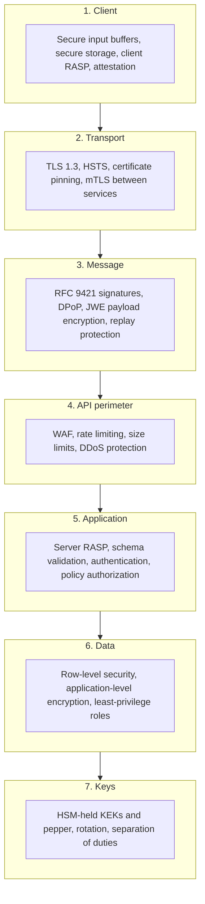
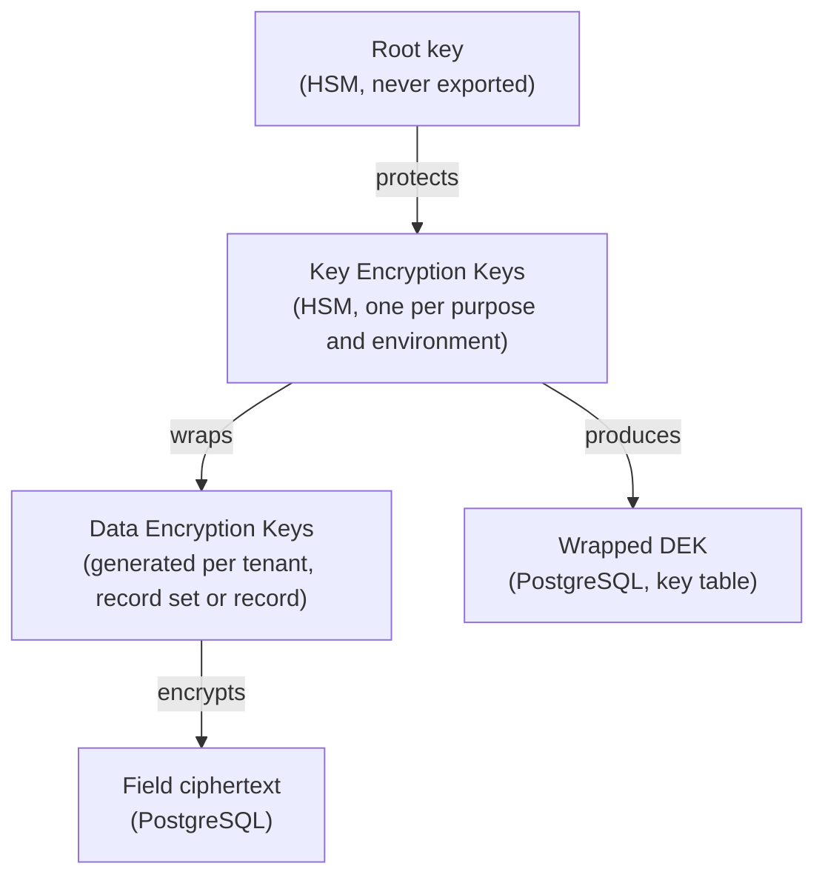
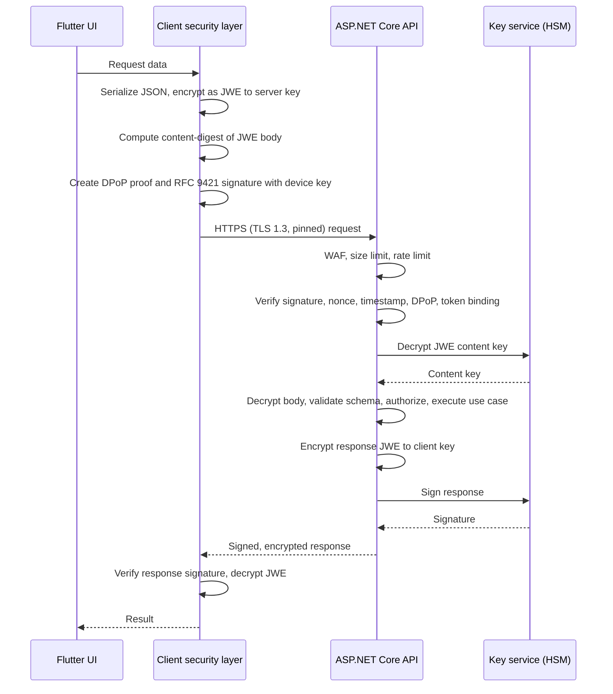

# Security: Defense in Depth

## 1. Purpose, status and scope

This document is the binding cybersecurity reference for every project built on the stacks documented in this repository.

**Status.** Binding. Every rule marked MUST or MUST NOT is mandatory. No waiver, exception or temporary bypass is permitted. When a rule conflicts with a feature requirement, the conflict is raised with the project owner and resolved before implementation continues. The resolution is either a change to the feature, code never silently deviates from it.

**Scope.** The document covers three tiers and everything between them:

| Tier | Technology | Targets |
|---|---|---|
| Frontend | Flutter | iOS, Android, Web, Desktop (macOS, Windows, Linux) |
| Backend | ASP.NET Core API | All deployed environments |
| Database | PostgreSQL | All deployed environments, including replicas and backups |

**Relationship to other documents.**

- `docs/ASPNET_API_ARCHITECTURE.md` and `docs/FLUTTER_ARCHITECTURE.md` define structure and coding standards. Where they describe a security-relevant mechanism, this document defines the minimum it must satisfy.
- `docs/GDPR.md` defines personal data rules. Every control here that touches personal data is applied together with `docs/GDPR.md`. When both documents apply, the stricter requirement wins.

**Governing idea.** No single control is sufficient on its own. Every layer is designed on the assumption that the layers around it have already failed. A stolen access token does not allow request forgery without the device key. A compromised TLS terminator does not expose request bodies. A bypassed API authorization check is still caught inside the use case and by row-level security. A stolen database backup yields only ciphertext. A stolen ciphertext is useless without a separately audited call to the key service.

## 2. Normative language and rule identifiers

The keywords MUST, MUST NOT, REQUIRED, SHALL, SHALL NOT, SHOULD, SHOULD NOT and MAY are interpreted as described in RFC 2119 and RFC 8174 when they appear in capitals.

Because no waivers exist (section 1), SHOULD is used only where a stronger alternative is also acceptable. Choosing not to follow a SHOULD requires the stronger alternative, or an equivalent control, to be in place and recorded in the feature's threat model.

Every rule has a stable identifier of the form `SEC-<AREA>-<NN>`, for example `SEC-ALE-03`. Identifiers are cited in code reviews, threat models, test names and pull request descriptions. A removed rule's identifier is never reused.

| Area code | Section | Topic |
|---|---|---|
| `GOV` | 1 to 4 | Governance, baselines, threat modeling |
| `CLS` | 5 | Data classification |
| `CRY` | 6 | Cryptographic standards |
| `KEY` | 7 | Key management and envelope encryption |
| `ALE` | 8 | Application-level encryption |
| `TLS` | 9 | Transport security |
| `SIG` | 10 | Request and response signing |
| `JWE` | 11 | Request and response encryption |
| `AUTH` | 12 | Authentication and sessions |
| `PWD` | 13 | Frontend password handling |
| `AUTHZ` | 14 | Authorization and RBAC |
| `DB` | 15 | Database security and RLS |
| `RASP` | 16 | Runtime application self-protection |
| `APP` | 17 | Application-layer defenses |
| `FE` | 18 | Frontend platform hardening |
| `LLM` | 19 | LLM layer and ingested third-party text |
| `INF` | 20 | Secrets and infrastructure |
| `OPS` | 21 | Logging, monitoring, incident response |
| `SDLC` | 22 | Secure development lifecycle and supply chain |

## 3. Verification baselines

This document sits on top of recognized verification standards. It adds to them; it never weakens them.

- **SEC-GOV-01.** The ASP.NET Core API and the Flutter Web build MUST satisfy OWASP ASVS 5.0 at Level 3.
- **SEC-GOV-02.** The Flutter iOS and Android builds MUST satisfy OWASP MASVS at Level L2 together with the Resilience (R) profile.
- **SEC-GOV-03.** The Flutter Desktop builds MUST satisfy the MASVS L2 storage, cryptography, authentication, network and code requirements that are applicable to a desktop operating system, and the ASVS 5.0 Level 3 requirements for any embedded web content.
- **SEC-GOV-04.** Every PostgreSQL instance MUST satisfy the CIS PostgreSQL Benchmark for the deployed major version, Level 2 profile.
- **SEC-GOV-05.** Any component that sends data to, or acts on output from, a large language model MUST satisfy the OWASP Top 10 for LLM Applications (section 19).
- **SEC-GOV-06.** Where a baseline and this document differ, the stricter requirement applies.

## 4. Threat model and defense-in-depth layers

### 4.1 Layer model

Each layer holds on its own. A request that defeats one layer is still subject to every layer after it.

| Failure assumed | Layer that still holds |
|---|---|
| TLS terminated or inspected by a hostile intermediary | JWE keeps bodies confidential; signatures detect tampering |
| Access token stolen from memory or logs | DPoP and RFC 9421 require the non-exportable device key |
| Request replayed | Nonce store and timestamp window reject it |
| Client binary tampered or instrumented | Server-side attestation verification and server-side authorization |
| API authorization check missing on a new endpoint | Use-case authorization and RLS |
| Application bug issues an unfiltered query | RLS returns only the caller's rows |
| Database or backup exfiltrated | ALE ciphertext without the KEK |
| Application host compromised | KEKs and pepper never leave the HSM; every unwrap is audited and rate limited |

### 4.2 Threat modeling

- **SEC-GOV-07.** Every feature that handles Confidential or Restricted data (section 5), adds an endpoint, changes authentication or authorization, or adds a third-party dependency or service MUST have a STRIDE threat model before implementation starts.
- **SEC-GOV-08.** The threat model MUST list each threat, the rule identifiers that mitigate it, and the tests that verify those rules. It is stored with the feature's document under `docs/features/`.
- **SEC-GOV-09.** A threat without a mitigating rule MUST be resolved before the feature is implemented. Accepting an unmitigated threat is not permitted.

## 5. Data classification

Every field, file, log event and message is assigned one class. The class decides the mandatory controls. When a data item fits more than one class, the highest applies.

| Class | Definition | Examples (generic) |
|---|---|---|
| Public | Intended for anyone | Published content, public reference data |
| Internal | No harm to individuals if disclosed; not meant for the public | Feature flags, non-personal configuration, aggregate metrics |
| Confidential | Personal data or business data whose disclosure harms individuals or the organization | Email address, name, user preferences, user-generated records, IP addresses |
| Restricted | Data whose disclosure causes severe or irreversible harm, or that grants access | Credentials, password hashes, tokens, key material, third-party credentials held for users, special category personal data, financial records |

| Control | Public | Internal | Confidential | Restricted |
|---|---|---|---|---|
| TLS 1.3 in transit (section 9) | MUST | MUST | MUST | MUST |
| JWE payload encryption (section 11) | MUST | MUST | MUST | MUST |
| Storage-level encryption at rest | MUST | MUST | MUST | MUST |
| ALE (section 8) | MAY | MAY | MUST | MUST |
| Dedicated DEK per record (section 7) | MAY | MAY | MAY | MUST |
| RLS policy (section 15) | MAY | MUST | MUST | MUST |
| Allowed in logs, traces, metrics | Yes | Yes | MUST NOT | MUST NOT |
| Allowed in URLs and query strings | Yes | Yes | MUST NOT | MUST NOT |
| Cached on the client | Yes | Yes | Only encrypted (section 18) | MUST NOT, except tokens and keys in secure storage |
| Sent to an LLM (section 19) | Yes | Yes | Only as allowed by `docs/GDPR.md` | MUST NOT |
| Access audited (section 21) | No | No | Writes | Reads and writes |

- **SEC-CLS-01.** Every persisted field MUST have a class recorded in the entity configuration or schema documentation of the owning feature.
- **SEC-CLS-02.** An unclassified field MUST be treated as Restricted until classified.
- **SEC-CLS-03.** Reclassifying a field to a lower class MUST go through a threat model update (SEC-GOV-07).
- **SEC-CLS-04.** Retention and deletion periods for Confidential and Restricted data MUST follow `docs/GDPR.md`.

## 6. Cryptographic standards

### 6.1 Approved algorithms

Only the following algorithms and parameters are permitted. Anything absent from this table is forbidden.

| Purpose | Approved algorithm and parameters |
|---|---|
| Symmetric authenticated encryption | AES-256-GCM, 96-bit random nonce, 128-bit tag |
| Key wrapping (inside the HSM) | AES-256 key wrap (RFC 3394 / RFC 5649) or AES-256-GCM |
| Digital signatures | ECDSA P-256 with SHA-256; Ed25519 where both peers support it |
| Key agreement | ECDH P-256 (ECDH-ES in JWE) |
| Message authentication and blind indexes | HMAC-SHA-256 |
| Key derivation | HKDF-SHA-256 |
| Hashing (non-password) | SHA-256, SHA-384, SHA-512 |
| Password hashing | Argon2id (section 12) |
| Transport | TLS 1.3 (section 9) |
| Random generation | Operating system CSPRNG |

### 6.2 Rules

- **SEC-CRY-01.** Cryptography MUST be implemented only through the platform's vetted cryptographic providers or libraries that call them. Writing a custom cryptographic primitive, mode or protocol is forbidden.
- **SEC-CRY-02.** The following are forbidden for any purpose that relies on a security property: MD5, SHA-1, DES, 3DES, RC4, AES-ECB, AES-CBC without an authenticated construction, RSA PKCS#1 v1.5 encryption, RSA keys under 3072 bits, static or hard-coded IVs and nonces, and non-cryptographic random generators. The only permitted use of SHA-1 is as a non-secret lookup identifier when matching against a published breached-password corpus (SEC-AUTH-04), where it provides no security property.
- **SEC-CRY-03.** All keys, nonces, salts, tokens, identifiers used for security decisions and challenge values MUST come from the operating system CSPRNG.
- **SEC-CRY-04.** An AES-GCM key MUST NOT encrypt more than 2^32 messages with random nonces. The key service tracks usage per DEK and rotates before the limit.
- **SEC-CRY-05.** Every ciphertext, signature and wrapped key MUST carry a header that states the algorithm identifier and key version. Decryption selects the algorithm from this header and rejects any identifier not in the approved table. This is what makes algorithm and key rotation possible without data migration.
- **SEC-CRY-06.** Comparison of MACs, tags, tokens, hashes and any other secret-derived values MUST use constant-time comparison.
- **SEC-CRY-07.** Key material, plaintext secrets and decrypted Restricted data MUST be held in mutable byte buffers that are overwritten with zeros immediately after use. On .NET this means `byte[]` or `Span<byte>` cleared with `CryptographicOperations.ZeroMemory`, allocated pinned (`GC.AllocateArray<byte>(length, pinned: true)`) so the garbage collector cannot copy it. Immutable `string` instances MUST NOT hold secrets.

## 7. Key management and envelope encryption

### 7.1 Key hierarchy

Envelope encryption works as follows. The application asks the key service for a new DEK. It receives the plaintext DEK and the same DEK wrapped by a KEK. The plaintext DEK encrypts data in the application process and is then erased. The wrapped DEK is stored in the database. To decrypt, the application sends the wrapped DEK to the key service, which unwraps it inside the HSM and returns the plaintext DEK over an authenticated channel. The KEK never leaves the HSM.

This gives three properties: the database alone holds only ciphertext and wrapped keys; every unwrap is an audited, authorized, rate-limited call; and rotating a KEK means re-wrapping small DEKs, not re-encrypting all data.

### 7.2 Key service capabilities

- **SEC-KEY-01.** KEKs, the root key, the password pepper (SEC-AUTH-06) and the server signing and encryption private keys (sections 10 and 11) MUST be generated and held in an HSM validated to FIPS 140-3 Level 3 or higher, and MUST be marked non-exportable.
- **SEC-KEY-02.** The key service MUST support: wrap and unwrap operations performed inside the HSM; per-key access policies bound to workload identity (SEC-INF-03); immutable audit logs of every operation; key versioning; scheduled and on-demand rotation; disabling a key without destroying it; and scheduled destruction with a waiting period.
- **SEC-KEY-03.** Each KEK MUST serve exactly one purpose in exactly one environment (for example, "Confidential field encryption, production"). Keys are never shared between environments, purposes or tenants' isolation boundaries.

### 7.3 DEK lifecycle

- **SEC-KEY-04.** A DEK MUST be 256 bits, generated by the key service or the CSPRNG (SEC-CRY-03), and wrapped immediately.
- **SEC-KEY-05.** DEK scope MUST follow data class: at least one DEK per tenant for Confidential data, and one DEK per record for Restricted data (section 5).
- **SEC-KEY-06.** Plaintext DEKs MAY be cached in process memory only, for at most 5 minutes and at most 1,000 entries per process, in pinned buffers that are zeroed on eviction (SEC-CRY-07). Plaintext DEKs MUST NOT be written to disk, a distributed cache, logs or crash dumps. Crash dumps are disabled on production API hosts.
- **SEC-KEY-07.** The stored wrapped DEK MUST record the KEK identifier and version that wrapped it (SEC-CRY-05).

### 7.4 Rotation, compromise and destruction

- **SEC-KEY-08.** KEKs MUST be rotated at least every 12 months. After rotation, new DEKs are wrapped with the new version and a background process re-wraps existing DEKs. The old KEK version is disabled once no wrapped DEK references it.
- **SEC-KEY-09.** On suspected compromise of any key, the key MUST be rotated immediately, every DEK it wrapped re-wrapped, and data encrypted under an exposed DEK re-encrypted under a new DEK. The incident process in section 21 applies.
- **SEC-KEY-10.** Key destruction MUST require approval by two authorized people (dual control) and MUST respect a waiting period during which the destruction can be cancelled.
- **SEC-KEY-11.** Crypto-shredding MUST be available: destroying a per-record or per-subject DEK makes that data permanently unreadable, including in backups. This supports erasure obligations defined in `docs/GDPR.md`.

### 7.5 Separation of duties

- **SEC-KEY-12.** Identities that can use a key (encrypt, decrypt, wrap, unwrap, sign) MUST NOT be able to administer it (create, change policy, rotate, disable, destroy), and the reverse.
- **SEC-KEY-13.** No human identity may hold unwrap permission on production KEKs. Only the production workload identity may unwrap.
- **SEC-KEY-14.** The key service MUST alert on unwrap volume above the established baseline for each workload, and throttle unwraps above a hard limit (section 21).

## 8. Application-level encryption (ALE)

ALE encrypts selected fields in application code before they reach the database. Storage-level encryption at rest protects against lost disks. ALE protects against anyone with database access, backup access or a leaked connection string.

- **SEC-ALE-01.** Every Confidential and Restricted field MUST be encrypted with ALE before it is persisted (section 5).
- **SEC-ALE-02.** ALE MUST use AES-256-GCM with a DEK obtained through envelope encryption (section 7) and a fresh random 96-bit nonce per encryption.
- **SEC-ALE-03.** The ciphertext MUST be bound to its location with additional authenticated data (AAD) containing at least: schema and table name, column name, the row's primary key, the tenant identifier where one exists, and the key version. A ciphertext copied into another row, column or tenant fails authentication and is rejected.
- **SEC-ALE-04.** The stored value MUST use a versioned envelope: format version, algorithm identifier, DEK reference, nonce, ciphertext and tag (SEC-CRY-05). It is stored in a `bytea` column.
- **SEC-ALE-05.** Equality lookup on an encrypted field MUST use a blind index: HMAC-SHA-256 of the normalized plaintext under a dedicated index key separate from every encryption key, stored in its own column. Blind indexes MUST NOT be created for low-cardinality fields, because their values can be inferred from frequency. Range queries, sorting and partial matching on ALE fields are not permitted; features that need them are redesigned.
- **SEC-ALE-06.** Encryption and decryption MUST happen only in the application core through a dedicated port (section 23). Controllers, repositories and database functions MUST NOT decrypt. PostgreSQL MUST NOT receive plaintext or keys for encryption (no database-side encryption functions with application keys).
- **SEC-ALE-07.** Decrypted values MUST NOT be logged, placed in exception messages, cached in shared or distributed caches, or returned in responses beyond what the caller is authorized to see.
- **SEC-ALE-08.** A decryption failure MUST be treated as a security event (section 21) and MUST NOT fall back to returning ciphertext or a default value.

## 9. Transport security

- **SEC-TLS-01.** All external endpoints MUST accept TLS 1.3 only. Plain HTTP MUST NOT be served, including redirects, on API hosts.
- **SEC-TLS-02.** Every response MUST include `Strict-Transport-Security: max-age=63072000; includeSubDomains; preload`, and the domain MUST be on the HSTS preload list.
- **SEC-TLS-03.** Server certificates MUST use ECDSA P-256 or RSA 3072 bits or higher, be issued by a public CA with Certificate Transparency, and be protected by CAA DNS records. OCSP stapling MUST be enabled.
- **SEC-TLS-04.** The iOS, Android and Desktop builds MUST pin the SubjectPublicKeyInfo (SPKI) hash of the API's certificate keys, with at least one backup pin for a key held offline. A pin failure MUST abort the connection and be reported as a security event. Pinning MUST NOT be disabled by configuration in a release build.
- **SEC-TLS-05.** Flutter Web cannot pin certificates. On Web the compensating controls are HSTS preload (SEC-TLS-02), JWE payload encryption to a pinned server key (SEC-JWE-03) and response signatures (SEC-SIG-10).
- **SEC-TLS-06.** The API MUST connect to PostgreSQL over TLS with `sslmode=verify-full` and a pinned CA. PostgreSQL MUST refuse non-TLS connections (SEC-DB-10).
- **SEC-TLS-07.** Service-to-service calls inside the environment MUST use mutual TLS with workload identities (SEC-INF-03). Being on an internal network is not a form of authentication.
- **SEC-TLS-08.** Certificate validation MUST NOT be disabled or relaxed in any build or environment. A build that accepts all certificates is not allowed to exist, including for tests; tests use a dedicated test CA (SEC-SDLC-09).

## 10. Request and response signing

### 10.1 Keys and registration

Every installation of the client holds its own asymmetric key pairs. The signing key proves that each request comes from the specific installation that authenticated, and not from whoever holds a copy of the token.

- **SEC-SIG-01.** On first use, the client MUST generate an ECDSA P-256 signing key pair that is non-exportable:
  - iOS and macOS: in the Secure Enclave.
  - Android: in StrongBox where present, otherwise in the TEE-backed Keystore.
  - Windows and Linux: in the TPM where present, otherwise in the operating system's protected key store.
  - Web: as a WebCrypto `CryptoKey` with `extractable: false`, stored in IndexedDB.
- **SEC-SIG-02.** The client MUST generate a second, separate P-256 key pair used only for response encryption (SEC-JWE-04). A key is never used for both signing and encryption.
- **SEC-SIG-03.** The public keys MUST be registered with the backend during login, inside the login request, which is itself signed by the new signing key (proof of possession). On iOS and Android the registration MUST include a hardware key attestation and an operating system app attestation that the backend verifies before accepting the key (SEC-RASP-07). The backend stores each public key with its user, installation identifier and attestation result.
- **SEC-SIG-04.** A registered key MUST be revoked on logout, password change, detected compromise, account deletion and after 90 days of inactivity. A revoked key cannot be reactivated; the client generates a new pair.

### 10.2 Signing requests

- **SEC-SIG-05.** Every API request MUST carry an HTTP Message Signature (RFC 9421) made with the installation signing key. The signature base MUST cover at least:
  - `@method`
  - `@target-uri`
  - `content-digest` (RFC 9530, SHA-256) when a body is present
  - `content-type` when a body is present
  - `authorization` and `dpop` when present
  - the `created` parameter
  - the `nonce` parameter (128-bit random value)
  - the `keyid` parameter (registered key identifier)
  - the `tag` parameter with the fixed application value, so a signature made for another protocol cannot be accepted
- **SEC-SIG-06.** The backend MUST reject a request, before any other processing, when: the signature is missing or invalid; a required component is not covered; `created` is more than 60 seconds away from server time; the nonce has already been seen within the replay window; the key is unknown, revoked or does not belong to the token's subject; or the `content-digest` does not match the received body.
- **SEC-SIG-07.** The backend MUST store seen nonces per key in a shared replay store with a time to live of at least 120 seconds, and the store MUST be consulted atomically (check and insert in one operation).

### 10.3 Token binding

- **SEC-SIG-08.** Access tokens MUST be sender-constrained with DPoP (RFC 9449) using the installation signing key. The token carries the key thumbprint in `cnf.jkt`. DPoP proofs MUST include `htm`, `htu`, `iat`, `jti`, `ath` and, when the server issues one, the server `nonce`.
- **SEC-SIG-09.** Access tokens MUST expire within 5 minutes. Refresh tokens MUST be bound to the same key, rotated on every use, and invalidated as a family on reuse detection, which also revokes the installation key (SEC-SIG-04) and raises a security event.

### 10.4 Signing responses

- **SEC-SIG-10.** Every API response MUST carry an RFC 9421 signature made with a server response-signing key held in the HSM. It covers `@status`, `content-digest`, `content-type` and the request's signature via the `req` parameter, which binds the response to the request that caused it.
- **SEC-SIG-11.** The client MUST verify the response signature against the server public keys shipped in the build, and MUST discard any response that fails verification. The server public key set is rotated by publishing a new set signed by an offline root key whose public key is pinned in the client.

### 10.5 Request pipeline

## 11. Request and response encryption

TLS protects data between the client and the first TLS terminator. Load balancers, CDNs, WAFs, proxies and observability agents that terminate or inspect TLS see plaintext. Message-level encryption keeps bodies confidential end to end between the client security layer and the API application code.

- **SEC-JWE-01.** Every request body and every response body MUST be a JWE in compact serialization (RFC 7516), using `alg` = `ECDH-ES+A256KW` and `enc` = `A256GCM`. The content type is `application/jose`.
- **SEC-JWE-02.** Requests without a body MUST NOT carry Confidential or Restricted values in the URL, path or headers (section 5). An operation that needs such a value as input uses a request with an encrypted body.
- **SEC-JWE-03.** Requests MUST be encrypted to the server's current encryption public key. Its private key is held in the HSM (SEC-KEY-01). The client obtains the server's encryption public keys only from the key set signed by the pinned offline root key (SEC-SIG-11), never from an unauthenticated source.
- **SEC-JWE-04.** Responses MUST be encrypted to the installation's registered encryption public key (SEC-SIG-02).
- **SEC-JWE-05.** The JWE protected header MUST include `kid`, `iat`, a request identifier, and the HTTP method and path of the request. The receiver rejects a JWE whose header values do not match the actual request, which prevents a valid body being moved to another endpoint.
- **SEC-JWE-06.** The order MUST be encrypt, then sign: the RFC 9421 `content-digest` is computed over the JWE, so the signature is verified before any decryption work is done (SEC-SIG-06).
- **SEC-JWE-07.** Every decryption, header, algorithm or key failure MUST produce the same generic error response and MUST be logged as a security event without the payload. Algorithms not listed in SEC-JWE-01, including `none` and `dir`, MUST be rejected.
- **SEC-JWE-08.** Error responses after the signature has been verified MUST also be encrypted and signed. Errors returned before verification contain only a generic status and a correlation identifier.

## 12. Authentication and sessions

### 12.1 Password rules

The backend owns password verification. These rules follow NIST SP 800-63B-4.

- **SEC-AUTH-01.** A password MUST be at least 15 characters. The maximum accepted length MUST be at least 64 characters and MUST NOT exceed 256 bytes in UTF-8, enforced by both client and server.
- **SEC-AUTH-02.** All printable Unicode characters and spaces MUST be accepted. The password MUST be normalized to Unicode NFKC before hashing, on the server, inside a byte buffer (SEC-CRY-07).
- **SEC-AUTH-03.** Composition rules (required character types) and periodic forced changes MUST NOT be used. A change is forced only on evidence of compromise.
- **SEC-AUTH-04.** A new or changed password MUST be rejected if it appears in the breached-password corpus. The corpus is held locally by the backend, refreshed at least every 90 days, and checked inside the backend. The candidate password, and any hash or prefix of it, MUST NOT be sent to any external service. The password MUST also be rejected if it contains the account's email address or display name, or the application name.
- **SEC-AUTH-05.** Password hints, knowledge-based questions and password disclosure by email are forbidden.

### 12.2 Password storage

- **SEC-AUTH-06.** Passwords MUST be hashed with Argon2id using at least: 64 MiB memory, 3 iterations, parallelism 1, a 128-bit random salt per password, and a 256-bit output. The Argon2id output MUST then be processed with HMAC-SHA-256 inside the HSM under a pepper key that never leaves it (SEC-KEY-01). Only the peppered result, the salt, the parameters and the pepper key version are stored.
- **SEC-AUTH-07.** The stored record MUST include the algorithm identifier, parameters and pepper version (SEC-CRY-05). On successful login, a record with parameters below the current minimum is re-hashed with current parameters.
- **SEC-AUTH-08.** Password hashing MUST run on a bounded worker pool with a queue limit, so a flood of login attempts cannot exhaust memory. Requests over the limit receive HTTP 429 (SEC-APP-07).

### 12.3 Password handling on the backend

- **SEC-AUTH-09.** The login, registration and password change endpoints MUST read the decrypted body with a dedicated input reader that places the password bytes directly into a pinned `byte[]` (SEC-CRY-07). The password MUST NOT be bound to a `string` property, pass through default model binding, or appear in any object that is logged, serialized or cached.
- **SEC-AUTH-10.** The password buffer MUST be zeroed with `CryptographicOperations.ZeroMemory` in a `finally` block immediately after hashing or verification, on every path including exceptions.

### 12.4 Multi-factor authentication

- **SEC-AUTH-11.** Multi-factor authentication MUST be enabled for every account.
- **SEC-AUTH-12.** Phishing-resistant authenticators (WebAuthn / FIDO2 passkeys) MUST be offered and MUST be the default. TOTP (RFC 6238) MAY be offered as an alternative. SMS and email one-time codes MUST NOT be used as a second factor.
- **SEC-AUTH-13.** Administrative, support and operational accounts MUST use phishing-resistant authenticators only.
- **SEC-AUTH-14.** Recovery codes MUST be generated with at least 80 bits of entropy each, shown once, stored hashed like passwords, and single-use.

### 12.5 Login protection

- **SEC-AUTH-15.** Failed attempts MUST be throttled per account and per source: progressive delay after 5 failures, temporary lock of the account's password step after 10 failures within 15 minutes, with notification to the account owner. Throttling MUST NOT permanently lock out the legitimate owner.
- **SEC-AUTH-16.** Login, registration, recovery and password reset responses MUST NOT reveal whether an account exists: same message, same status code and comparable response time.
- **SEC-AUTH-17.** Password reset MUST use a single-use, 256-bit random token that expires within 15 minutes, is stored hashed, is invalidated by any successful login or password change, and requires the second factor before the new password is accepted.

### 12.6 Sessions

- **SEC-AUTH-18.** Sessions MUST have an idle timeout of at most 30 minutes and an absolute lifetime of at most 12 hours, after which full authentication is required.
- **SEC-AUTH-19.** Password change, MFA change, and account recovery MUST revoke every other session, refresh token and installation key of the account.
- **SEC-AUTH-20.** Users MUST be able to list and revoke their active sessions and registered installations.
- **SEC-AUTH-21.** Sensitive actions (changing credentials, email or MFA, exporting data, deleting the account) MUST require re-authentication within the previous 5 minutes.

## 13. Frontend password handling

### 13.1 The problem

A Dart `String` is immutable. Once a password is in a `String`, it cannot be erased; it stays in memory until the garbage collector reuses that memory, and it can be copied during collection. The standard `TextField` stores its whole value as a `String` in a `TextEditingController`. Dart has no `char` type, so the equivalent of a Java `char[]` is a mutable typed list.

### 13.2 Secure input buffer

- **SEC-PWD-01.** Passwords, recovery codes and any other secret typed by the user MUST be captured by a dedicated secure input widget. The standard `TextField` or `TextFormField` with a normal controller MUST NOT be used for secrets.
- **SEC-PWD-02.** The widget MUST store the secret in a fixed-capacity `Uint32List` of Unicode code points, sized to the maximum length (SEC-AUTH-01), plus an integer length counter. It MUST NOT grow the list, because growing copies the data and leaves the old copy in memory.
- **SEC-PWD-03.** The widget MUST, on every editing event, move the newly entered characters into the buffer and immediately replace the platform editing value with a mask of the same length made of a fixed placeholder character. As a result no `String` holding more than the characters of a single editing event ever exists in Dart memory.
- **SEC-PWD-04.** The widget MUST support only appending characters and deleting the last character. Cursor movement, selection, cut, copy and paste MUST be disabled, so the buffer and the displayed mask always stay aligned.
- **SEC-PWD-05.** The widget MUST set: `obscureText: true`, `autocorrect: false`, `enableSuggestions: false`, `enableIMEPersonalizedLearning: false`, `enableInteractiveSelection: false`, the `visiblePassword` keyboard type where supported, and a context menu that offers no items. It MAY expose platform password-manager autofill (`AutofillHints.password`), because a password manager reduces password reuse; autofilled values are moved into the buffer by the same mechanism.
- **SEC-PWD-06.** A "show password" feature, if offered, MUST render the buffer through a custom painter directly from the code points, never by building a `String`, and MUST revert to the mask after 5 seconds.

### 13.3 Lifecycle and submission

- **SEC-PWD-07.** On submit, the client MUST encode the code points into a `Uint8List` of UTF-8 bytes of exact length, pass that `Uint8List` directly to the JWE encryption step (section 11), and then overwrite both the code point buffer and the UTF-8 buffer with zeros using `fillRange(0, length, 0)`.
- **SEC-PWD-08.** The buffer MUST also be zeroed when the widget is disposed, when the app moves to the background (`AppLifecycleState.paused`, `hidden` or `inactive`), after 60 seconds without input, and on every error path.
- **SEC-PWD-09.** The secret MUST NOT be placed in state-management stores, navigation arguments, `toString()` output, logs, analytics, crash reports, restoration state, or any persistent storage. The secure input widget's state MUST be excluded from state restoration.
- **SEC-PWD-10.** JSON serialization of the login body MUST write the password bytes into the output buffer directly from the `Uint8List` (for example, as a base64 value produced from the byte list), without creating an intermediate `String` of the password. The serialized plaintext buffer MUST itself be zeroed after encryption.
- **SEC-PWD-11.** The same buffer discipline applies on the backend (SEC-AUTH-09, SEC-AUTH-10).

### 13.4 Platform limits

Memory erasure in Dart is best-effort, and this document says so plainly:

- The platform text input channel delivers each editing event as a short, transient `String`. Its characters cannot be erased; SEC-PWD-03 limits this to one editing event at a time.
- The Dart garbage collector can move objects. Typed data lists are not guaranteed to stay at one address.
- On Flutter Web, text input uses a hidden browser `<input>` element that the browser controls. SEC-PWD-03 replaces its value with the mask on every event, but the browser and extensions can observe keystrokes.
- On every platform, the operating system keyboard and accessibility services see the input.

Because of these limits, SEC-PWD rules reduce exposure but do not remove it. The other layers remain mandatory: RASP and hooking detection (section 16), screen-capture protection (section 18), message encryption (section 11), and mandatory phishing-resistant MFA (SEC-AUTH-12), which keeps a captured password alone from being enough to log in.

## 14. Authorization and RBAC

- **SEC-AUTHZ-01.** Access is denied by default. Every endpoint MUST declare an authorization policy; the API MUST be configured with a fallback policy that requires an authenticated user, and the build MUST fail if an endpoint is found without an explicit policy or explicit anonymous marker.
- **SEC-AUTHZ-02.** Authorization MUST use named, capability-based policies (for example `CanExportData`) mapped to roles in one place. Raw role-name checks scattered through code are forbidden.
- **SEC-AUTHZ-03.** Authorization MUST be enforced in three layers: the API boundary policy, the use case in the application core (so every inbound adapter is covered, including background jobs and message consumers), and RLS in the database (section 15).
- **SEC-AUTHZ-04.** Every access to an object by identifier MUST check that the caller may access that specific object (object-level authorization). A valid identifier from another user or tenant returns the same response as a non-existent identifier.
- **SEC-AUTHZ-05.** Every write MUST check field-level authorization: fields the caller may not change are rejected, not silently ignored. Mass assignment from request bodies onto entities is forbidden; request DTOs map explicitly.
- **SEC-AUTHZ-06.** Roles MUST follow least privilege. Separation of duties MUST apply: the same identity cannot request and approve a sensitive action, and an identity that administers application data cannot administer keys (SEC-KEY-12).
- **SEC-AUTHZ-07.** Privileged roles MUST be granted with an expiry (just-in-time access) and every grant, use and expiry MUST be audited (section 21).
- **SEC-AUTHZ-08.** Authorization decisions MUST use server-held data only. Roles, tenant identifiers or permissions sent by the client are never trusted.

## 15. Database security and row-level security

### 15.1 Row-level security (RLS)

RLS enforces inside PostgreSQL which rows a session may read or change. It holds even when application code has a bug, a missing filter, or a raw SQL query.

- **SEC-DB-01.** Every table that holds Internal, Confidential or Restricted data MUST have `ENABLE ROW LEVEL SECURITY` and `FORCE ROW LEVEL SECURITY`.
- **SEC-DB-02.** The application runtime role MUST NOT own any table and MUST have `NOBYPASSRLS`. Only the migration role owns tables (SEC-DB-07).
- **SEC-DB-03.** Every policy MUST be written per command (`SELECT`, `INSERT`, `UPDATE`, `DELETE`) and MUST include `USING` and, for writes, `WITH CHECK`, so a row can be neither read nor written outside the caller's scope. A table with RLS enabled and no matching policy denies all access, which is the required default.
- **SEC-DB-04.** The caller's context (subject identifier, tenant identifier, role set) MUST be set at the start of each transaction with `SET LOCAL` (or `set_config(..., true)`), from values the API derived from the verified token, never from client input. Session-level `SET` is forbidden, because pooled connections would carry one caller's context into another caller's request. Policies read the context with `current_setting('app.<name>', false)`, so a missing context raises an error instead of matching nothing silently.
- **SEC-DB-05.** Views over RLS tables MUST be created with `security_invoker = true`. Functions used inside policies MUST be `LEAKPROOF` or reviewed so they cannot leak row data through errors. `SECURITY DEFINER` functions are forbidden unless they set a fixed `search_path` and are covered by the review and test rules below.
- **SEC-DB-06.** Every policy MUST have automated tests that run against a real PostgreSQL instance and prove both that the caller sees and changes their own rows and that the caller cannot see or change other callers' rows, for every command.

### 15.2 Roles and privileges

- **SEC-DB-07.** Separate database roles MUST exist for: runtime application traffic (data read and write only, no DDL); migrations (DDL, used only by the deployment pipeline); read-only reporting (select on explicitly granted views); and key re-wrap jobs (access to the wrapped key table only). No application role is a superuser or has `CREATEROLE`, `CREATEDB` or `REPLICATION`.
- **SEC-DB-08.** `CREATE` and `USAGE` on the `public` schema MUST be revoked from `PUBLIC`. Every role gets only the grants it needs. Default privileges MUST be set so new objects grant nothing automatically.
- **SEC-DB-09.** Human access to production databases MUST be just-in-time, read-only by default, through an audited bastion, and MUST NOT include unwrap permission on keys (SEC-KEY-13). Because of ALE, such access sees only ciphertext for Confidential and Restricted fields.

### 15.3 Connections and configuration

- **SEC-DB-10.** `pg_hba.conf` MUST allow only `hostssl` entries with `scram-sha-256` authentication (or certificate authentication) from the application network segment. `trust`, `password` and `md5` methods MUST NOT appear.
- **SEC-DB-11.** Database credentials MUST come from the secret store (SEC-INF-01) and MUST be short-lived or rotated at least every 30 days.
- **SEC-DB-12.** The database MUST NOT be reachable from the internet (SEC-INF-04).
- **SEC-DB-13.** Only extensions on an approved list may be installed. Extensions that allow file system, network or program execution access are forbidden.

### 15.4 Queries and integrity

- **SEC-DB-14.** All queries MUST be parameterized. String concatenation or interpolation of values into SQL is forbidden, including in raw SQL escape hatches. Dynamic identifiers (table or column names) MUST come from a fixed allowlist in code.
- **SEC-DB-15.** Every operation that changes more than one related piece of state MUST run in one database transaction, so it either fully applies or fully rolls back. A partial write, such as a permission change without its audit record, is a security defect.
- **SEC-DB-16.** Operations that must not run twice (payments, transfers, creation of unique resources) MUST require an idempotency key that is stored inside the same transaction as the effect.
- **SEC-DB-17.** Check-then-act logic on security-relevant state (balances, quotas, limits) MUST use either the `Serializable` isolation level with retry, or row locks, or a single atomic conditional update.

### 15.5 Auditing and backups

- **SEC-DB-18.** Database auditing MUST record DDL, role and privilege changes, failed authentications, and all access to tables that hold Restricted data. Audit output MUST be shipped to the append-only log store (SEC-OPS-02).
- **SEC-DB-19.** Backups MUST be encrypted with a key held in the key service, stored in a separate account or location from the primary, and at least one copy MUST be immutable for its retention period.
- **SEC-DB-20.** A full restore MUST be performed and verified at least every 90 days. An untested backup does not count as a backup.

## 16. Runtime application self-protection (RASP)

RASP runs inside the application process and detects or blocks attacks at the moment they reach a dangerous operation. It sees what a perimeter WAF cannot: payloads that were encrypted in transit (section 11) and only become dangerous after decryption.

### 16.1 Backend RASP

- **SEC-RASP-01.** The ASP.NET Core API MUST run with an in-process RASP capability that, at minimum, monitors and can block: SQL execution with injected syntax; operating system command execution; unsafe deserialization; file system access with path traversal; outbound requests to disallowed destinations (SSRF); template and expression evaluation with injected content; and reflection or dynamic code loading triggered by request data.
- **SEC-RASP-02.** RASP MUST run in blocking mode in production. Monitoring-only mode is permitted only in non-production environments while tuning.
- **SEC-RASP-03.** For the sinks listed in SEC-RASP-01, RASP MUST fail closed: if the protection cannot evaluate a call, the call is blocked.
- **SEC-RASP-04.** Every RASP detection MUST produce a security event (section 21) containing the rule, sink, endpoint and correlation identifier, and MUST NOT contain Confidential or Restricted payload data.
- **SEC-RASP-05.** RASP is a safety net. It MUST NOT be cited as the mitigation for a threat that input validation, parameterization or authorization is required to handle (section 17).

### 16.2 Mobile RASP (iOS and Android)

- **SEC-RASP-06.** The iOS and Android builds MUST detect: rooted or jailbroken devices; hooking and dynamic instrumentation frameworks; attached debuggers; emulators and simulators in release builds; repackaging and signature tampering; and code integrity modification. Checks MUST run at startup and repeatedly at random intervals during runtime, and before every sensitive action (SEC-AUTH-21).
- **SEC-RASP-07.** The backend MUST verify an operating system app attestation (the platform vendor's app and device integrity service) at key registration (SEC-SIG-03) and at least every 24 hours for each active installation. The attestation verdict is evaluated on the server; the client's own verdict is never trusted alone.
- **SEC-RASP-08.** Responses MUST be graded and defined per feature:
  - integrity or signature tampering, hooking, or a failed server-side attestation: block the session, revoke the installation key, and report;
  - root or jailbreak, or a debugger on a release build: block access to Restricted data and sensitive actions, and report;
  - emulator in a release build: block, and report.
- **SEC-RASP-09.** RASP checks MUST be protected by code obfuscation (SEC-FE-03) and MUST NOT expose a single switch or return value that disables them all.

### 16.3 Desktop RASP

- **SEC-RASP-10.** Desktop builds MUST verify their own code signature at startup, detect attached debuggers and injected libraries, and refuse to run from a modified installation. Detections follow the grading in SEC-RASP-08.

### 16.4 Web compensating controls

Browsers do not allow an application to inspect its own runtime environment in any trustworthy way, so RASP is not available on Flutter Web. The following controls compensate:

- **SEC-RASP-11.** The Web build MUST be served with a strict Content Security Policy: no `unsafe-inline`, no `unsafe-eval` except the single source hash or nonce the Flutter runtime requires, `object-src 'none'`, `base-uri 'none'`, `frame-ancestors 'none'`, and `connect-src` limited to the API origin.
- **SEC-RASP-12.** The Web build MUST enforce Trusted Types (`require-trusted-types-for 'script'`), use Subresource Integrity on every script it loads, and send `Cross-Origin-Opener-Policy: same-origin`, `Cross-Origin-Embedder-Policy: require-corp` and `Cross-Origin-Resource-Policy: same-origin`.
- **SEC-RASP-13.** The Web build MUST NOT load third-party scripts at runtime. All code is bundled and served from the application origin.

### 16.5 Trust boundary

- **SEC-RASP-14.** Client-side RASP runs on hardware under the attacker's control. It raises the cost of attack; it is not a trust boundary. Every security decision MUST be made and enforced on the server.

## 17. Application-layer defenses

- **SEC-APP-01.** A web application firewall MUST sit in front of the API with a maintained rule set for injection, protocol anomalies and known malicious sources, in blocking mode in production.
- **SEC-APP-02.** Every decrypted request body MUST be validated against a strict schema before use: types, lengths, formats, ranges and allowlisted values. Unknown properties MUST be rejected. Validation failure returns HTTP 400 with a generic problem description.
- **SEC-APP-03.** JSON deserialization MUST NOT use polymorphic type information from input (no type name handling). Binary or XML formatters that allow type loading from input are forbidden. XML input, where unavoidable, MUST have DTD processing and external entities disabled.
- **SEC-APP-04.** Outbound HTTP requests from the backend MUST go through one client component with an allowlist of destinations, MUST block private, loopback, link-local and metadata addresses after DNS resolution, and MUST NOT follow redirects to non-allowlisted hosts.
- **SEC-APP-05.** Request size limits MUST be set per endpoint, with a global maximum of 1 MiB unless the endpoint documents a larger need. Header count, header size and JSON depth MUST also be limited.
- **SEC-APP-06.** Output MUST be encoded for its context. The API returns JSON only; it MUST NOT return HTML fragments built from data.
- **SEC-APP-07.** Rate limits MUST be applied per account, per installation key and per source address, with stricter limits for authentication, recovery, export and expensive queries. Limit breaches return HTTP 429 and are logged.
- **SEC-APP-08.** Every API response MUST include: `Cache-Control: no-store`, `X-Content-Type-Options: nosniff`, `Content-Security-Policy: default-src 'none'; frame-ancestors 'none'`, `Referrer-Policy: no-referrer`, and `Permissions-Policy` with every feature disabled. The `Server` and `X-Powered-By` headers MUST be removed.
- **SEC-APP-09.** CORS MUST allow only the exact origins of the Web build per environment, with credentials only when required. Wildcard origins and reflected origins are forbidden.
- **SEC-APP-10.** Errors MUST be returned as RFC 9457 problem details without stack traces, exception types, SQL, file paths or internal identifiers. Detailed errors are logged server-side under a correlation identifier that is returned to the client.
- **SEC-APP-11.** File uploads, where present, MUST be checked by content (not by extension or declared type), size limited, stored outside the web root with generated names, scanned for malware, and encrypted by ALE when their class requires it.
- **SEC-APP-12.** Endpoints MUST NOT accept cookies for authentication. Tokens are sent only in the `Authorization` header, bound by DPoP (SEC-SIG-08), which removes CSRF exposure.

## 18. Frontend platform hardening

- **SEC-FE-01.** Tokens, installation key references and any other secret MUST be stored only in the platform secure store: Keychain with `kSecAttrAccessibleWhenUnlockedThisDeviceOnly` on iOS and macOS, Keystore-backed encrypted storage on Android, the operating system credential store (bound to the TPM where present) on Windows and Linux. On Web, tokens MUST be held in memory only and MUST NOT be stored in `localStorage`, `sessionStorage`, IndexedDB or cookies; only the non-extractable signing and encryption keys are stored in IndexedDB (SEC-SIG-01).
- **SEC-FE-02.** Confidential data cached on the device (offline data, local database) MUST be encrypted with a key held in the platform secure store, and MUST be deleted on logout. Restricted data MUST NOT be cached, except tokens and keys under SEC-FE-01.
- **SEC-FE-03.** Release builds MUST be built with `--obfuscate` and `--split-debug-info`. Debug symbols are stored only in the private build artifact store and never shipped.
- **SEC-FE-04.** No secret (API secret, private key, signing secret, credential) MUST be embedded in any client build. Build-time configuration contains only public values such as API URLs, pins and public keys.
- **SEC-FE-05.** Screens that show Confidential or Restricted data or secure input MUST block screenshots and screen recording where the platform allows it (the secure window flag on Android, capture detection with content hiding on iOS, and the equivalent display affinity setting on Windows and macOS), and MUST hide their content in the app switcher snapshot.
- **SEC-FE-06.** Copying Confidential or Restricted data to the clipboard MUST be disabled, except for values the user explicitly copies (such as recovery codes on the one screen that shows them). Such copies MUST be marked sensitive where the platform supports it and cleared after 60 seconds.
- **SEC-FE-07.** Deep links MUST use verified links (associated domains on iOS, verified app links on Android) and MUST NOT perform a sensitive action without confirmation inside the app. Custom URL schemes MUST NOT carry tokens or Confidential data.
- **SEC-FE-08.** Embedded web views MUST be avoided. Where unavoidable, they MUST load only allowlisted HTTPS origins, have JavaScript bridges disabled unless required and reviewed, and MUST NOT receive tokens.
- **SEC-FE-09.** Android release builds MUST set `android:allowBackup="false"`, `android:debuggable="false"`, `usesCleartextTraffic="false"`, and a network security configuration that trusts only system CAs and applies the pins (SEC-TLS-04). iOS builds MUST keep App Transport Security fully enabled with no exceptions. Exported Android components MUST be limited to those the app requires, each protected by a permission.
- **SEC-FE-10.** Client logging MUST be disabled in release builds except for security events, which contain no personal data (SEC-OPS-03). Crash reports MUST be scrubbed of personal data and secrets before they leave the device.
- **SEC-FE-11.** The client MUST enforce a minimum supported version returned in signed server responses and MUST block use when it is below that version, so security fixes cannot be avoided by keeping an old build.
- **SEC-FE-12.** The client MUST re-lock after 5 minutes in the background, requiring device biometrics or re-authentication. Biometric unlock MUST be bound to a key that the operating system invalidates when enrolled biometrics change.

## 19. LLM layer and ingested third-party text

Text from outside the system (third-party content, user input, documents, web pages, API responses) can contain instructions aimed at a language model. The model cannot reliably tell data from instructions, so the surrounding code enforces the boundary.

- **SEC-LLM-01.** All ingested third-party text and user content MUST be treated as untrusted data. It MUST be placed in prompts only inside clearly delimited data sections, separate from system instructions, and MUST NOT be able to change the instructions, tools or permissions available to the model.
- **SEC-LLM-02.** Model output MUST be treated as untrusted input: validated against a strict schema, encoded for its output context, and never executed, evaluated, used as SQL, used as a file path, or used as a URL without passing the same validation as user input (section 17).
- **SEC-LLM-03.** Tools or functions available to the model MUST come from a fixed allowlist, run with the permissions of the end user on whose behalf the request is made (never elevated), and MUST require explicit user confirmation for any action that changes state, sends data outside the system or costs money.
- **SEC-LLM-04.** Prompts MUST NOT contain secrets, keys, tokens or Restricted data. Confidential data MAY be included only where `docs/GDPR.md` permits it for the specific processing purpose and provider.
- **SEC-LLM-05.** The LLM provider MUST be contractually bound not to retain or train on submitted data, and MUST be recorded as a processor under `docs/GDPR.md` before any personal data is sent.
- **SEC-LLM-06.** LLM calls MUST have per-user and global rate limits, token limits and cost limits, and the system MUST behave safely when the provider is unavailable.
- **SEC-LLM-07.** Retrieval sources used to build prompts MUST apply the caller's authorization (section 14), so a user cannot retrieve another user's data through the model.
- **SEC-LLM-08.** Prompts, tool calls and outputs MUST be logged for security review with personal data removed (SEC-OPS-03), and prompt-injection detections MUST raise security events.

## 20. Secrets and infrastructure

- **SEC-INF-01.** Runtime secrets (connection credentials, third-party API keys, service credentials) MUST be held in a dedicated secret store and delivered to the process at runtime through its workload identity. Production secrets MUST NOT be placed in source control, configuration files, container images, build logs or plain environment variables.
- **SEC-INF-02.** Secrets MUST be rotated at least every 90 days, immediately after the departure of anyone who had access, and immediately on suspected exposure.
- **SEC-INF-03.** Every workload MUST have its own cryptographic identity (used for mTLS, key service access and secret store access). Shared service accounts are forbidden.
- **SEC-INF-04.** The network MUST be segmented: only the edge (WAF and load balancer) is reachable from the internet; the API tier is reachable only from the edge; the database and key service are reachable only from the tiers that need them. Egress MUST be denied by default and allowed per destination.
- **SEC-INF-05.** Public endpoints MUST be protected by volumetric DDoS mitigation at the edge in addition to application rate limits (SEC-APP-07).
- **SEC-INF-06.** Containers MUST run as non-root with a read-only root file system, drop all Linux capabilities, use minimal base images pinned by digest, and be rebuilt when their base image has a security update.
- **SEC-INF-07.** Infrastructure MUST be defined as code, reviewed like application code, and scanned for misconfiguration in the pipeline. Manual changes to production infrastructure are forbidden outside the incident process.
- **SEC-INF-08.** Production, staging and development MUST be isolated in separate accounts or subscriptions with separate keys, secrets and identities. Production data MUST NOT be copied into non-production environments.

## 21. Logging, monitoring and incident response

- **SEC-OPS-01.** The following MUST be logged as security events: authentication success and failure; MFA changes; session and key revocation; authorization denials; signature, replay, DPoP and JWE failures; RASP detections; attestation failures; rate limit breaches; key service operations; privilege grants; access to Restricted data; configuration changes; and administrative actions.
- **SEC-OPS-02.** Security events MUST be written to append-only storage that the application cannot modify or delete, with each record hash-chained to the previous one so that tampering is detectable. The chain MUST be verified automatically at least daily.
- **SEC-OPS-03.** Logs, traces and metrics MUST NOT contain passwords, tokens, keys, full request or response bodies, or Confidential or Restricted values. Identifiers of people MUST be pseudonymized as required by `docs/GDPR.md`. Log injection MUST be prevented by structured logging with encoded values.
- **SEC-OPS-04.** Security events MUST be forwarded to a monitoring system that alerts, at minimum, on: bursts of authentication failures; signature or replay failures above baseline; any attestation or integrity failure; key unwrap volume above baseline (SEC-KEY-14); RLS policy errors; privilege grants; and hash chain verification failures.
- **SEC-OPS-05.** Clocks on all servers MUST be synchronized to an authenticated time source, because signature windows (SEC-SIG-06) and log correlation depend on it.
- **SEC-OPS-06.** A written incident response plan MUST exist and define roles, contacts, severity levels, containment steps, evidence preservation, and the notification duties in `docs/GDPR.md`. It MUST include runbooks for: key compromise (SEC-KEY-09); token or signing key compromise; database exfiltration; and compromised dependency.
- **SEC-OPS-07.** The incident response plan MUST be exercised at least every 12 months, and after every exercise or real incident the findings MUST be turned into completed changes.
- **SEC-OPS-08.** A public vulnerability disclosure policy and a `security.txt` file (RFC 9116) MUST be published for every public domain.

## 22. Secure development lifecycle and supply chain

- **SEC-SDLC-01.** Every change MUST pass these pipeline gates before merge: static application security testing; software composition analysis with no known high or critical vulnerability; secret scanning; infrastructure-as-code scanning; and the full test suite. A failing gate blocks the merge.
- **SEC-SDLC-02.** Dynamic application security testing MUST run against a deployed non-production environment for every release candidate.
- **SEC-SDLC-03.** Dependencies MUST be pinned with committed lock files (`packages.lock.json` for .NET, `pubspec.lock` for Flutter). New dependencies MUST be reviewed for maintenance status, provenance, license and permissions before adoption.
- **SEC-SDLC-04.** Every build MUST produce a software bill of materials, and every release artifact MUST be signed with provenance that links it to its source revision and build. Deployment MUST verify signatures and refuse unsigned artifacts.
- **SEC-SDLC-05.** Every change that touches a rule in this document MUST be reviewed by a second person with security review responsibility, and the pull request MUST list the affected rule identifiers.
- **SEC-SDLC-06.** Test coverage MUST be at least 90%, and the security-critical components (crypto ports and adapters, signature verification, JWE handling, password handling, authorization policies, RLS policies) MUST have tests for both success and failure paths.
- **SEC-SDLC-07.** The following security tests are REQUIRED at minimum:
  - ALE round trip, tampered ciphertext, and ciphertext moved to another row (SEC-ALE-03);
  - signature failure for each covered component, expired timestamp and replayed nonce (SEC-SIG-06);
  - DPoP proof with a different key, and a token presented without its proof (SEC-SIG-08);
  - JWE with a wrong algorithm, a wrong key, and a header that does not match the request (SEC-JWE-05, SEC-JWE-07);
  - password buffers are zero after submit, dispose, backgrounding and errors (SEC-PWD-07, SEC-PWD-08, SEC-AUTH-10);
  - RLS positive and negative tests per policy and command (SEC-DB-06);
  - object-level authorization with another user's identifier (SEC-AUTHZ-04).
- **SEC-SDLC-08.** An independent penetration test covering the API, each client platform and the database configuration MUST be performed at least every 12 months and after every major change to authentication, cryptography or authorization. Findings rated high or critical MUST be fixed before the next release.
- **SEC-SDLC-09.** Simulation and test paths MUST be separate from real paths and MUST NOT blend with them. Test keys, test HSM partitions, a test CA and simulated attestation exist only in test builds and test environments, are selected at build time, and cannot be enabled in a release build by configuration. Production keys and production data MUST NOT be used in tests.

## 23. SOLID in security components

Security components are small, replaceable and testable. This section states where each SOLID principle applies and why.

| Component (port) | Responsibility | Principle and reason |
|---|---|---|
| `IFieldEncryptor` / `IFieldDecryptor` | ALE of one field value with its AAD | **SRP**: knows only the AES-GCM envelope format, not keys or storage. **ISP**: split so components that only write data cannot decrypt. |
| `IKeyWrapper` | Wrap and unwrap DEKs through the key service | **SRP**: the only component that talks to the key service. **DIP**: the core depends on this port, not on a specific key service. |
| `IDekCache` | Bounded, zeroing in-memory DEK cache | **SRP**: cache lifetime and zeroing rules live in one place (SEC-KEY-06). |
| `IBlindIndexer` | HMAC blind index for searchable fields | **SRP**: uses a separate key from encryption (SEC-ALE-05). |
| `IRequestSigner` / `IRequestVerifier` | RFC 9421 signing and verification | **SRP**: signing is separate from encryption. **LSP**: any implementation (hardware key, WebCrypto key, test key) is substitutable without the caller changing behavior. |
| `IPayloadEncryptor` / `IPayloadDecryptor` | JWE creation and opening | **SRP**: separate from signing, so the encrypt-then-sign order is composed explicitly. **ISP**: callers get only the direction they need. |
| `IReplayGuard` | Atomic nonce check and insert | **SRP**: one responsibility with its own storage (SEC-SIG-07). |
| `IPasswordHasher` | Argon2id and HSM pepper | **SRP**: the only place password parameters live. **OCP**: a new parameter set or algorithm version is added as a new implementation selected by the stored algorithm identifier (SEC-CRY-05), without changing callers. |
| `ISecureSecretBuffer` (backend and Flutter) | Holds and zeroes a secret | **SRP**: the only type allowed to hold secret bytes (SEC-PWD-02, SEC-AUTH-09). |
| `IIntegrityMonitor` (Flutter) | Client RASP checks | **DIP**: features depend on the port, and platform-specific implementations are injected per platform. **OCP**: a new check is a new implementation added to the set. |
| `IAuthorizationPolicy` | Capability checks in use cases | **SRP**: authorization rules are separate from business rules. **OCP**: new capabilities are new policies, not edits to existing ones. |

- **SEC-GOV-10.** Security components MUST be accessed only through their ports and registered through dependency injection. Business code MUST NOT call cryptographic APIs, the key service or platform security APIs directly.
- **SEC-GOV-11.** Each security component's doc comment MUST state the business rule it enforces, the rule identifiers it implements, and the SOLID principle its design applies.

## 24. Compliance checklist

A change that touches security-relevant code is complete only when every applicable line below is true and the affected rule identifiers are listed in the pull request.

- [ ] A STRIDE threat model exists for the feature and every threat maps to rules and tests (SEC-GOV-07 to SEC-GOV-09).
- [ ] Every new field is classified; Confidential and Restricted fields use ALE with AAD binding (SEC-CLS-01, SEC-ALE-01 to SEC-ALE-08).
- [ ] Only approved algorithms are used; ciphertexts, signatures and hashes carry algorithm and key version (SEC-CRY-01 to SEC-CRY-07).
- [ ] Keys are HSM-held, purpose-scoped, rotated and separated by duty; DEKs follow the cache rules (SEC-KEY-01 to SEC-KEY-14).
- [ ] TLS 1.3, HSTS preload, pinning on native builds, `verify-full` to PostgreSQL and mTLS internally (SEC-TLS-01 to SEC-TLS-08).
- [ ] Requests and responses are signed (RFC 9421), tokens are DPoP-bound, replay is rejected (SEC-SIG-01 to SEC-SIG-11).
- [ ] Request and response bodies are JWE, encrypt then sign, with header binding (SEC-JWE-01 to SEC-JWE-08).
- [ ] Password rules, Argon2id with HSM pepper, local breach check, mandatory phishing-resistant MFA and session limits are in place (SEC-AUTH-01 to SEC-AUTH-21).
- [ ] Secrets typed by users use the secure input buffer and are zeroed on every path (SEC-PWD-01 to SEC-PWD-11).
- [ ] Authorization is default-deny, capability-based, enforced at API, use case and database, with object-level checks (SEC-AUTHZ-01 to SEC-AUTHZ-08).
- [ ] RLS is enabled and forced with per-command policies, `SET LOCAL` context and positive and negative tests; roles are least privilege (SEC-DB-01 to SEC-DB-20).
- [ ] Server RASP blocks in production; native client RASP and server-side attestation are in place; Web CSP and Trusted Types are enforced (SEC-RASP-01 to SEC-RASP-14).
- [ ] Validation, safe deserialization, SSRF controls, size and rate limits, headers, CORS and generic errors are in place (SEC-APP-01 to SEC-APP-12).
- [ ] Client storage, obfuscation, screen and clipboard protection, deep link and platform settings comply (SEC-FE-01 to SEC-FE-12).
- [ ] LLM inputs are isolated, outputs validated, tools allowlisted and personal data handled per `docs/GDPR.md` (SEC-LLM-01 to SEC-LLM-08).
- [ ] Secrets come from the secret store; the network is segmented; containers are hardened; environments are isolated (SEC-INF-01 to SEC-INF-08).
- [ ] Security events are logged tamper-evidently without personal data, and alerts exist (SEC-OPS-01 to SEC-OPS-08).
- [ ] Pipeline gates pass, dependencies are pinned, artifacts are signed, coverage is at least 90%, the required security tests exist, and simulation paths are separate (SEC-SDLC-01 to SEC-SDLC-09).
- [ ] Security components are used only through their ports, and their doc comments state rule identifiers and SOLID principles (SEC-GOV-10, SEC-GOV-11).
- [ ] `docs/GDPR.md` section 20 checklist passes for any change involving personal data.
