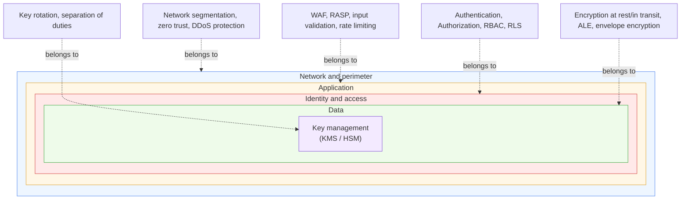
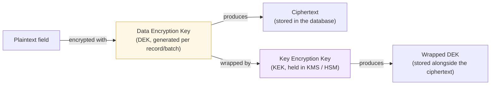

# Security: Defense in Depth

## 1. Purpose and scope

This document is the organization's defense-in-depth security reference. It applies across the stacks documented in this repository, the ASP.NET Core backend pattern described in [`docs/aspnet-architecture-and-guidelines.md`](docs/aspnet-architecture-and-guidelines.md) and the Flutter frontend pattern described in [`docs/flutter-architecture-and-guidelines.md`](docs/flutter-architecture-and-guidelines.md), and it is written as a standalone reference, not tied to the current Python/FastAPI pipeline's specific implementation.

The governing idea is defense in depth: no single control on this page is assumed sufficient on its own. Each is one layer, and each layer is designed on the assumption that the layers around it can fail. A leaked API key should not expose a database. A compromised application server should not expose every tenant's data. A bypassed authorization check at the API boundary should still be caught by a check inside the application core or by row-level security in the database. Where a control below has already been documented in detail elsewhere in this repository, this document states the principle and points to the detailed treatment rather than repeating it.

## 2. Terminology

A few terms in this document have more than one common meaning in the industry. This section states the meaning used here explicitly, so a reader can correct it if a different meaning was intended for this organization.

- **RASP (Runtime Application Self-Protection).** An in-process control that instruments the running application itself to detect and block attacks as they happen, a malicious payload reaching a dangerous sink, an attempted deserialization exploit, at runtime. This is distinct from a Web Application Firewall, which inspects traffic at the network perimeter before it reaches the application.
- **ALE (Application-Level Encryption).** Encryption performed by application code on specific sensitive fields before they are written to storage, also called field-level or client-side encryption. This is distinct from transport encryption (TLS) and from whole-disk or whole-database encryption at rest; a database administrator with read access to the raw table, or an attacker who exfiltrates a database backup, still cannot read an ALE-protected field without the encryption key.
- **Envelope Encryption.** The key-wrapping pattern that makes ALE practical at scale: each piece of data is encrypted with its own data encryption key (DEK), and the DEK itself is encrypted (wrapped) by a key encryption key (KEK) held in a key management service or hardware security module. This avoids sending every plaintext record to a central key service for encryption, while still centralizing control over the KEK.
- **Atomic Transactions.** Transactional atomicity treated as a security and integrity control: a set of related state changes either all succeed or none do, so the system is never left in a partially applied state that could represent an inconsistent authorization or balance state. This is the same guarantee described operationally in the EF Core transactions section of the ASP.NET document; this document frames it specifically as a security control.
- **RLS (Row-Level Security).** Database-enforced filtering of which rows a given database role or session may see or modify, applied inside the database engine itself rather than solely in application code.

## 3. The defense-in-depth model

Each layer below assumes the layer outside it can be bypassed, misconfigured, or compromised, and is designed to still hold on its own.

A request that has bypassed the network layer still has to pass application-layer controls. A request that has bypassed application-layer controls still has to pass identity and access checks. A caller with a valid identity but the wrong role still has to pass RLS at the database. Data that reaches storage despite all of that is still unreadable without the encryption keys, which are themselves access-controlled and rotated independently of the application.

## 4. Identity and access

### 4.1 Authentication

Authentication answers one question: who is making this request. Use a standard, well-reviewed authentication mechanism, a managed identity provider or a well-supported OIDC/OAuth2 flow, rather than a hand-rolled credential scheme. Enforce multi-factor authentication (MFA) for any account with elevated privilege, administrative access, database access, key management access, without exception, and offer it to end users as a strong default wherever the application handles sensitive data.

Store credentials correctly where the application does manage them directly: passwords hashed with a modern, deliberately slow algorithm (Argon2id or bcrypt, not a fast general-purpose hash), never in plaintext or reversibly encrypted, and API keys or tokens as hashed values compared in constant time. Avoid the OAuth Resource Owner Password Credentials grant, since it requires the client to handle the user's raw password directly; use an authorization code flow with PKCE instead. This mirrors the guidance already stated for the backend in the ASP.NET document's security section.

### 4.2 Authorization

Authorization answers a second, separate question: given who the caller is, what are they allowed to do. Keep this distinct from authentication in the code as well as in the mental model, a successfully authenticated caller is not automatically an authorized one for a given action. Prefer policy-based or claims-based authorization, where a named capability (`CanManageUsers`, `CanApproveTransaction`) is checked at the call site and the mapping from that capability to the roles or claims that satisfy it lives in one place, over scattering raw role-string checks through the codebase.

### 4.3 Role-Based Access Control (RBAC) in depth

RBAC is the specific authorization model of assigning permissions to roles and roles to users, rather than assigning permissions to users directly. It scales because adding a new user is a matter of assigning an existing role, not re-deriving a permission set, and because auditing "who can do X" becomes a matter of listing a role's holders rather than scanning every user's individual grants.

Apply RBAC at more than one layer, since relying on a single check anywhere leaves every other entry point unprotected if that one check is bypassed or a new entry point is added later without it:

- **At the API boundary**, through the framework's policy-based authorization (covered in detail in the ASP.NET document, section 7.4).
- **At the application layer**, inside use cases themselves, so the check travels with the business logic regardless of which adapter invoked it, an HTTP controller, a background job, a message consumer.
- **At the database layer**, through row-level security (section 7 below) as defense in depth against a bug or an unreviewed raw-SQL escape hatch in the layers above it.

Two principles govern how roles and permissions should be designed, regardless of the specific framework implementing them:

- **Least privilege.** A role should carry exactly the permissions its holders need to do their job, no more. A broad "just in case" role is a standing liability, not a convenience.
- **Separation of duties.** No single role should be able to both perform a sensitive action and approve or audit it unsupervised, the person who can initiate a fund transfer should not also be the only person who can approve it, and the account that can modify application data should not also be the account that can rotate the encryption keys protecting that data.

## 5. Application-layer defense

### 5.1 RASP (Runtime Application Self-Protection)

RASP instruments the running application to detect and block exploitation attempts at the point they actually execute, inside the process, rather than only at the network edge. This catches attacks that a perimeter control cannot see because they arrive through an already-authenticated, already-TLS-terminated request, an injection payload that only becomes dangerous once it reaches a specific internal sink, a deserialization gadget chain triggered by application logic. Evaluate a RASP product or library against the specific language runtime in use (a .NET-targeted RASP agent for the ASP.NET backend, for example) rather than treating RASP as a single interchangeable product category; coverage and performance overhead vary significantly by runtime and by vendor.

### 5.2 Web Application Firewall (WAF)

A WAF is RASP's perimeter counterpart: it inspects HTTP traffic before it reaches the application, filtering known attack patterns (common injection signatures, malformed requests, known bad actors by reputation) at the network edge. A WAF and RASP are complementary, not redundant, a WAF stops what it can recognize in transit, RASP stops what actually reaches a dangerous point in the running code, including attacks a WAF's signatures do not yet cover.

### 5.3 Input validation and injection prevention

Validate every input at the boundary where it enters the system, type, length, format, and allowed value range, before it is used for anything. This is the first and cheapest line of defense against injection classes of vulnerability (SQL injection, command injection, path traversal), and it should not be treated as replaced by RASP or a WAF; both of those are safety nets for validation that was missed or insufficient, not a substitute for validating in the first place. The specific SQL injection guidance for this stack (parameterized queries, never interpolating a value directly into raw SQL) is detailed in the ASP.NET document, section 7.5.

### 5.4 Rate limiting and anti-automation

Apply rate limiting to any endpoint that performs a sensitive or costly action, authentication attempts, password resets, data export, expensive queries, to blunt both brute-force attacks and unintentional load spikes from a misbehaving client. Rate limit by a meaningful key (account, API key, or IP, chosen based on what the endpoint actually needs to protect against) rather than applying a single global limit that a distributed attacker can trivially spread across.

## 6. Data protection

### 6.1 Application-Level Encryption (ALE)

For fields that are sensitive enough to warrant protection even from someone with direct database access, a database administrator, an attacker who has exfiltrated a backup, a misconfigured read replica, encrypt the field in application code before it is persisted, rather than relying solely on the database's own at-rest encryption. Identify which fields warrant this treatment through the data classification exercise described in section 6.5; not every column needs it, and applying it indiscriminately makes the data unqueryable and adds real operational cost for no corresponding benefit on low-sensitivity fields.

### 6.2 Envelope encryption

Envelope encryption is the mechanism that makes ALE practical without funneling every encryption operation through a central key service for every record:

To read the data back: the wrapped DEK is unwrapped by calling the KMS/HSM with the KEK (which never leaves the KMS/HSM in plaintext), and the resulting plaintext DEK decrypts the ciphertext. This means compromising the database alone yields only ciphertext and a wrapped key, both useless without a successful, separately audited call to the key service. It also makes key rotation tractable: rotating the KEK means re-wrapping the (much smaller) set of DEKs, not re-encrypting every record.

### 6.3 Transport and at-rest encryption

Enforce TLS on every connection that carries application data, between the client and the API, between the API and the database, between the API and any external service, with HSTS enabled so a downgrade to plaintext HTTP is rejected by the client rather than silently allowed. Enable the underlying storage platform's at-rest encryption as a baseline for every dataset, and layer ALE on top of it for the specific fields identified as needing protection even from someone with legitimate storage-level access.

### 6.4 Key management

- **Centralize key custody in a KMS or HSM**, never in application configuration files, environment variables, or source control. This applies to KEKs above and to any other long-lived cryptographic material (signing keys, service credentials).
- **Rotate keys on a defined schedule** and immediately on suspected compromise, and design the system so rotation is an operational event, not a migration project, envelope encryption's separation of DEK and KEK exists specifically to make this practical.
- **Apply separation of duties to key access.** The engineers or services that can use a key to encrypt or decrypt data should not, by default, also be the ones who can export, delete, or change permissions on that key.

### 6.5 Data classification

None of the controls above can be applied correctly without first knowing which data actually needs them. Classify data explicitly, at minimum distinguishing public, internal, and sensitive/regulated categories, and let that classification drive concrete decisions: which fields get ALE, which tables get RLS policies beyond the default, which data appears in logs at all (sensitive fields should never be logged in plaintext, including in error messages and stack traces), and which data triggers stricter retention and deletion requirements.

## 7. Database and transactional integrity

### 7.1 Row-Level Security (RLS)

RLS enforces, inside the database engine itself, which rows a given database role or session may see or modify. This matters as a distinct layer from application-level authorization because it holds even if the application layer has a bug, an unreviewed raw SQL query, or a new code path that forgot to apply a tenant filter. For genuinely sensitive multi-tenant data, define RLS policies so that a query issued under a given tenant's session can only ever return that tenant's rows, regardless of what the application code asked for. The PostgreSQL-specific mechanics (`CREATE POLICY`) and how this combines with application-layer RBAC are detailed in the ASP.NET document, section 7.4.

### 7.2 Atomic transactions as an integrity control

Treat transactional atomicity as a security property, in addition to a correctness one. A partially applied multi-step write, half of a fund transfer committed, a permission grant applied without its corresponding audit record, is not just a data quality bug; it can leave the system in a state that an attacker, or an ordinary user encountering the failure, can exploit. Wrap every operation that changes more than one piece of related state in a transaction so it either fully applies or fully rolls back, with no partial state ever visible to a concurrent reader. The concrete EF Core mechanics, implicit transactions, explicit transactions, savepoints, isolation levels, are detailed in the ASP.NET document, section 7.1 and 7.2.

### 7.3 Least-privilege database accounts

Do not connect to the database as a single account with full schema ownership for ordinary application traffic. Use separate accounts scoped to what each workload actually needs: an application runtime account with data read/write permissions but no schema-modification rights, a separate migration account used only during controlled deploys, and a reporting/read-only account for anything that only needs to query. This limits the blast radius of a compromised application process to data manipulation within its granted scope, not schema destruction or privilege escalation.

## 8. Network and infrastructure

- **Network segmentation.** Place the database and any internal services on a network segment not directly reachable from the public internet; only the application tier that needs to reach them should be able to.
- **Zero trust networking.** Do not treat "inside the network perimeter" as equivalent to "trusted." Authenticate and authorize service-to-service calls even within a private network, since network segmentation is one layer, not a substitute for identity checks at every hop.
- **Secrets management.** Store connection strings, API keys, and other runtime secrets in a dedicated secret store (a vault service or the platform's managed secret store), injected into the running process at deploy time, never committed to source control and never held in plain environment variables in a production environment where avoidable. This mirrors the guidance already stated for the backend in the ASP.NET document's security section.
- **DDoS and perimeter protection.** Use the hosting platform's or CDN's DDoS mitigation for any public-facing endpoint, and combine it with the rate limiting described in section 5.4 for protection against application-layer abuse that volumetric DDoS protection does not address.

## 9. Observability, response, and process

- **Logging and tamper-evident audit trails.** Log security-relevant events, authentication attempts, authorization denials, data access to sensitive records, administrative actions, in a way that the application itself cannot silently alter after the fact (append-only storage, or a separate system the application only writes to, never edits). A log an attacker who gains application access can also rewrite is not an audit trail.
- **Monitoring and alerting.** Route security-relevant events into monitoring that can alert on anomalies, a spike in authorization denials, repeated failed authentication from one source, an unusual volume of data export, rather than relying on logs being read manually after an incident is already suspected. Route to a SIEM where the organization's scale justifies one.
- **Incident response readiness.** Maintain a written incident response process, who is notified, how access is revoked or rotated, how affected users are informed, and exercise it before it is needed. A plan that has never been tested is a plan that will fail under the pressure of an actual incident.
- **Dependency and supply chain security.** Scan dependencies for known vulnerabilities (software composition analysis) as part of the build pipeline, pin dependency versions rather than floating on the latest at build time, and prefer packages with verifiable provenance over unmaintained or unusually low-trust ones.
- **Secure SDLC.** Apply threat modeling to new features that touch authentication, authorization, or sensitive data before they are built, not after. Include security-focused review as part of ordinary code review for such changes, and run secrets-scanning in CI so a credential accidentally committed is caught before merge, not after it reaches a public or widely-accessible repository.
- **Backup and recovery integrity.** Treat backups as a security control, in addition to an operational one: verify they are encrypted, verify they are tested by actually performing a restore periodically, and, for the most sensitive datasets, keep at least one backup copy immutable so it cannot be deleted or encrypted by an attacker who has gained write access to the primary environment (relevant against ransomware-style scenarios specifically).

## 10. Frontend and mobile-specific controls

The Flutter frontend, described in [`docs/flutter-architecture-and-guidelines.md`](docs/flutter-architecture-and-guidelines.md), runs on a device the organization does not control, which changes the threat model relative to the backend:

- **Secure local storage.** Store tokens, credentials, and any sensitive cached data using the platform's secure storage (Keychain on iOS, Keystore-backed storage on Android), never in plain `SharedPreferences`, a plain local file, or an unencrypted local database.
- **Certificate pinning.** Pin the expected server certificate or public key for calls to the backend where the threat model justifies it (an app handling financial or otherwise highly sensitive data), to reduce exposure to a compromised or coerced certificate authority and to on-path interception on untrusted networks.
- **No secrets embedded in the client binary.** An API key, signing secret, or credential compiled into a mobile app is extractable by anyone with the installed package; anything that must remain secret belongs on the backend, behind an endpoint the client calls, never inside the client itself.
- **RASP considerations on mobile.** Where the threat model justifies it, apply runtime protections appropriate to mobile specifically, jailbreak/root detection, anti-tampering, anti-debugging, recognizing that these raise the cost of attack but, unlike server-side RASP, run on hardware fully under the attacker's physical control and so are a deterrent, not an absolute guarantee.

## 11. Quick reference checklist

- No single control here is sufficient alone. Every layer is designed to hold even if the layer around it fails.
- Authenticate with a standard mechanism plus MFA for privileged accounts; keep authorization checks separate from authentication checks.
- Enforce RBAC at the API, application, and database layers, not at one alone. Apply least privilege and separation of duties to every role, human and service account alike.
- Pair RASP (in-process) with a WAF (perimeter), and treat both as a safety net for input validation, not a replacement for it.
- Classify data before deciding what protects it. Apply ALE via envelope encryption to fields that need protection even from someone with direct storage access; enforce TLS/HSTS and at-rest encryption everywhere as the baseline underneath that.
- Centralize key custody in a KMS/HSM, rotate on a schedule, and separate who can use a key from who can manage it.
- Use RLS as database-enforced defense in depth behind application-layer authorization, not as a replacement for it.
- Wrap every multi-step state change in an atomic transaction; a partial write is a security bug, not just a data quality one.
- Use least-privilege, workload-scoped database accounts, never one shared account with full schema rights for ordinary traffic.
- Segment the network, apply zero trust between services even inside the perimeter, and never commit secrets or hold production secrets in plain environment variables.
- Make audit logs tamper-evident, route security events to monitoring that alerts, and keep an incident response process that has actually been exercised.
- Scan dependencies, pin versions, thread-model and review security-sensitive changes before they ship, and scan for secrets in CI.
- Test backup restores, not just backup creation; keep at least one immutable copy of the most sensitive data.
- On the Flutter client, use platform secure storage, pin certificates where justified, and never embed a secret in the client binary.
